# Unit 3: Creating a Database Application

This exercise includes three hands-on-labs.

**HOL 3-1 Creating a Database Application from Scratch**: In this hands-on-lab, you create a database Web application, Demo Projects. You will extend and improve this application later.

**HOL 3-2 Creating a Database Application from a Spreadsheet**: In this hands-on lab, you use a spreadsheet to create a database Web application, Budget App. You do not extend this application but will use in a later exercise.

**HOL 3-3 Creating a Websheet Application**: In this hands-on lab, you create a Websheet application for the Tech Sales Team daily reporting.

## HOL 3-1: Creating a Database Application from Scratch

In this lab, you create the initial application using the Create Application wizard to define multiple pages. Now that you have created the underlying tables, you are ready to create a desktop application. You will be adding reports and forms for the tables you created.

Generally, when developing an application you will not know all of the pages required at the beginning. Therefore, you will only generate a select number of pages initially, and then use the wizard to add additional pages as required. However, for this exercise you will generate most of the pages required for the application up front.

1.  Using the Create Application Wizard, create the Demo Projects application. Navigate to **App Builder** and then click **Create**.  
    

2.  Click **Desktop**.
    

3.  For Name, enter **Demo Projects**. Accept the remaining defaults and click **Next**.
    

4.  Next, add Report and Form page types for the following tables:

    -   DEMO\_PROJ\_TEAM\_MEMBERS

    -   DEMO\_PROJECTS

    -   DEMO\_PROJ\_MILESTONES

    -   DEMO\_PROJ\_TASKS
        
        Click **Add Page**.
        

    For Page Type, select **Report and Form** and then enter/select the following:

    -   Table Name: **DEMO\_PROJ\_TEAM\_MEMBERS**

    -   Report Type: **Interactive Grid**

    -   Form Page Mode: **Modal Dialog**

    Then, click **Add Page**.
    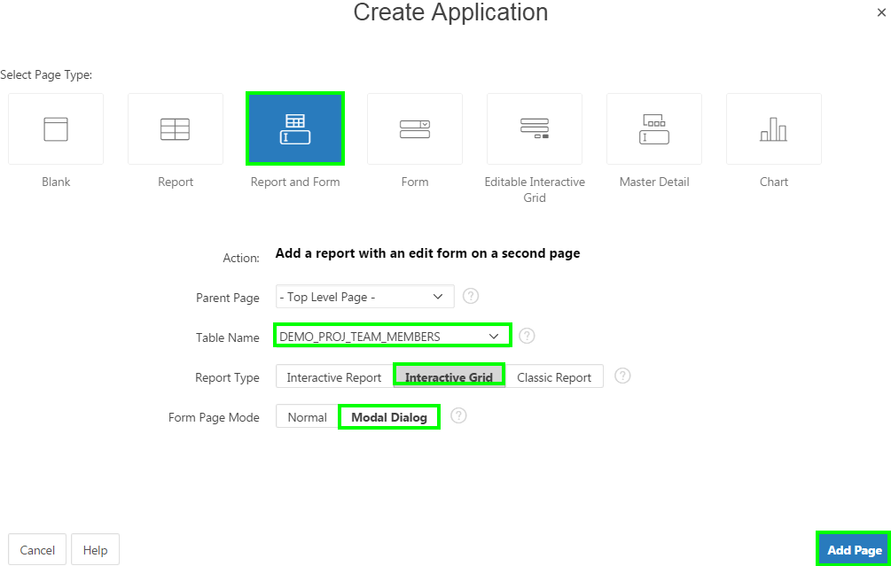

5.  Add Report and Form page type for the DEMO\_PROJECTS table.

    Click **Add Page**. For Page Type, select **Report and Form** and then enter/select the following:

    -   Table Name: **DEMO\_PROJECTS**

    -   Report Type: **Interactive Grid**

    -   Form Page Mode: **Modal Dialog**

    Then, click **Add Page**.

6.  Add Report and Form page type for the DEMO\_PROJ\_MILESTONES table.

    Click **Add Page**. For Page Type, select **Report and Form** and then enter/select the following:

    -   Table Name: **DEMO\_PROJ\_MILESTONES**

    -   Report Type: **Interactive Grid**

    -   Form Page Mode: **Modal Dialog**

    Then, click **Add Page**.

7.  Add Report and Form page type for the DEMO\_PROJ\_TASKS table. The form page mode for DEMO\_TASKS should be generated as a normal page rather than a modal dialog.

    Click **Add Page**. For Page Type, select **Report and Form** and then enter/select the following:

    -   Table Name: **DEMO\_PROJ\_TASKS**

    -   Report Type: **Interactive Grid**

    -   Form Page Mode: **Normal**

    Then, click **Add Page**.

8.  Verify that your screen matches the following image. You must create these pages in the order shown to ensure that they correspond with instructions later in this tutorial. If your screen does not look the same as the illustration below, use the X icon to the right of each page to delete problem pages and restart Step 2. Do not delete the Home page.
    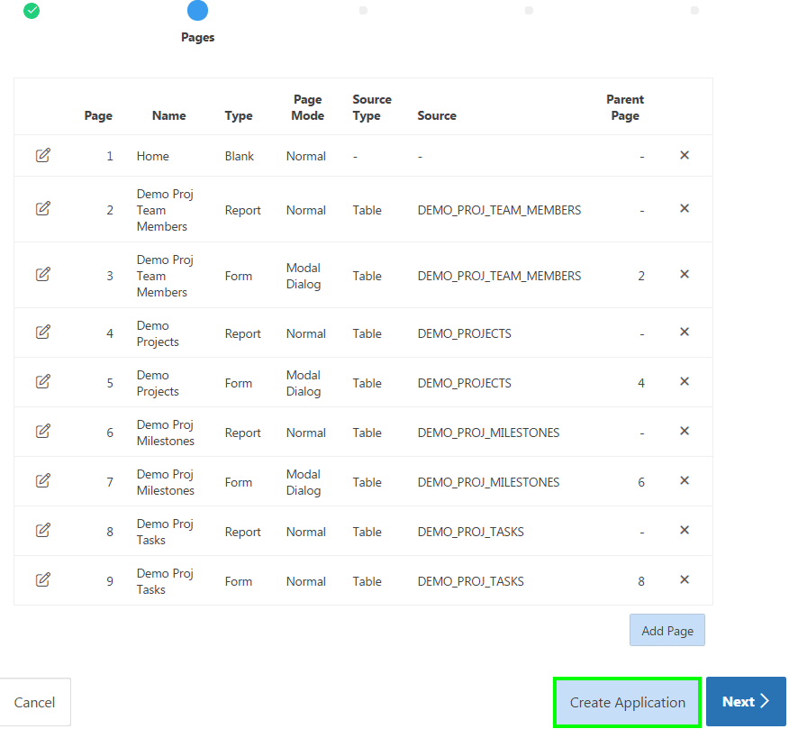

    Click **Create Application**. On the confirmation page, click **Create Application**.

9.  Click **Run Application**. Then, log in using your Workspace username and password.
    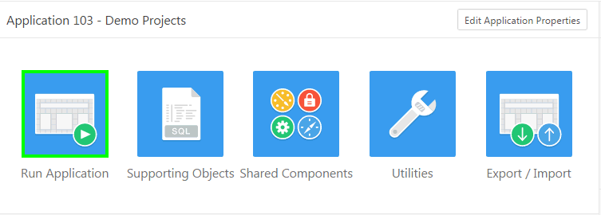

10. Your screen should look like the following:
    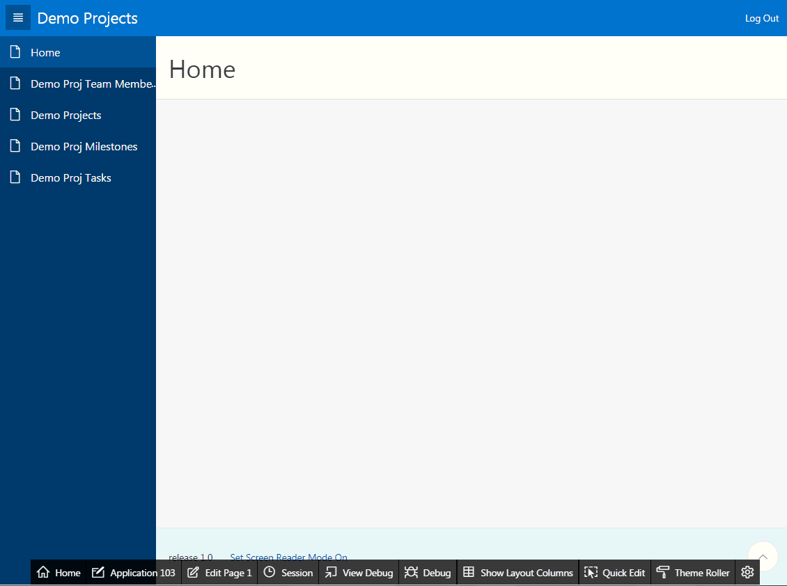

## HOL 3-2: Creating a Database Application from a Spreadsheet

In this lab, you use a spreadsheet to create a database application.

1.  Navigate to **App Builder** and click **Create**.
    

2.  Select **From a Spreadsheet**.
    

3.  Select **Upload file, comma separate (\*.csv) or tab delimited** for Import From, and click **Next**.
    

4.  Click **Choose File**. Navigate to your working directory and double-click **budget.csv**. Then, click **Next**.
    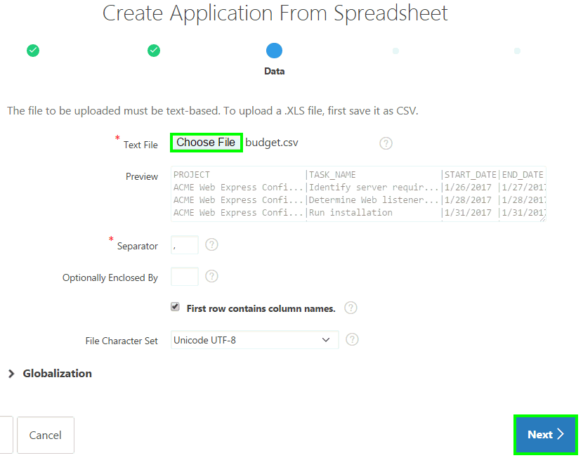

5.  Enter **Project\_Budget** for Table Name. Verify the data types for each of the columns. Make sure that START\_DATE and END\_DATE columns have DATE Data Type. Click **Next**.
    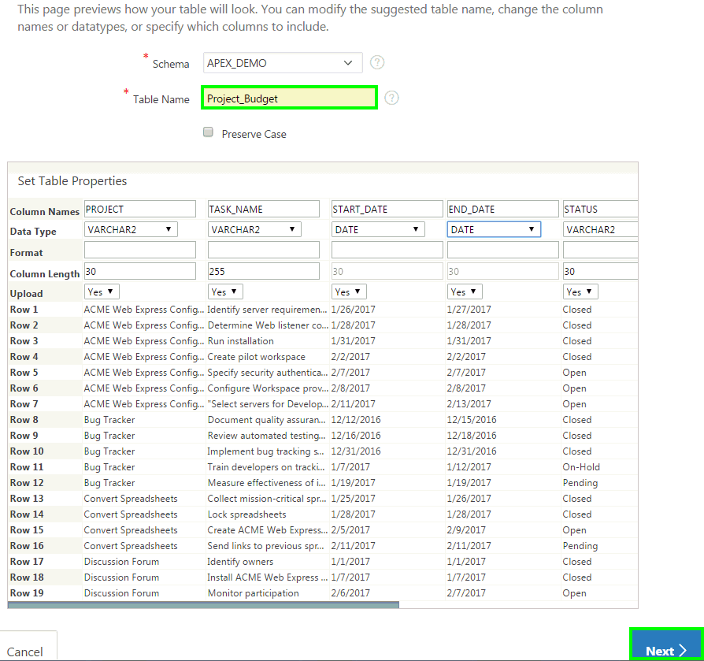

6.  For Application Options, accept the defaults (Report Type: Interactive Report) and click **Create Application**.
    

7.  Click **Run Application**.

    

8.  Enter your Workspace Username and Password. Click **Log In**.

    

9.  Review the Budget App application that you just created.
    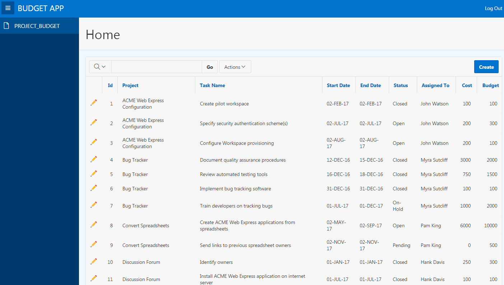

## HOL 3-3: Creating a Websheet Application

Tech Sales Team management want to track the daily status of the sales executives. You help them create a Websheet application. Once created, managers add pages for daily status and executives simply enter their daily status online by logging in to the Websheet application.

1.  Navigate to **App Builder** and click **Create**. 

    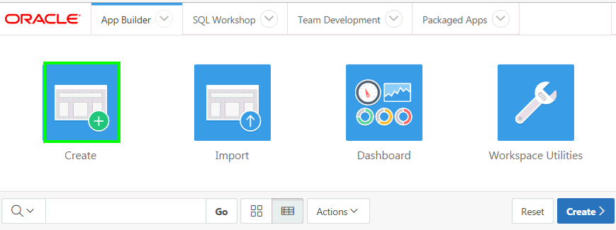 

2.  Click **Websheet**. 

    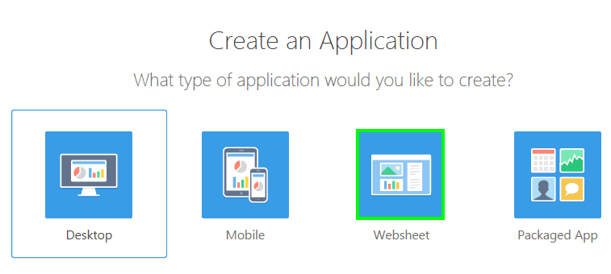 

3.  Enter **Team Status** for Name, deselect the **Include Getting Started Guide** checkbox and click **Create Websheet**.
    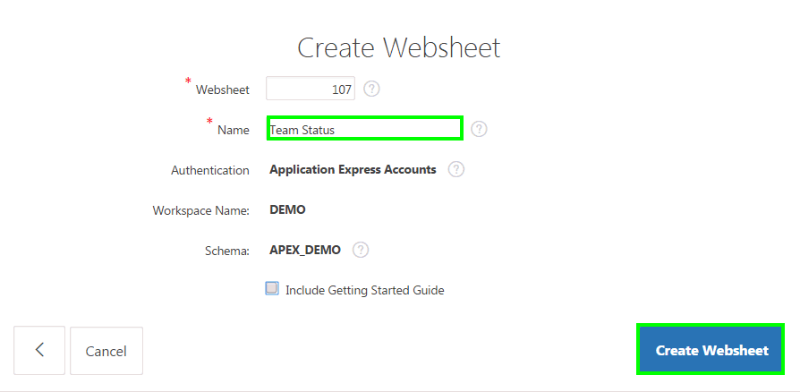

4.  Click **Run Websheet**.

    

5.  Enter user Workspace Username and password. Click **Sign In**.

    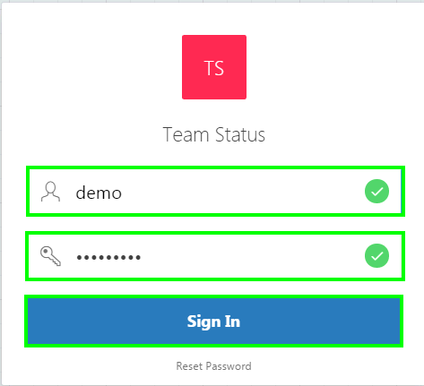

6.  You want to rename the Home Page. Click **Edit** and select **Edit Page**.
    

7.  Enter **Tech Sales Team Daily Report** for Name and click **Apply Changes**.

    

8.  You want to add a new section on the page. Under **Control Panel**, click **New Section**.

    

9.  You want to add a text section so that you can enter some instructions. Select **Text** and click **Next**.

    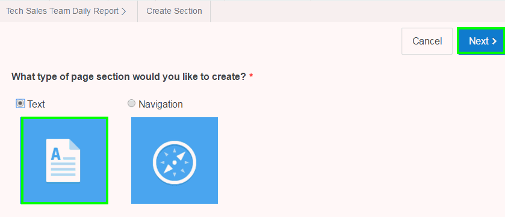

10. Select **Create single text section** for Method, enter **Daily Report** for Title. Under Content, click the **Expand Toolbar** button to expand the toolbar. Enter text and click **Create Section**.

    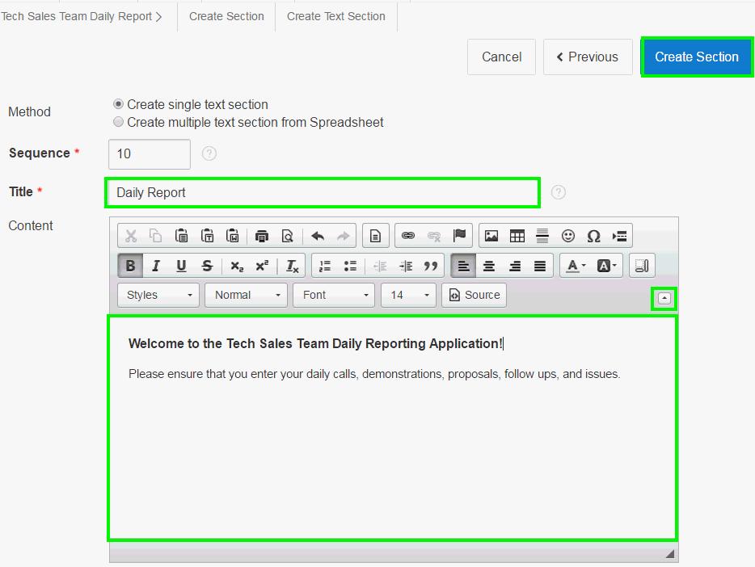

11. You want to add a navigation section now. Under Control Panel, click **New Section**.

    

12. Select **Navigation** and click **Next**.
    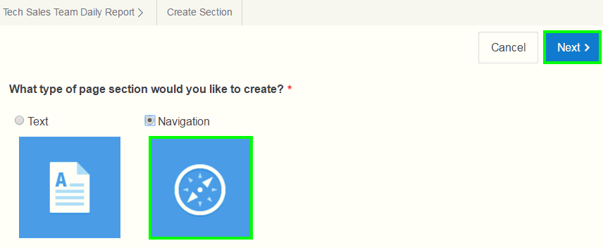

13. You want to include page navigation to enable navigation across daily status report pages. Select **Page Navigation** for Navigation Type and click **Next**.

    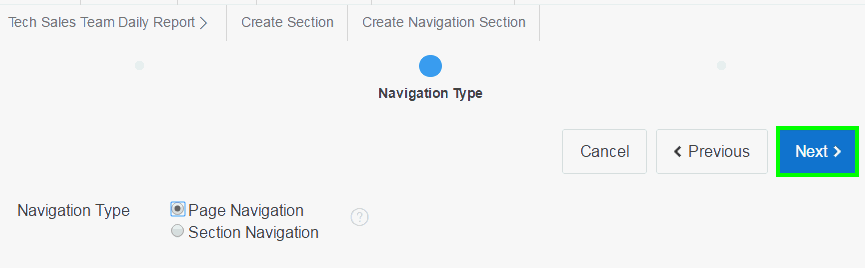

14. Enter text for Title and click **Create Section**.
    

15. Now you see the navigation has been created. You can create status report for each day as a page.
     

For example, as you add daily status report pages, your home page will look like:
    

16. You can view your Websheet in Presentation mode. Click the Presentation button to the top right of the Websheet.
    

17. You are now on the home page. To navigate to the next section, click the **&lt;** button.
    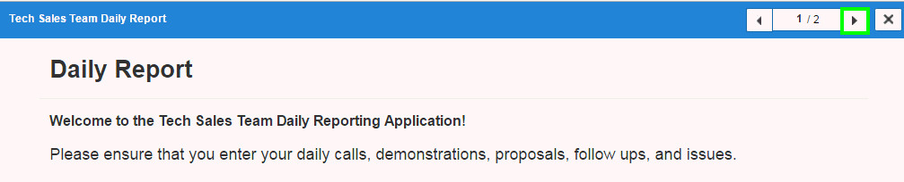

18. To return to the normal mode, click **X**.
    

    You can also expand this application further by adding different sections, data grids. To learn more about Websheets, navigate to **Packaged Apps &gt; All** and install **Sample Websheet AnyCo IT Department**.\
    To perform the next hands-on-lab, you need to switch to the App Builder window.

----------

