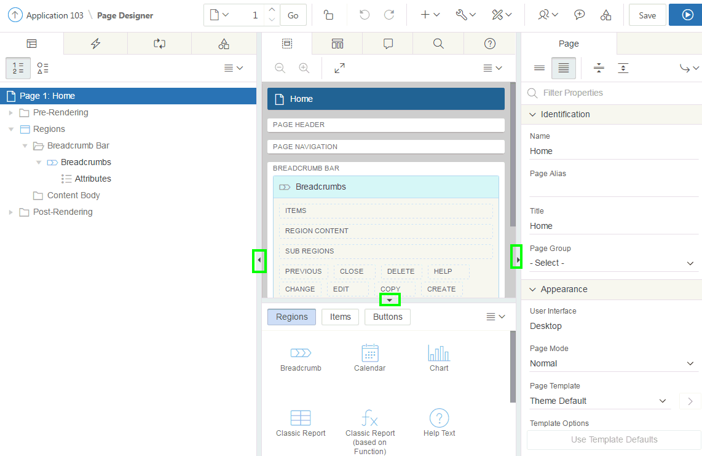
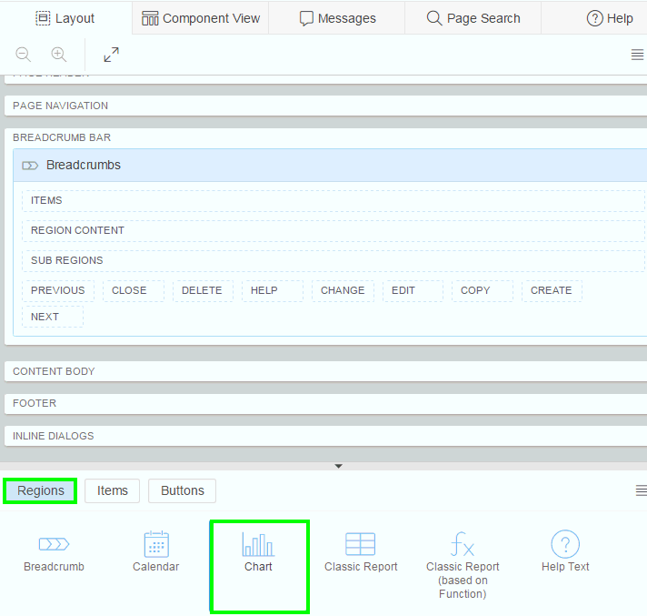
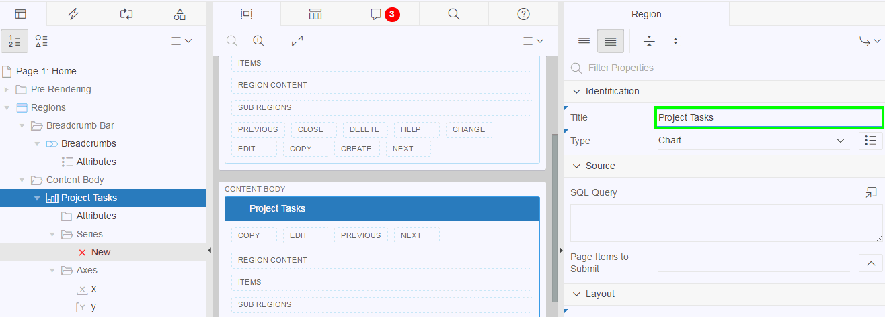
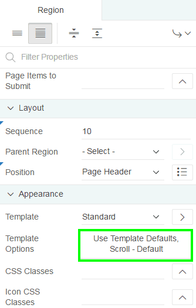
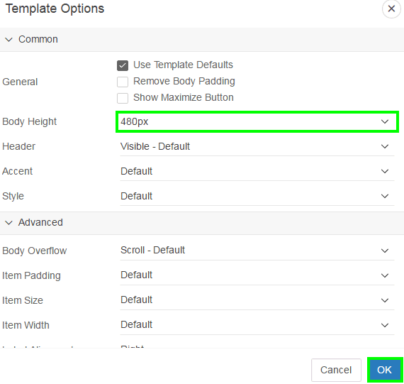
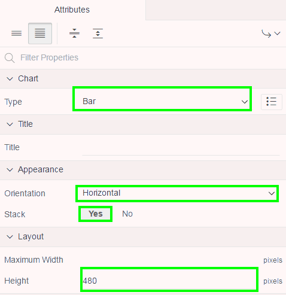
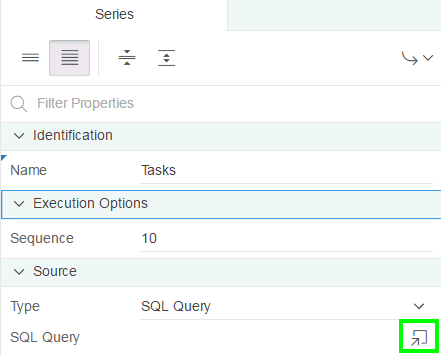
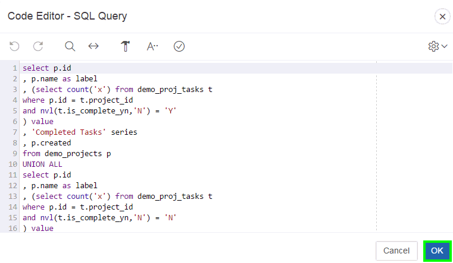
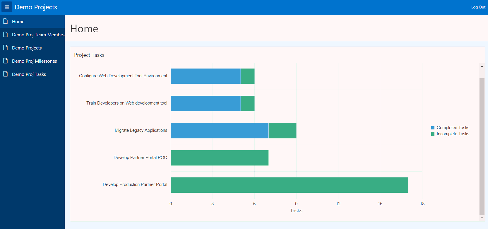

# Unit 4: Managing Pages in Page Designer

In this lab, you create a dashboard by adding a new component to the Home page of the Demo Projects application. You open the home page in page designer, navigate through and review the page designer panes, add a chart region and edit the chart attributes.

1.  In the lab **HOL 3-1**, you finished by running the application. Given that you ran the application from the Application Builder, there is a Developer Toolbar at the bottom of the screen. This toolbar allows developers to quickly navigate between runtime and various sections within the Application Builder.

    Navigate to the **Home** page in the runtime application.

    In the Developer Toolbar, click **Edit Page 1**.

    **Note**: If you are not on the Home page then the Developer Toolbar will show the current page number, and clicking on Edit Page xx will navigate to that page, instead of Page 1.
    

2.  The Page Designer is displayed for Page 1. There are three main panes within Page Designer: Left Pane, Central Pane, and Right Pane.
    
    You can change the size of each pane by selecting the dividers and sliding them left or right. Change the size of **Grid Layout** and **Gallery** by sliding the divider between them up and down.
    

3.  In the Page Designer, you can invoke help on any attribute by clicking Help icon (shown as a question mark) on the toolbar. Select a component and then select an attribute in the Property Editor to display help on that attribute.
    

4.  Add a bar chart using drag and drop. The chart shows projects with the number of tasks.
    
     a) Click **Layout**. 
        

        

     b) In the Gallery (directly below the Grid Layout), click **Regions**, and locate **Chart**.
        

     c) Click and hold **Chart** and drag it to the **Content Body** region. It should appear as a darkened tile before you drop it into place.
        

 
       **Note**: When you drag the region up, and hover over the small yellow section, below Content Body, the yellow section will expand. A darker yellow section, with a black box around it, will indicate where the region will be placed.

     d) Now you modify the properties for a region, such as the Title and Template Options. When you first create a region, it is created with default properties, such as a Title of **New**.

       Use the Property Editor to edit attributes for the currently selected component.

       In the **Property Editor**, under Identification, for Title - enter **Project Tasks**.

       **Note**: The region name in the Rendering tree (left pane) and the Grid Layout (central pane) are updated to reflect the new title, as soon as you navigate out of the Title attribute in the Property Editor.
       

     e) In the Property Editor, under **Appearance**, locate **Template Options** and click **Use Template Defaults, Scroll - Default**.
        

     f) For Body Height select **480px**.
       Click **OK**.        
        
       

     g) For certain region types, such as Charts, there are also Attribute properties. The region properties determine how the region is displayed, whereas, the Attributes for a region (where available) are used to define the characteristics of the region, and how the contents of the region are displayed.

       Locate the Rendering tree. Under the **Project Tasks** region, click **Attributes**.

       

     h) In the Property Editor:
       - Chart: Type - select **Bar**
       - Appearance: Orientation - select **Horizontal**
       - Appearance: Stack - select **Yes**
       - Layout: Height - enter **480**                    
        

     i) Under Rendering &gt; Project Tasks region, navigate to **Axes** and select **y**. 
        In the property editor, enter **Tasks** for Title.
        

     j) The DEMO\_PROJ\_TASKS table includes a column called IS\_COMPLETE\_YN. This column is populated by users to indicate that a task is complete. Next, enter chart series details for 
        completed and incomplete tasks within a project.
        In the Rendering tree, nested under the Project Tasks region, click Series **X New**.  
        

     k)  In the property editor, under Identification &gt; Name, enter **Tasks**.

     l)  In the property editor, under Source, click the Code Editor icon. 
         

     m)  For SQL Query, copy and paste the following code and then click **OK**.

  
          select p.id
      
         , p.name as label
      
         , (select count('x') from demo_proj_tasks t
      
         where p.id = t.project_id
      
         and nvl(t.is_complete_yn,'N') = 'Y'
      
         ) value
      
         , 'Completed Tasks' series
      
         , p.created
      
         from demo_projects p
      
         UNION ALL
      
         select p.id
      
         , p.name as label
      
         , (select count('x') from demo_proj_tasks t
      
         where p.id = t.project_id
      
         and nvl(t.is_complete_yn,'N') = 'N'
      
         ) value
      
         , 'Incomplete Tasks' series
      
         , p.created
      
         from demo_projects p
      
         order by 5
      

    

    n) Under Column Mapping, select:

      -   Series Name: **SERIES**

      -   Label: **LABEL**

      -   Value: **VALUE**  

     Click **Save**. Then, click **Save and Run Page**. 
    

    o)  You might have to log in using Workspace username and password. The Demo Projects application home page now looks like: 
        

---------
