# Unit 7: Managing and Customizing Interactive Grids

This exercise includes six hands-on-labs.

Labs HOL 7-1 through HOL 7-4 use the Demo Projects application.

Labs HOL 7-5 and HOL 7-6 use the Budget App application.

**HOL 7-1: Customizing the Team Members Interactive Grid**: In this lab, you modify the source query, and customize the Demo Proj Team Members interactive grid.

**HOL 7-2: Customizing the Projects Interactive Grid**: In this lab, as a developer, you modify the source query, create a new column link, and customize the display of the Demo Projects interactive grid.

**HOL 7-3: Customizing the Milestones Interactive Grid**: In this lab, you modify the source query, and customize the Demo Proj Milestones interactive grid.

**HOL 7-4: Customizing the Tasks Interactive Grid**: In this lab, you customize the display of the Demo Proj Tasks interactive grid.

**HOL 7-5: Customizing an Interactive Grid as a Developer**: In this lab, you customize the Project Budget Interactive Grid for your end users.

**HOL 7-6: Customizing an Interactive Grid as an End User**: In this lab, you use and customize the display of your Project Budget Interactive Grid.

## HOL 7-1: Customizing the Team Members Interactive Grid

Developers can modify the SQL source query of an interactive grid. In this lab, you modify the source query of the Demo Proj Team Members interactive grid. Then, you hide columns that you do not want to be displayed in the interactive grid. Finally, you save the default settings of the interactive grid.

1.  Navigate to **App Builder** and run the **Demo Projects** application.

2.  In the navigation menu, select **Demo Proj Team Members**. In the Developer Toolbar, click **Edit Page 2**.

3.  The report shows all of the columns in the table and some of those columns (such as those associated with the image), should not be included in the report. Remove columns from the report by updating the SQL Source for the region. In the Rendering tree, locate the **Demo Proj Team Members** region. Click the **Demo Proj Team Members** region. 
    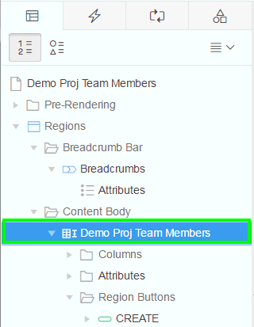

4.  In the Property Editor, click **Code Editor**.  
    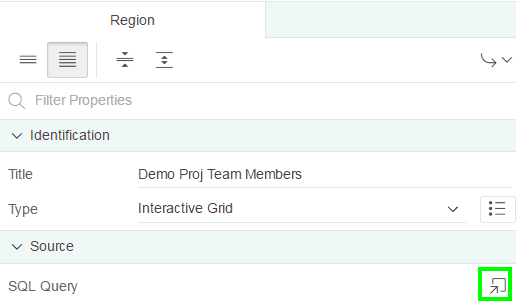

5.  In the Code Editor, replace the existing SQL with copy and paste of the following:

  
          select
      
	      "ID",
	      
	      "USERNAME",
	      
	      "FULL_NAME",
	      
	      "EMAIL",
	      
	      "PROFILE",
	      
	      "CREATED",
	      
	      "CREATED_BY",
	      
	      "UPDATED",
	      
	      "UPDATED_BY"
	      
	      from "DEMO_PROJ_TEAM_MEMBERS"
  

6.  Click **Validate**, to ensure the SQL statement is valid. Click **OK**.
    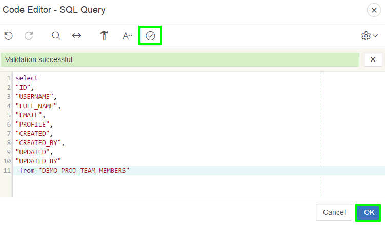

7.  Click **Save**. Then, click **Save and Run Page** to access the runtime application.

8.  Some of the report columns should be included in the report, but not visible by default. That way, if users want to review that information, they can manipulate the Interactive Grid and make the columns visible. To change what columns are displayed in the Interactive Grid by default, you must alter the report in the runtime environment and then save the grid. 
    Click **Actions** and select **Columns**. 
    

9.  In the Columns dialog, under Displayed, deselect the check boxes for **Username**, **Created**, **Created By**, **Updated**, and **Updated By**. Then, click **Save**. 
    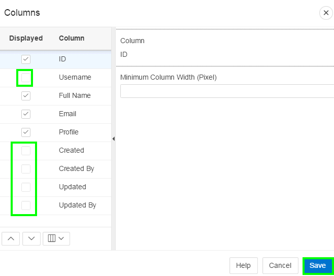

10.  The interactive grid now does not display the columns that you deselected in the previous step.
    

11.  To keep the changes you just made, you must save the report. If you were to log out and log back into the runtime environment, or another user runs the report, then the columns you just removed would be visible again.
    A Primary interactive grid displays to all users. Only the developer who creates an interactive grid can save a new Primary interactive grid, rename it, or delete it.
    Click **Actions** and select **Report &gt; Save**.  
    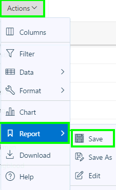

12.  The default report is now saved for all users. 
    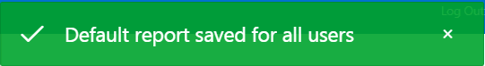

## HOL 7-2: Customizing the Projects Interactive Grid

In this lab, you update the report source query and remove the column link defined on the ID column. Then, you customize the interactive grid by hiding the columns that need not be displayed, and creating an aggregation on the Tasks column. You save these customizations for all the users. Navigating back to the page designer, you define a column link on the NAME column.

1.  If you are in the application runtime environment, click **Demo Projects** in the navigation menu. Then, in the Developer Toolbar, click **Edit Page 4**.
    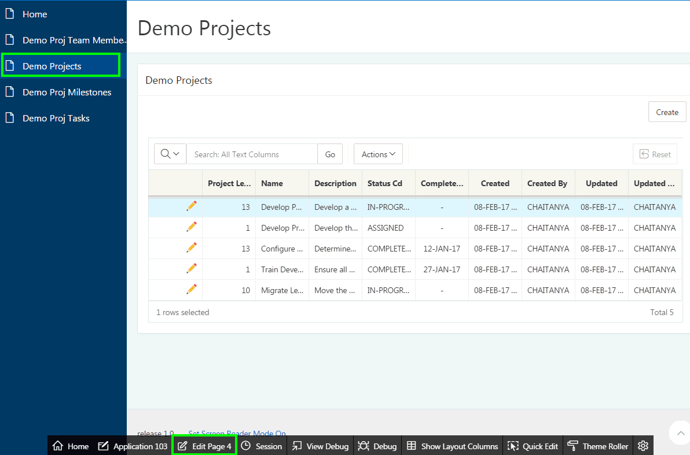

2.  Modify the existing Demo Projects Interactive Grid (Page 4) and update the SQL Query associated with the report to add summations for milestones and tasks. Under **Rendering &gt; Regions**, click the **Demo Projects** region.

3.  In the Property Editor, click the **Code Editor: SQL Query** button, and copy and paste the following SQL:

  
	      select
	      
	      "ID" ,
	      
	      "NAME",
	      
	      "DESCRIPTION",
	      
	      "PROJECT_LEAD",
	      
	      "COMPLETED_DATE",
	      
	      "STATUS_CD",
	      
	      "CREATED",
	      
	      "CREATED_BY",
	      
	      "UPDATED",
	      
	      "UPDATED_BY",
	      
	      (select count('x')
	      
	      from demo_proj_milestones m
	      
	      where m.project_id = p.id
	      
	      ) milestones,
	      
	      (select count('x')
	      
	      from demo_proj_tasks t
	      
	      where t.project_id = p.id
	      
	      ) tasks
	      
	      from "DEMO_PROJECTS" p
	  

	 Then, click **OK**.
	 

4.  Under Rendering &gt; Regions &gt; Demo Projects, expand the **Columns** node. A column link to Page 5 is defined on the ID column. Select ID.
    In the property editor, navigate to Link. For Target, you see *Page 5*. Click **Page 5**.
    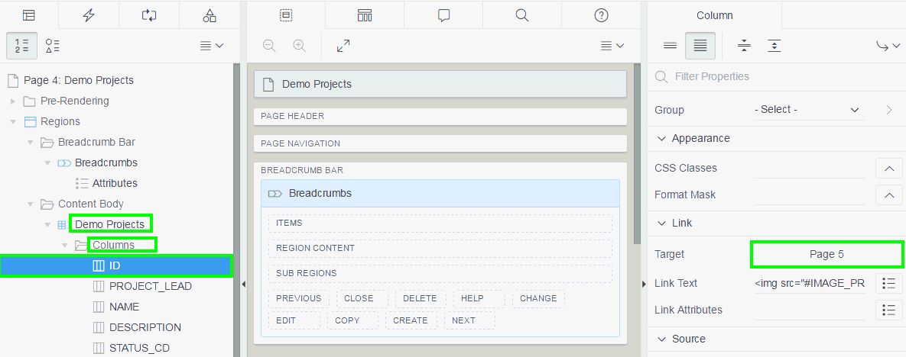

5.  The Link Builder - Target dialog appears. For Type, you see *Page in this application*. Remove this selection. Click **OK**.
    

6.  In the property editor, under Link &gt; Target, you see *No Link Defined*. Navigate to Heading and enter **ID**.
    Click **Save**. Then, click **Save and Run Page**.  
    

7.  You are now in the application runtime environment. Click **Actions &gt; Columns**.
    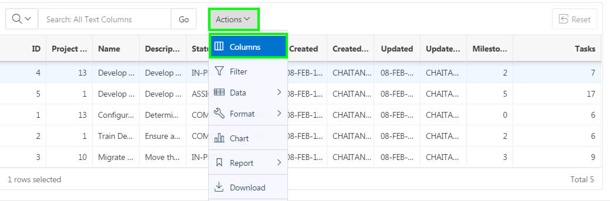

8.  In the Columns dialog, under Displayed, deselect **ID**, **Description**, **Created**, **Created By**, **Updated**, and **Updated By** columns.

9.  Under Column, select **Project Lead** and click the **move down** arrow. Then, click **Save**.
    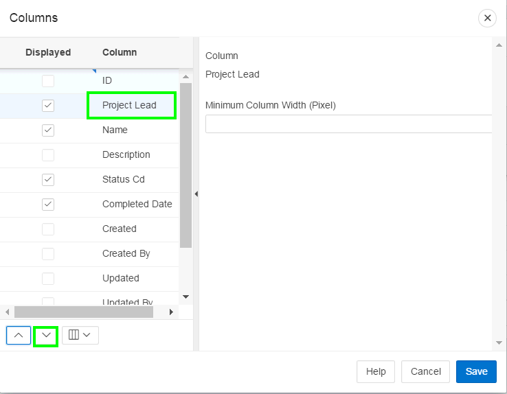

10.  The Demo Projects interactive grid should now look like:
    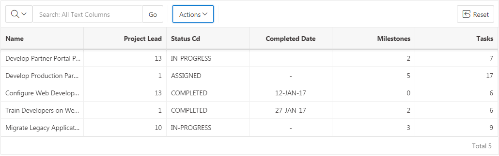

11.  You want to define aggregations on the Milestones and Tasks columns. Select **Actions &gt; Data &gt; Aggregate**.
    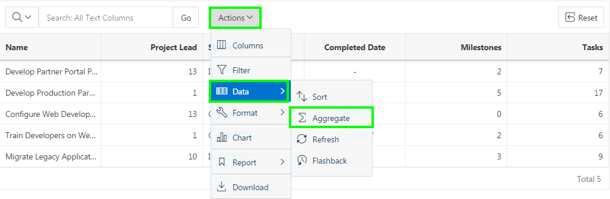

12.  In the Aggregation dialog

a)  Click the Add (**+**) button.

b)  For column, select **Milestones**, for Aggregation, select **Sum**, and select the **Show Overall Value** checkbox.

c)  Click the **Add** (+) button again.

d)  For Column, select **Tasks**, select **Sum for Aggregation**, and select the **Show Overall Value** checkbox.

e)  Click **Save**.
	    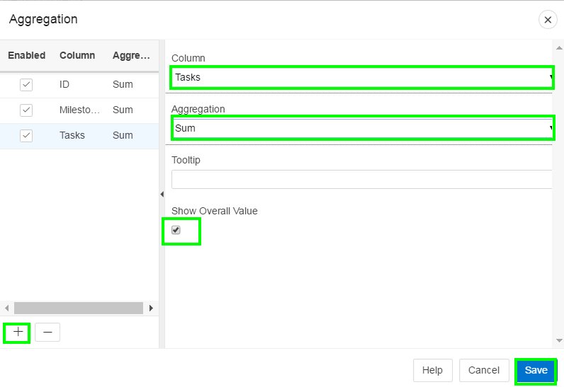

13.  You want to save the changes made to the primary interactive grid. **Select Actions &gt; Report &gt; Save**. The default report is now saved for all users.

14.  Navigate to page designer. In the Developer Toolbar, click **Edit Page 4**.

15.  You want to define a column link on the NAME column. Under Rendering &gt; Regions &gt; Demo Projects region, expand the **Columns** node. Select **NAME**.

16.  In the property editor, under Identification, select **Link** for Type. Under Link &gt; Target, click **No Link Defined**.
    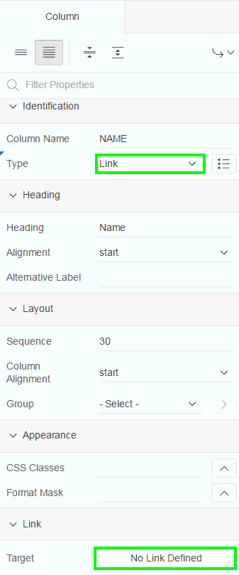

17.  In the Link Builder – Target dialog:

-   Page - enter **5**

-   Name - select **P5\_ID**

-   Value - select **\#ID\#**

-   Clear Cache - enter **5**

    Click **OK**. 
   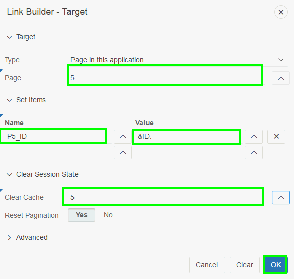
   
18.  For Link Text, under Link, use the quick pick to select **NAME**. 
    
    
19.  Click **Save**. Then, click **Save and Run Page**. The Demo Projects interactive grid might now look like:
    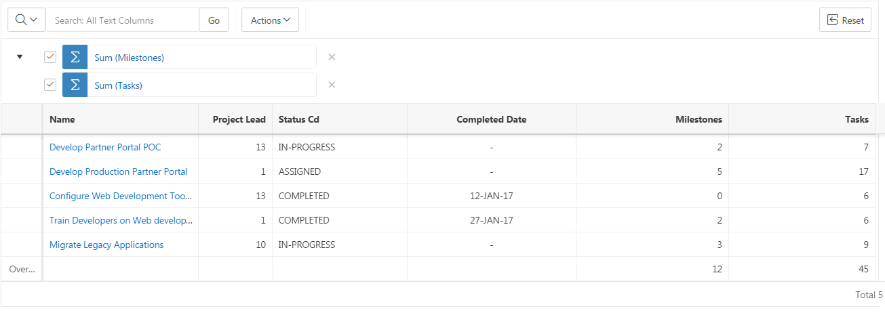

## HOL 7-3 Customizing the Milestones Interactive Grid

In this lab, you modify the interactive grid source query. Then, you customize the interactive grid by hiding columns that need not be displayed, and sorting the interactive grid on the Due Date column. You also create an aggregation on the Tasks column and save the customizations made to the Primary interactive grid.

1.  You are in the application runtime environment. In the navigation menu, click **Demo Proj Milestones**. In the Developer Toolbar, click **Edit Page 6**.

2.  Modify the existing Milestones Interactive Grid and update the SQL Query associated with the grid to add a new column. Under **Rendering &gt; Regions**, click the **Demo Proj Milestones** region.

3.  In the Property Editor, click the **Code Editor: SQL Query** button, and copy and paste the following SQL:

  
	      select
	      
	      "ID" ,
	      
	      "PROJECT_ID",
	      
	      "NAME",
	      
	      "DESCRIPTION",
	      
	      "DUE_DATE",
	      
	      "CREATED",
	      
	      "CREATED_BY",
	      
	      "UPDATED",
	      
	      "UPDATED_BY",
	      
	      (select count('x')
	      
	      from demo_proj_tasks t
	      
	      where t.milestone_id = m.id
	      
	      ) tasks
	      
	      from "DEMO_PROJ_MILESTONES" m
  

    Click **OK**.  
    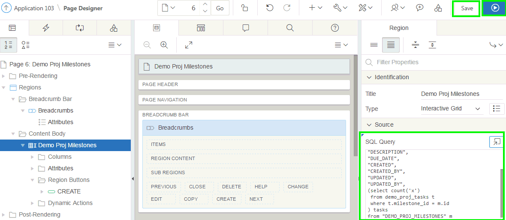

4.  Click **Save**. Then, click **Save and Run Page**.

5.  Reconfigure which columns are displayed by default in the Interactive Grid. In the Interactive Grid runtime window, click **Actions** and select **Columns**.

6.  In the Columns dialog, under Displayed, deselect **Description**, **Created**, **Created By**, **Updated**, and **Updated By**. Then, click **Save**.
    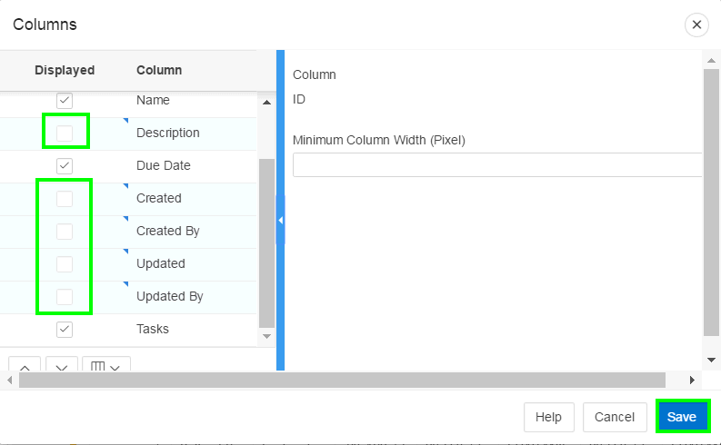

7.  Sort the interactive grid by Due Date in ascending order. Click the **Due Date** column and in the column heading, click the **Sort Ascending** button.
    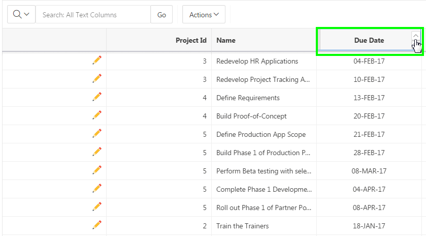

8.  Make the interactive grid functional by adding an aggregation. Create an aggregation on the Tasks column.

	a)  Click the **Actions** menu and select **Data &gt; Aggregate**. In the Aggregation dialog, click the Add button (**+**).
	
	b)  Select **Tasks** for Column, and **Sum** for Aggregation. Select the **Show Overall Value** checkbox and Click **Save**.
	    

9.  You want to save the changes made to the primary interactive grid. **Select Actions &gt; Report &gt; Save**. The default report is now saved for all users.

## HOL 7-4 Customizing the Tasks Interactive Grid

In this lab, you reconfigure which columns are displayed by default in the Demo Proj Tasks interactive grid. Then, you create control break on two columns, and sort the rows in the ascending order of Start Date. Finally, you save the default report for all users.

1.  You are in the application runtime environment. In the navigation menu, click **Demo Proj Tasks**. In the Developer Toolbar, click **Edit Page 8**.

2.  Reconfigure which columns are displayed by default in the Interactive Grid. Click **Actions &gt; Columns**.

3.  In the Columns dialog, under Displayed, deselect **ID**, **Description**, **Created**, **Created By**, **Updated**, and **Updated By**. Then, click **Save**.
    

    If the displayed columns are not in the following order, make sure to click the up and down buttons to set them accordingly:

	-   ID
	
	-   Assignee
	
	-   Name
	
	-   Start Date
	
	-   End Date
	
	-   Is Complete Yn

    Click **Save**.  

4.  Group the records by project and milestones.

	a)  Select **Actions &gt; Format &gt; Control Break**.
	    
	
	b)  In the Control Break dialog, click the Add (**+**) button. For Column, select **Project Id**.
	
	c)  Click the Add (**+**) button again. For Column, select **Milestone Id**.
	
	d)  Click **Save**. 
	    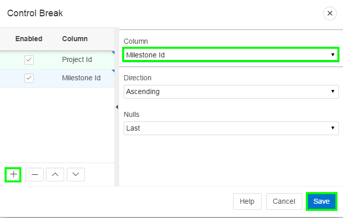

5.  Order the records in the ascending order of start date. Select **Actions &gt; Data &gt; Sort**.
    In the Sort dialog, click the Add (**+**) button.
    For Column, select **Start Date** and click **Save**.  
    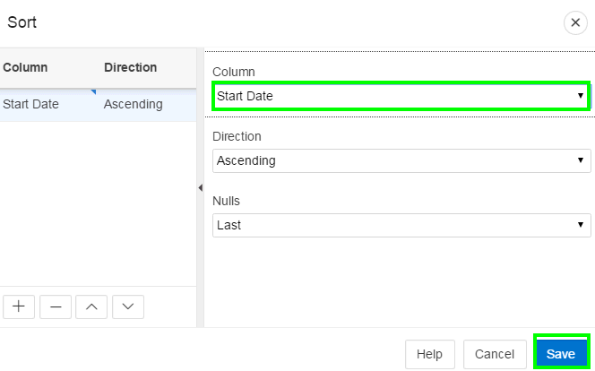

6.  You want to save the changes made to the primary interactive grid. **Select Actions &gt; Report &gt; Save**. The default report is now saved for all users.

## HOL 7-5: Customizing an Interactive Grid as a Developer

This lab uses the Budget App application. In this lab, you customize the interactive grid for end users. You create column groups, set pagination type, and set the report downloadable formats that should be available for end users. You also enable end users to save the report as Public interactive grids and convert a read only interactive grid to an editable interactive grid.

1.  Navigate to **App Builder** and run the **Budget App** application.
    

2.  In the navigation menu, click **Interactive Grid**. You want to customize the display of this interactive grid for your end users. In the Developer Toolbar, click **Edit Page 3**.
    
    

3.  You want to customize the display of this interactive grid for end users. Add column group headers to the interactive grid as:

	-   Work Breakdown: Project, Task\_Name columns
	
	-   Schedule: Start\_Date, End\_Date columns
	
	-   Project Financing: Cost, Budget columns

	a)  In the page designer, under Rendering &gt; Regions, navigate to Project Budget Interactive Grid region and right-click **Attributes**. Select Create **Column Group**.  
	    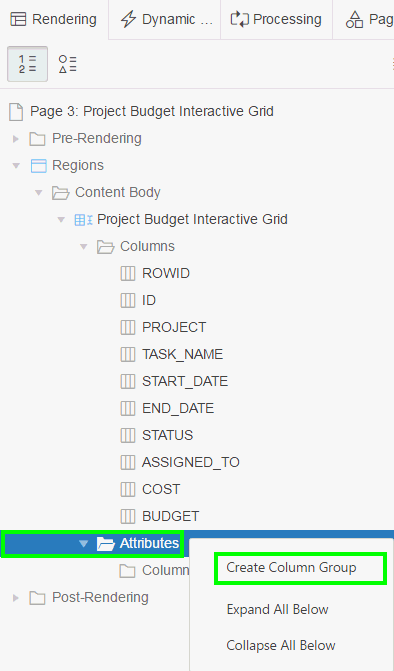   
	b)  In the Property Editor, enter **Work Breakdown** for Heading.  
	      
	
	c)  Repeat the above two steps a and b to create column groups: **Schedule** and **Project Financing**.
	
	d)  Now that you created column groups, you need to assign columns to them. Expand **Columns** and select **Project** and **Task\_Name** columns.
	
	e)  In the property editor, under Layout, select **Work Breakdown** for Group.
	    
	
	f)  Then, select Start\_Date and End\_Date columns. In the property editor, under Layout, select **Schedule** for Group.
	
	g)  Finally, select Cost, and Budget columns. In the property editor, under Layout, select **Project Financing** for Group.
	    Click **Save**. Then, click **Save and Run Page**.
	    
	
	h)  The interactive grid now displays column groups.
	    

4.  Rearrange the columns in the interactive grid. You want to display the column groups Work Breakdown, Schedule, and Project Financing display in order followed by Status and Assigned To.

	a)  Hover the mouse over the Project Financing column group header to display the drag handle. Your mouse cursor also changes when it comes into contact with the drag handle. Click and hold the drag handle.
	
	b)  Then, drag the column group to the Status column location. The heading shifts out of place in the row. The Project Financing column group should be followed by the Status column. Release the mouse. The Project Financing column group drops into place.
	    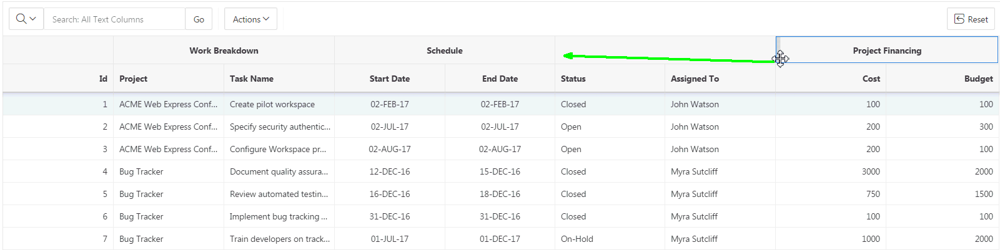

5.  Resize the width of the **Id** column. Click and hold the edge of the column heading and adjust with the mouse.
    

6.  You want to ensure that end users can save Public interactive grids. You want to exclude HTML from the download formats available to end users.

	a)  Under Rendering, select **Attributes** under the Project Budget Interactive Grid region.  
	    
	
	b)  In the property editor, under Attributes, navigate to Enable Users To. Select **Yes** for Save Public Report.
	
	c)  Under Download, deselect the **HTML** check box.  
	    

7.  Convert this read only interactive grid in to an editable interactive grid. Then, reset the pagination as Page type displaying the total row count.

	a)  Under Rendering, select **Attributes** under the Project Budget Interactive Grid region.
	
	b)  In the property editor, navigate to Edit. For Enabled, select **Yes**.
	
	c)  Under Pagination, select **Page** for Type and select **Yes** for Show Total Row Count.
	    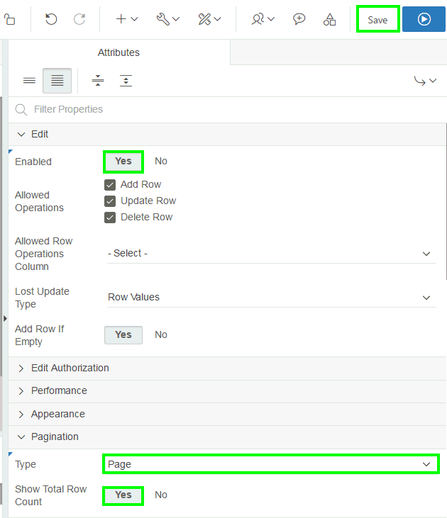

8.  Delete the column groups in the interactive grid. Under Rendering &gt; Project Budget Interactive Grid &gt; Attributes, expand Column Groups. Right-click **Project Financing** and click **Delete**. Similarly, delete the Schedule and Work Breakdown column groups.  
    

9.  Click **Save**. Then, click **Save and Run Page**.

## HOL 7-6: Customizing an Interactive Grid as an End User

In this lab, you use and customize the display of your interactive grid. You also edit an editable interactive grid.

1.  Notice that the interactive grid is editable now. You see the Edit, Save, and Add Row buttons. Also, the pagination type that you have set is displayed now. Perform a non-case-sensitive search for ‘server’ on the entire interactive grid. To do this, enter **server** in the search bar text area and click **Go**.\
    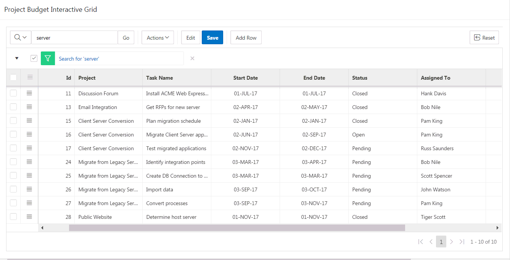

2.  Remove the filter by clicking the **X** icon.
    Now, in the search bar, click the magnifying glass and select **Task Name** column.
    Enter **server** in the text area and click **Go**. Notice that the search is now restricted only to the Task Name column.
    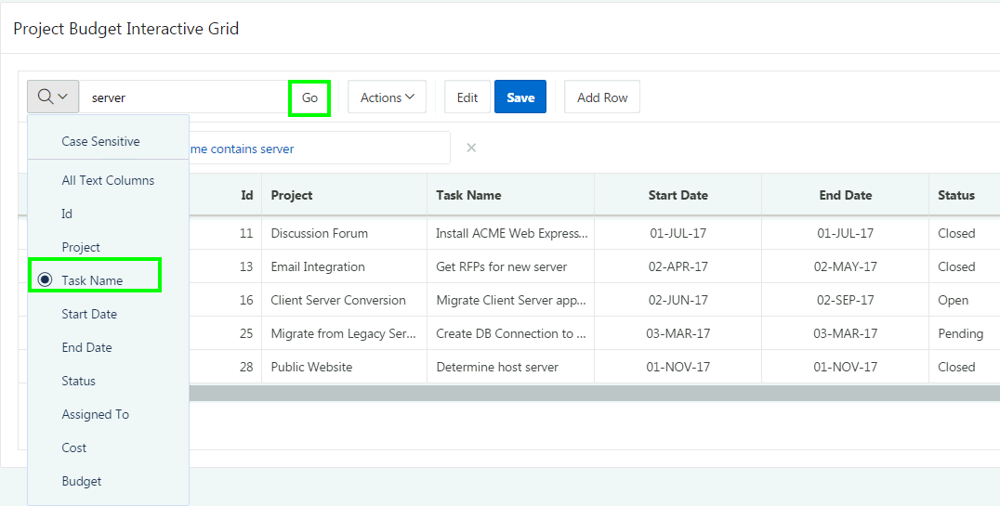

3.  Remove the filter by clicking the **X** icon. You want to update the budget for the Project with Id 1. Click the field and replace the existing value with **300**.
    

4.  The changes are not saved yet. Click the **Save** button.
    

	 The changes are saved now.
	 

5.  You want to update another row. This time, click the row header for the project with Id 2 and select **Single Row View**.
    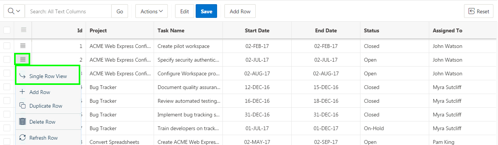

6.  You are now in the single row view of the project with Id 2. Click **Edit**.
    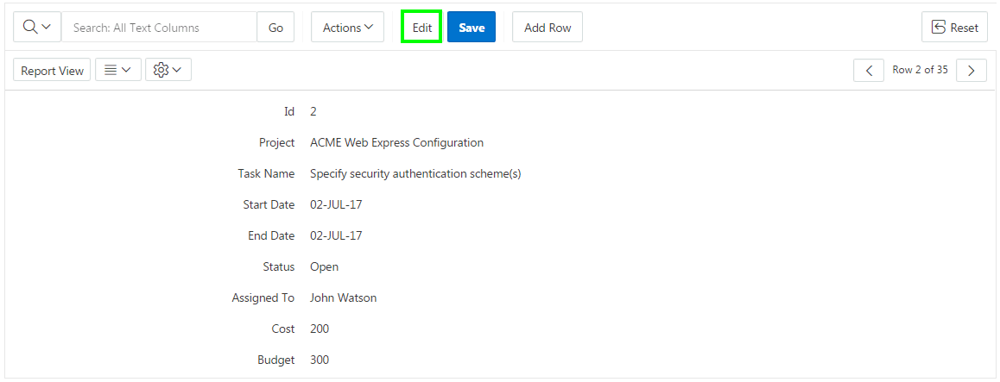

7.  Replace the existing value for Budget with **500** and click **Save**. Then, click **Report View**.
    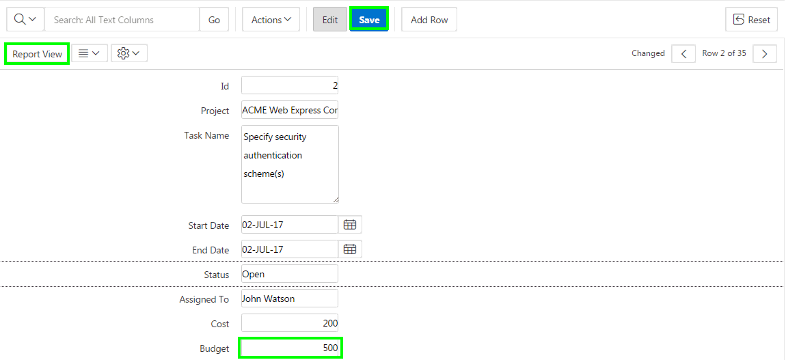

8.  The row now displays 500 for Budget. 

9.  Click **Add Row**. Enter values for all the columns. Click **Save**.
    

10.  Click the row header for the row that you just added and select **Delete Row**.
    

11.  You want to review the data that existed few minutes ago. Select **Actions &gt; Data &gt; Flashback**.
    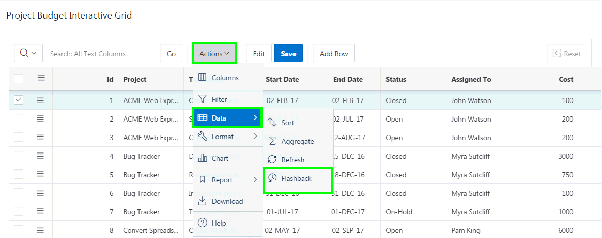

12.  Enter **5** for Minutes ago and click **Save**.  
    

13.  Notice the budget values for projects with Id’s 1 and 2.
    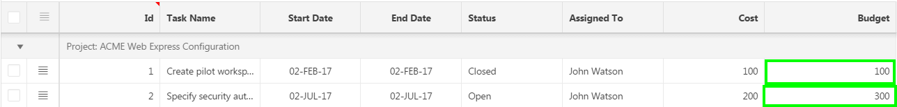

14. You want to create a control break on the Project column. Click **Actions &gt; Format &gt; Control Break**.
    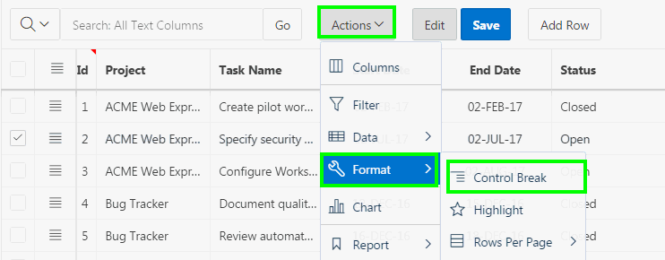

15. In the Control Break dialog, enter **Project** for Column and click **Save**.
    

16. The control break is now applied. You want to highlight rows that meet a condition. Select **Actions &gt; Format &gt; Highlight**.
    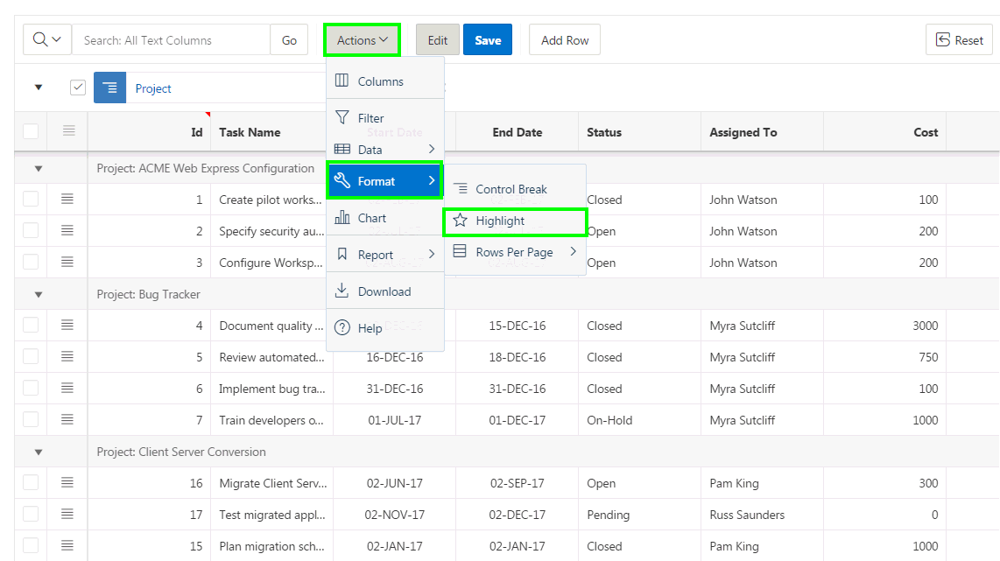

17. In the Highlight dialog:

	-   Name: Project costing greater than 750
	
	-   Background Color: Click **Colors** and select **Yellow**.
	
	-   Text Color: Click **Colors** and select **Red**.
	
	-   Column: Select **Cost**
	
	-   Operator: Select **greater than**
	
	-   Value: Enter **750**

    Click **Save**.
    

18.  Notice the rows with cost greater than 750 are highlighted.
    

19.  You want to save the changes made to the interactive grid. Select **Actions &gt; Report &gt; Save As**.
    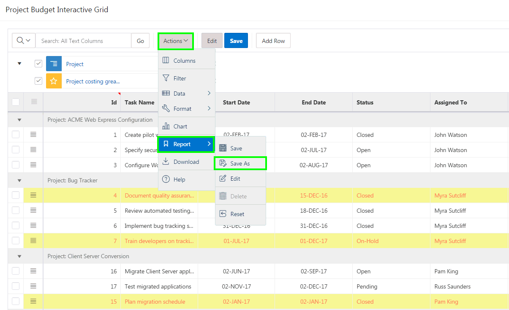

20.  In the Report – Save As dialog, select **Private** for Type. Enter **My Private Report** for Name.
    Click **Save**.
    

21.  Notice that the Primary interactive grid and the interactive grid you saved now are available in the Reports drop down list.
    You want to return back to the Primary interactive grid. Click **Primary Report** in the Reports drop down list.
    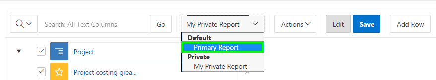
 
22.  You want to make few more customizations and save the interactive grid as another Private report. You do not want the Start Date, End Date, and Assigned To columns to be displayed in the report.  

   Click the **Start Date** column header and then click **Hide**.  
    
    
   Repeat this step for the **End Date** and **Assigned To** columns.
 
23.  Resize the columns’ width using the mouse. 
    

24.  You want to add a chart to the interactive grid. Select **Actions &gt; Chart**.  
      
 
25.  In the Chart dialog:

-   Type: Select **Bar**

-   Label: Select **Project**

-   Value: Select **Cost**

-   Aggregation: Select **Sum**

	 Click **Save**.
	 

26.  The chart is displayed. You want to save the customization made to the interactive grid. Select **Actions &gt; Report &gt; Save As**.
    

27.  In the Report – Save As dialog, select **Private** for Type. Enter **My Custom Report** for Name. Then, click **Save**.
    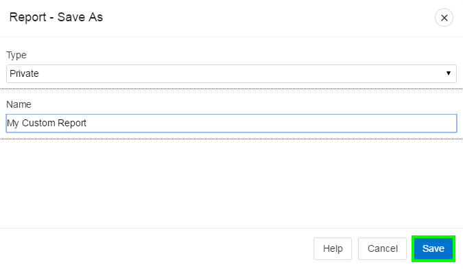

28.  The report is now saved under Private in the Reports drop down list. Click the Report View icon.
    You want to download the report. Select **Actions &gt; Download**.
    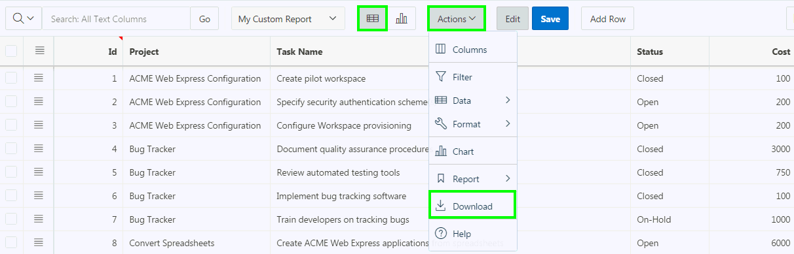

29.  Note that the HTML download option is no longer available. Select **CSV** and click **Download**.
    

30.  The report is now loaded as CSV. 
    

----------

