# Unit 9: Creating Application Page Controls

This exercise includes four hands-on-labs. The labs cover creating and updating page items, adjusting button properties, and making the form pages visually appealing. You also create and use Dynamic and Static List of Values.

**HOL 9-1 Updating the Team Members Pages**: In this hands-on lab, you update the page items on the form, and create a new collapsible sub-region to include the audit details.

**HOL 9-2 Updating the Projects Pages**: In this hands-on lab, you update the page items on the form, and create a new collapsible sub-region by copying it from another page in the application. You also create and use dynamic list of values.

**HOL 9-3 Updating the Milestones Pages**: This hands-on lab covers updating item properties, creating and using dynamic and static list of values.

**HOL 9-4 Updating the Tasks Pages**: In this hands-on lab, you create a new page item, update existing items on the form, and create a collapsible sub-region. You also use the list of values created as shared components.

## HOL 9-1 Updating the Team Members Pages

In this lab, you update the page items on the form page. You create an Audit Details collapsible sub-region on the form page. You make the form page visually appealing. This lab also covers updating the button properties and adjusting the button display on the interactive grid.

1.  Navigate to **App Builder** and run the **Demo Projects** application.
    In the navigation menu, click **Demo Proj Team Members**.
    In the Developer Toolbar, click **Edit Page 2**.

2.  By default, buttons are positioned in the region they are associated with. Move the Create button at the top of the page to the Breadcrumbs region. In the Rendering tree, locate the CREATE button under Content Body. Click and hold the **CREATE** button and drag it up into the Breadcrumbs region.  
    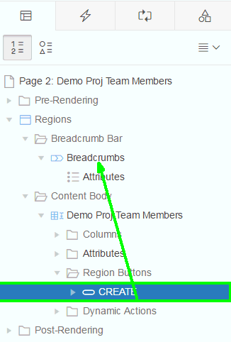

3.  The CREATE button will appear as a child within its own Region Buttons folder.
    

4.  In the Property Editor:

	-   Identification: Label - enter **Add Team Member**
	
	-   Layout: Button Position - select **Create**
	
	-   Appearance: Hot - select **Yes**

    Click **Save**. Then, click **Save and Run Page**.  
    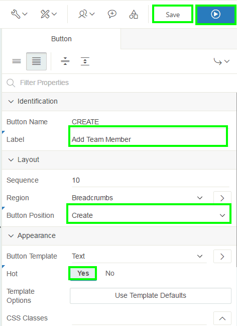

5.  Navigate back to page designer. You want to view Page 3 now. In the toolbar, click the **Navigate to next page** arrow.
    

6.  The generated page includes a page item for every column in the Demo\_Proj\_Team\_Members tables. You need to make the following changes:

	-   Make the Username and Full Name fields mandatory. If either of these fields are left blank when the record is saved, then an error message should display
	
	-   You expect users to enter multiple lines of information into the Profile field. Therefore, you need to convert the Profile item type to Textarea
	
	-   Alter the Photo Blob field to support file upload to a table
	
	-   Since the other photo fields are populated when a file is uploaded, these items must be hidden from users

    Perform the following steps:

	a)  In the Rendering tree, under Content Body, expand the **Items** node. Press and hold the Ctrl key to select more than one item. Select **P3\_USERNAME** and **P3\_FULL\_NAME** .
	
	b)  In the Property Editor, for Appearance &gt; Template, select **Required**.
	    For Validation &gt; Value Required, select **Yes**.
	    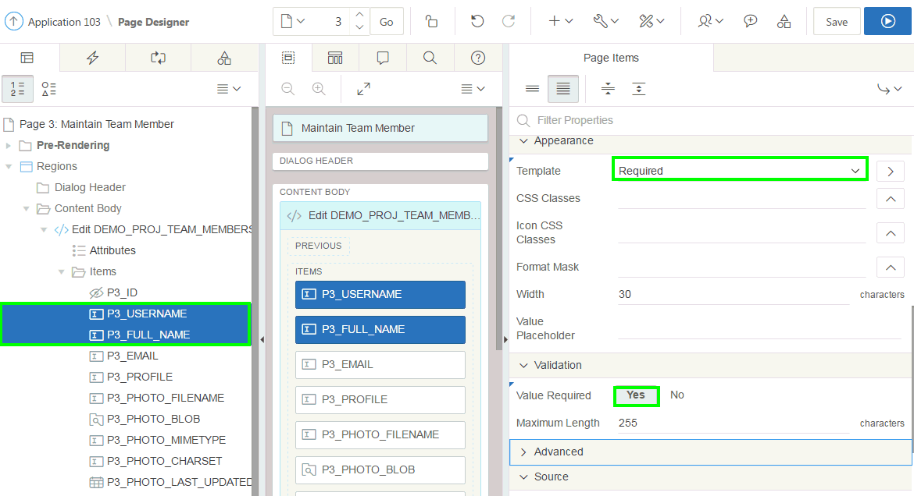
	
	c)  In the Rendering tree, click the **P3\_PROFILE** item.
	    In the Property Editor: Identification: Type - select **Textarea** 
	    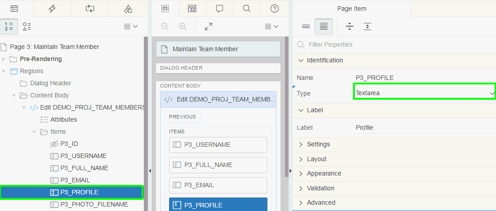
	
	d)  In the Rendering tree, click the P3\_PHOTO\_BLOB item. For Label, enter **Photo**.
	    
	
	e)  In the Layout, hold the Ctrl key and click these items to select more than one: **P3\_PHOTO\_FILENAME**, **P3\_PHOTO\_MIMETYPE**, **P3\_PHOTO\_CHARSET**, and **P3\_PHOTO\_LAST\_UPDATED**.
	    In the Property Editor under Identification, click the Type Quick Pick button and select **Hidden**.  
	    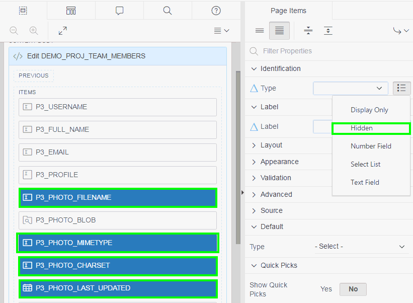

7.  The tables you created earlier include audit columns for storing when and who created and last updated each record. End users should never be allowed to enter data into these columns. Furthermore, these columns should not display when the user creates a new record.
    Given that audit information is only reviewed occasionally, it is preferable to add these columns into a separate, collapsible region, so they can be reviewed when necessary, but do not take up excessive screen real estate the majority of time.
    Reconfigure the audit columns to be *Display Only* and place them in a conditional sub-region.
    In the Rendering tree, right-click **Edit DEMO\_PROJ\_TEAM\_MEMBERS** and select **Create Sub Region**.
    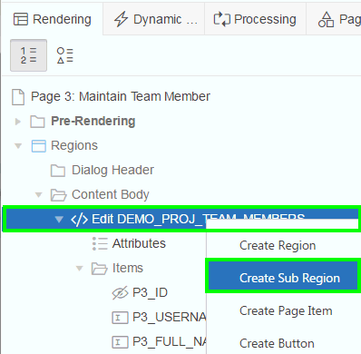

8.  In the Property Editor, for the New region: Identification: Title - enter **Audit Details**.
    For Appearance&gt;Template, select **Collapsible**.
    Click **Use Template Defaults, Expanded, Scroll-Default**.
    

9.  In the Template Options dialog, select **Collapsed** for Default State.
    Select **Remove UI Decoration** for Style, and click **OK**.
    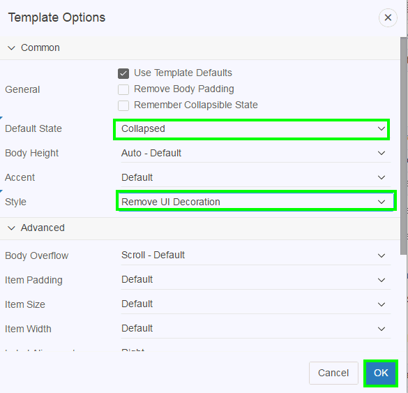

10.  In the property editor, navigate to Server-side Condition. For Type, select **Item is NOT NULL**. Select **P3\_ID** from the Item list.
    

11.  Move the audit columns into the new region. From the Rendering tree or Grid Layout, hold the Ctrl key and click these items to select them: **P3\_CREATED**, **P3\_CREATED\_BY**, **P3\_UPDATED**, and **P3\_UPDATED\_BY**.
    In the property editor, for Identification &gt; Type, select **Display Only**.
    For Layout &gt; Region, select **..Audit Details**.
    Click **Save**.
    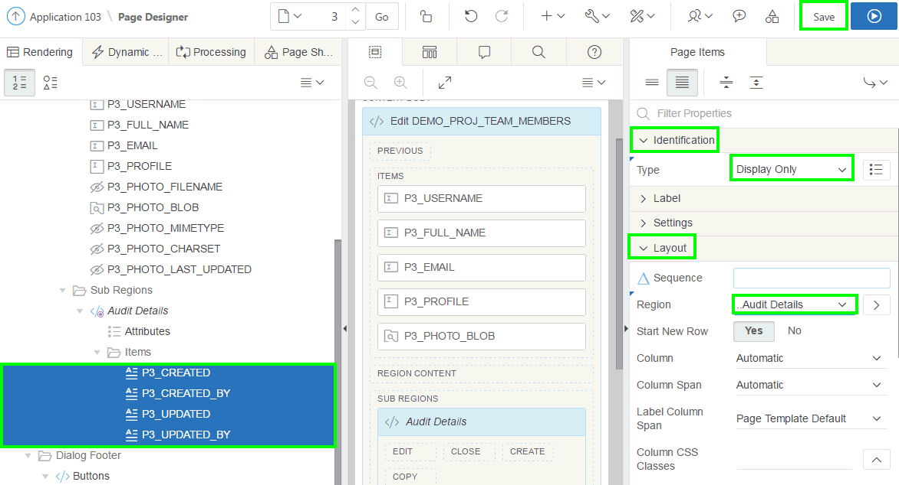

12.  Page 3 is a dialog and so you cannot run it directly. Navigate to the application runtime environment. In the navigation menu, click **Demo Proj Team Members**.
    Notice the **Add Team Member** button.
    In the report, select a team member record to view the improved modal dialog.
    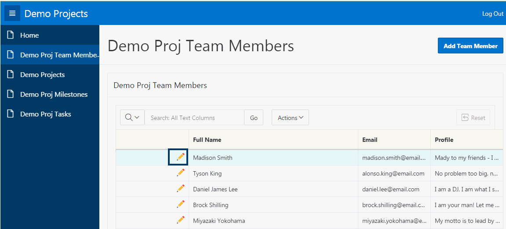
    

## HOL 9-2 Updating the Projects Pages

In this lab, you update the page items on the form page. This lab covers creating and using List of Values. You create both static and dynamic list of values. You create an Audit Details collapsible sub-region on the form page.

1.  In the application runtime environment, click **Demo Projects**.
    Then, in the Developer toolbar, click **Edit Page 4**.

2.  The Project Lead column is currently displaying an identifier instead of the team member's name. Defining a List of Values within Shared Components enables the same control to be used on this page and also the form page for projects.
    In Page Designer, click the **Shared Components** button, found on the right side of the toolbar (not in the Rendering tree).
    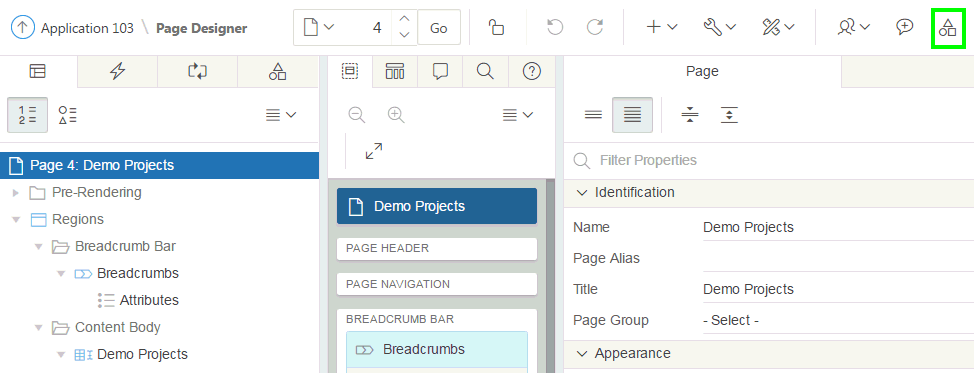

3.  Under Other Components, click **List of Values**.
    

4.  Then, click **Create**.

5.  For Create List of Values, select **From Scratch** and click **Next**.

6.  Enter **Team Members** for Name, select **Dynamic** for Type, and click **Next**.
    

7.  For Query, replace the existing SQL with the following and click **Create List of Values**.

	     select full_name as display,
	     id as return 
	     from demo_proj_team_members   
	     order by 1                                 

    

8.  Click **Edit Page 4** on the toolbar, to return to Page Designer.
    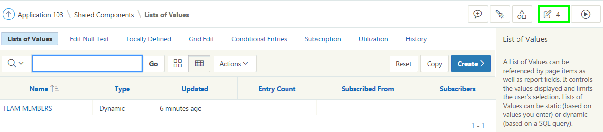

9.  In the Rendering tree, expand the **Columns** node under the DEMO\_PROJECTS region.
    Click the **PROJECT\_LEAD** column.

10.  In the property editor:

   -   Identification &gt; Type: select **Select List**
   -   Heading &gt; Alignment: select **Start**
   -   Layout &gt; Column Alignment: select **Start**
   -   List of Values &gt; Type: select **Shared Component**
   -   List of Values: select **Team Members**
    Click **Save**.
    

11.  It would look more aesthetically pleasing to place the Create button at the top of the page.
    In the Layout, locate the Breadcrumbs region. Note that there are several elements surrounded by dotted lines. These are placeholders for buttons.
    Locate the DEMO\_PROJECTS region. Click and hold the **Create** button and drag it up to the Breadcrumbs region and into the Create placeholder.
    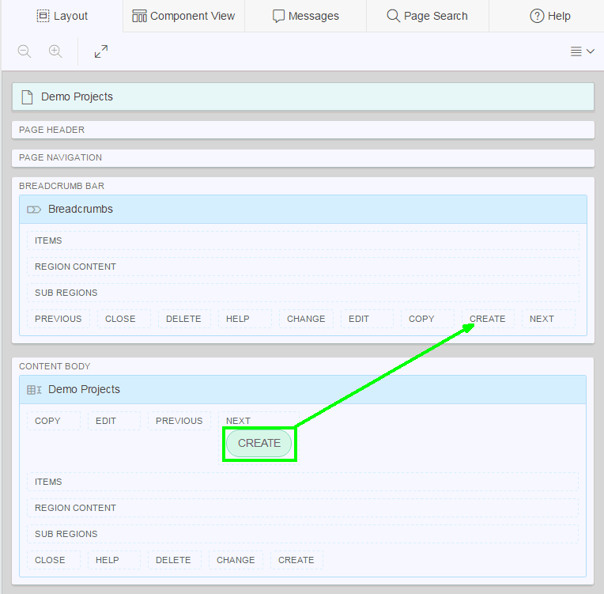
    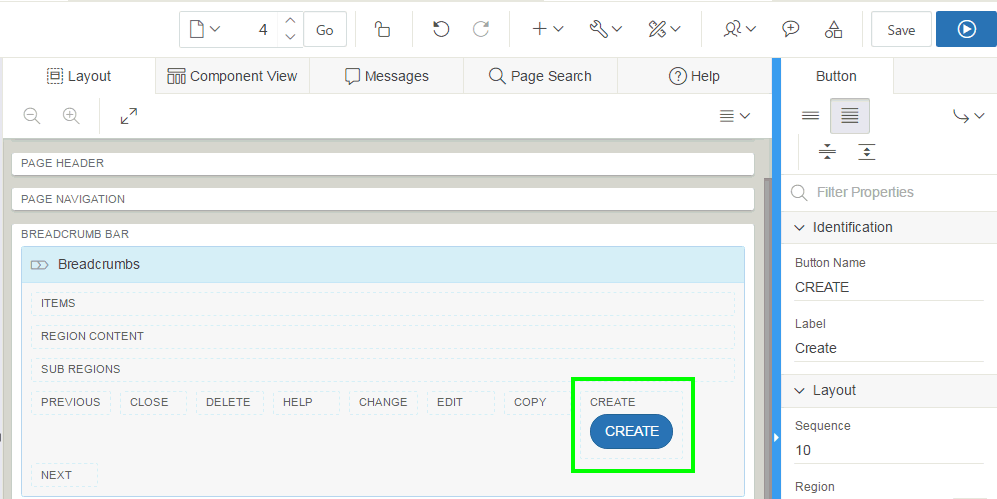

12.  In the property editor, enter **Create Project** for label.
    Under Appearance, select **Yes** for Hot.

13.  Click **Save**. Then, click **Save and Run Page**.

14.  Your screen might look like:
    

15.  You need to update page items on the Maintain Project form page. Click a project name and then in the Developer Toolbar, click **Edit Page 5**.

16.  In the Layout, under Content Body, click the **P5\_NAME** item. In the Property Editor:

	-   Appearance: Template – select **Required**
	
	-   Appearance: Width – enter **60**
	
	-   Validation: Value Required – select **Yes**
	    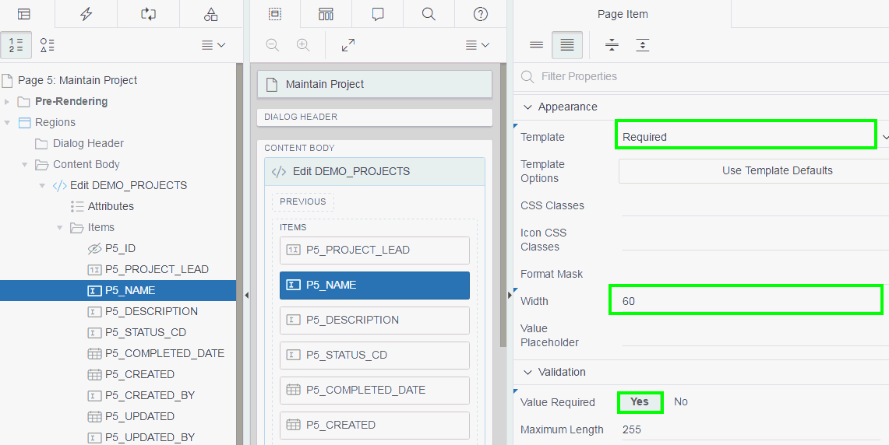

17.  In the Layout, under Content Body, click the **P5\_DESCRIPTION** item. In the Property Editor:

   -   Identification: Type – select **Text Area**
	
   -   Appearance: Width – enter **70**  
    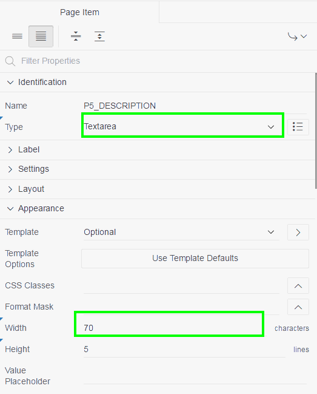

18.  In the Layout, under Content Body, click the **P5\_PROJECT\_LEAD** item. In the Property Editor:

   -   Identification: Type– select **Select List**
	
   -   List of Values: Type – select **Shared Component**
	
   -   List of Values: List of Values – select **Team Members**
	
   -   List of Values: Display Extra Values – select **No**
	
   -   List of Values: Null Display Value – enter **-Select Team Member-**
    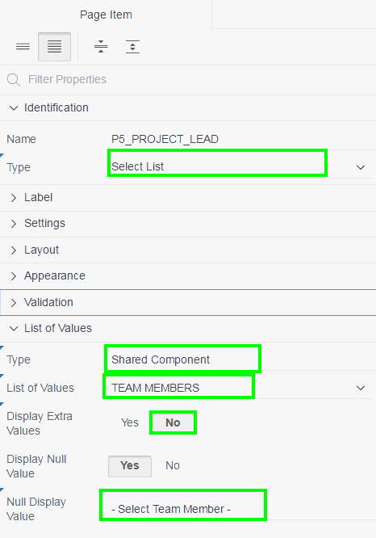

19.  Next define a static list of statuses. You can not define a dynamic list, as you did for TEAM\_MEMBERS, as there is no separate table which stores the statuses. In the Layout, locate the **P5\_STATUS** item.
    In the Property Editor:

   -   Identification: Type: select **Select List**

   -   List of Values: Type: select **Static Values**

   -   List of Values: Static Values – enter **STATIC2:Assigned,In-Progress,Completed**

   -   List of Values: Display Extra Values – select **No**

   -   List of Values: Display Null Value – select **No**

   **Note**: By specifying STATIC2 the records will be displayed in the order entered, rather than in alphabetic order.

   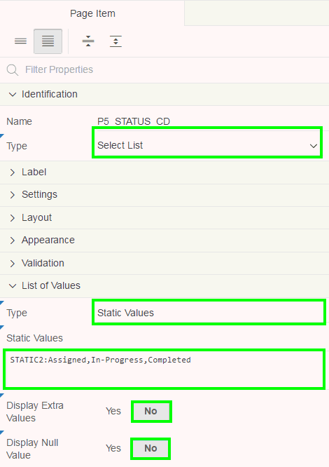

20.  Click the **P5\_COMPLETED\_DATE** item.
    In the property editor, under Appearance, select **Required** for Template.
    Then, click **Save**.  
    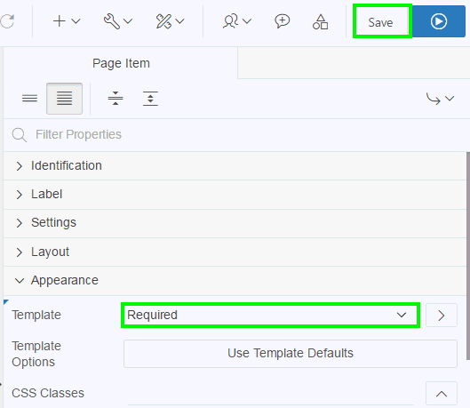

21.  In the lab HOL 9-1, you created a sub-region called Audit Details for the Maintain Team Member page (Page 3). Since the four items included in that region are the same as those on the Maintain Project page and are associated with the exact same database columns, you can copy them to the Maintain Project page. This approach is easier than creating a new region and updating the items. Copying the region will also copy the previously defined template and template options.  
    Delete the four audit items before copying the Audit Details region to this page. If you do not delete them, the item names in the copied Audit Details region will be renamed with a unique name (for example, P5\_CREATED will be renamed to P5\_CREATED\_1) to ensure all page items have unique names. Although this renaming will not break the page processing, Oracle does not recommend this approach.  
    In the Layout, hold the Ctrl key and select the items: **P5\_CREATED**, **P5\_CREATED\_BY**, **P5\_UPDATED**, and **P5\_UPDATED\_BY**.  
  Then, right-click and select **Delete**.  
  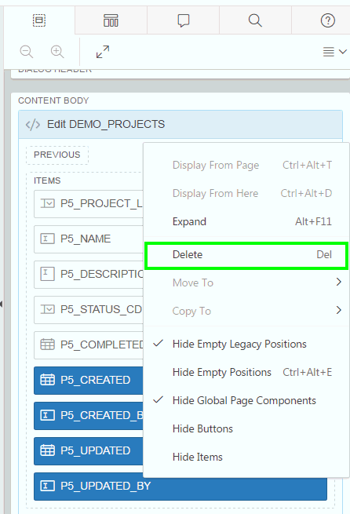
 
 Click **Save**.  

22.  In page designer, navigate to **Page 3**.

23.  In the Rendering tree, right-click the **Audit Details** sub region and select **Copy to other Page....**
    

24.  Enter **5** for To Page and select **Yes** for Copy Region Items. Click **Next**.
    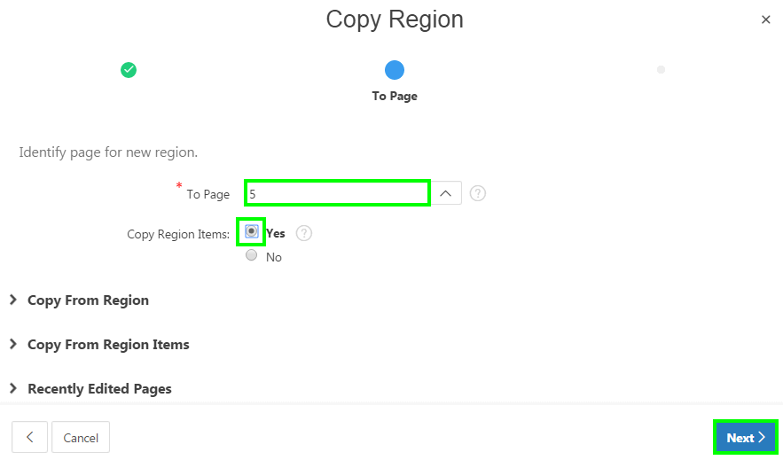

25.  Click **Copy**.
    

26.  In Page Designer, navigate back to **Page 5**.

27.  In the Rendering tree, select the **Audit Details** sub region.
    In the Property Editor, for Layout: Parent Region select **Edit DEMO\_PROJECTS**.
    

28.  Now, reposition the buttons. Under Rendering &gt; Buttons &gt; Region Buttons, select **CANCEL**. In the property editor, for Layout: Button Position select **Previous**.
    Click **Save**.
    

29. Navigate to the Demo Projects application runtime environment.
    In the navigation menu, click **Demo Projects**.
    Click a project name. Notice the modified dialog. Expand the Audit Details node.
    

## HOL 9-3 Updating the Milestones Pages

In this lab, you update the page items on the form page. You create the Audit Details collapsible sub-region by copying it from another page in the application. You make the form page visually appealing. This lab also covers creating and using list of values.

1.  In the Demo Projects application runtime environment, click **Demo Proj Milestones** in the navigation menu.
    In the Developer Toolbar, click **Edit Page 6**.

2.  The Project Id column is currently displaying an identifier instead of the project name. Defining a List of Values within Shared Components enables the same control to be used on this page, the form page for milestones, and the task pages.
    In Page Designer, click **Shared Components** found on the right on the toolbar.

3.  Under Other Components, click **List of Values**.

4.  Click **Copy**.
    

5.  Select **Team Members-Dynamic** from Copy List of Values.
    Enter **Projects** for New List of Values Name.
    Click **Copy**.

6.  Click the Projects List of Values entry.
    

7.  For Query, replace the existing SQL with the following.

  
	      select name as display
	      
	      , id as return
	      
	      from demo_projects
	      
	      order by 1
  

    Click **Apply Changes**.

8.  Click **Edit Page 6** on the toolbar, to return to Page Designer.
    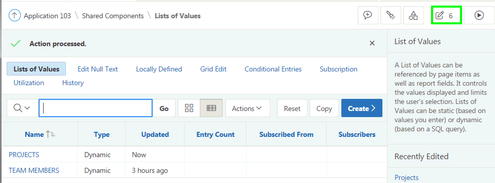

9.  In the Rendering tree, expand the Columns node under the DEMO\_PROJ\_MILESTONES region.
    Select the **PROJECT\_ID** column.
    In the Property Editor:

	-   Identification: Type - select **Select List**
	
	-   List of Values: Type - select **Shared Component**
	
	-   List of Values: List of Values - select **PROJECTS**
	
	-   Heading: Heading - enter **Project**
	
	-   Layout: Column Alignment - select **start**

     
    

10. The Name column is ambiguous and should be relabeled.
    In the Rendering tree, click the Name column.
    In the Property Editor, for Heading enter **Milestone**.

11.  Reposition the CREATE button to the top of the page.
    Locate the DEMO\_PROJ\_MILESTONES region and select the **Create** button.

12.  In the Property Editor:

   -   Identification: Label - enter **Create Milestone**
	
   -   Layout: Region - select **Breadcrumbs**
	
   -   Layout: Button Position - select **Create**
	
   -   Appearance: Hot - select **Yes**

   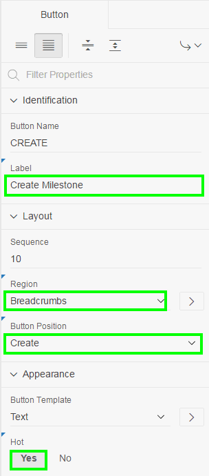

13.  Click **Save**. Then, click **Save and Run Page**.
    

14.  Click a project name. In the Developer Toolbar, click **Edit Page 7**.

15.  Update the page items. Under Rendering, expand Items, select the **P7\_PROJECT\_ID** item. In the Property Editor:

-   Identification: Type - select **Select List**

-   Label: Label - enter **Project**

-   Appearance: Template - select **Required**

-   Validation: Value Required - select **Yes**

-   List of Values: Type - select **Shared Component**

-   List of Values: List of Values - select **PROJECTS**

-   List of Values: Display Extra Values - select **No**

-   List of Values: Null Display Value - enter **– Select Project –**  

   
 

16.  In the Rendering tree, select the **P7\_NAME** item. In the Property Editor:

-   Label: Label - enter **Milestone**

-   Appearance: Template - select **Required**

-   Appearance: Width - enter **60**

-   Validation: Value Required - select **Yes**

17.  In the Layout, select the **P7\_DESCRIPTION** item. In the Property Editor:

-   Identification: Type - select **Textarea**

-   Appearance: Width - enter **70**

18.  Delete the four audit items from the Maintain Milestone page. Under Rendering, hold the Ctrl key and select the items: **P7\_CREATED**, **P7\_CREATED\_BY**, **P7\_UPDATED**, and **P7\_UPDATED\_BY**.
    Then, right-click and select **Delete**.
    
    Click **Save**.

19.  Copy the Audit Details region from Page 3 to Page 7. In page designer, navigate to **Page 3**.

20.  In the Rendering tree, right-click the **Audit Details** sub region and select **Copy to other Page....**
    

21.  Enter **7** for To Page and select **Yes** for Copy Region Items. Click **Next**.

22.  Click **Copy**.

23.  In Page Designer, navigate back to **Page 7**.

24.  In the Rendering tree, select the **Audit Details** sub region. In the Property Editor, for Layout: Parent Region select **Edit DEMO\_PROJ\_MILESTONES**.  
    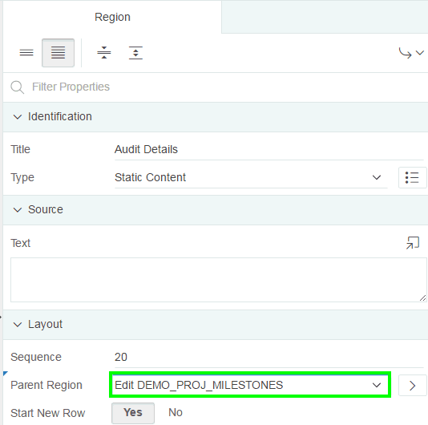

25.  Now, reposition the buttons. Under Rendering &gt; Buttons &gt; Region Buttons, select **CANCEL**. In the property editor, for Layout: Button Position select **Previous**.

26.  Click **Save**.
    Navigate to the application runtime environment and click **Demo\_Proj\_Milestones**.
    Click any milestone to see the modified dialog.
    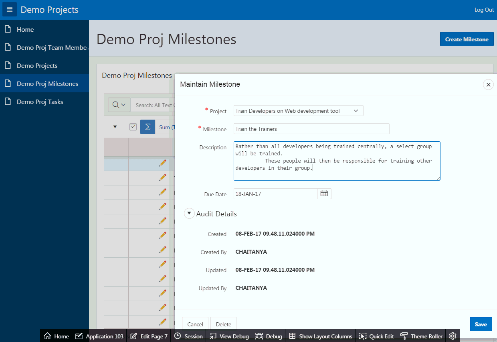

## HOL 9-4 Updating the Tasks Pages

In this lab, you update the page items on the form page. You use list of values created as shared components. This lab also covers creating a new page item on the form page. You make the form page visually appealing.

1.  In the Demo Projects application runtime environment, click Demo Proj Tasks in the navigation menu.
    In the Developer Toolbar, click **Edit Page 8**.

2.  The Project Id, Milestone Id, and Assignee columns are currently displaying identifiers instead of the names. You already created a List of Values for projects and assignees (Team Members). Therefore, you only need to create a List of Values for milestones.
    In Page Designer, click **Shared Components** found on the right on the toolbar.

3.  Under Other Components, click **List of Values**.

4.  Click **Copy**.

5.  Select **Projects-Dynamic** from Copy List of Values.
    Enter **Milestones** for New List of Values Name.
    Click **Copy**.
    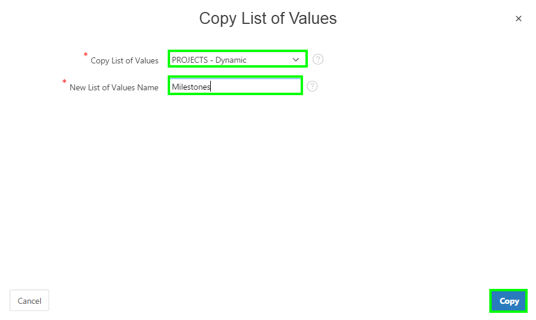

6.  Click the **Milestones** List of Values entry.

7.  For Query, replace the existing SQL with the following.

 
		  select name as display
		  
		  , id as return
		  
		  from demo_proj_milestones
		  
		  order by 1
     
      
    Click **Apply Changes**.

8.  Click **Edit Page 8** on the toolbar, to return to Page Designer.

9.  In the Rendering tree, locate the DEMO\_PROJ\_TASKS region. Expand the **Columns** node, and click the **ASSIGNEE** column. In the Property Editor:

	-   Identification: Type - select **Select List**
	
	-   List of Values: Type - select **Shared Component**
	
	-   List of Values: List of Values - select **TEAM MEMBERS**
	
	-   Layout: Column Alignment - select **start**

    

10.  In the Rendering tree, click the **PROJECT\_ID** column. In the Property Editor:

	-   Identification: Type - select **Select List**
	
	-   List of Values: Type - select **Shared Component**
	
	-   List of Values: List of Values - select **PROJECTS**
	
	-   Heading: Heading - enter **Project**
	
	-   Layout: Column Alignment - select **start**

11.  In the Rendering tree, click the **MILESTONE\_ID** column. In the Property Editor:

	-   Identification: Type - select **Select List**
	
	-   List of Values: Type - select **Shared Component**
	
	-   List of Values: List of Values - select **MILESTONES**
	
	-   Heading: Heading - enter **Milestone**
	
	-   Layout: Column Alignment - select **start**

12.  The Name column is ambiguous and should be relabeled. In the Rendering tree, click the **NAME** column.
    In the Property Editor, for Heading enter **Task.**

13.  The IS\_COMPLETE\_YN column should be relabeled and the values should be Yes / No, rather than Y / N. To change the displayed value, you can either modify the SQL Source for the report, or define a List of Values.
    In the Rendering tree, select the **DEMO\_PROJ\_TASKS** region.

14.  For the SQL Query, replace "IS\_COMPLETE\_YN", with the following:

      
      `decode (IS\_COMPLETE\_YN, 'Y', 'Yes', 'No') as "IS\_COMPLETE\_YN",`
      

   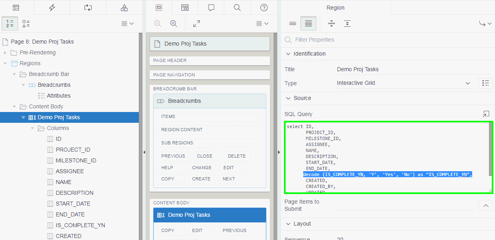

15.  In the Rendering tree, click the **IS\_COMPLETE\_YN** column.
    In the Property Editor, for Heading enter **Completed?**

16.  Reposition the CREATE button to the top of the page. Locate the **DEMO\_PROJ\_TASKS** region.
    Select the **Create** button.
    In the Property Editor:

-   Identification: Label - enter **Create Task**

-   Layout: Region - select **Breadcrumbs**

-   Layout: Button Position - select **Create**

-   Appearance: Hot - select **Yes**

    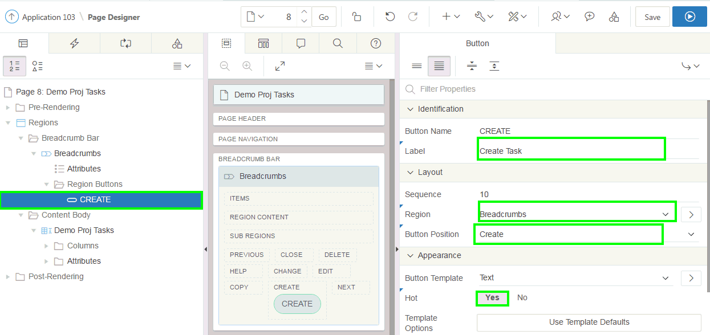

17.  Click **Save**. Then, click **Save and Run Page**.

18.  In the interactive grid, rearrange the Task and Assignee columns so that Task is displayed first followed by Assignee.
    Then, click **Actions &gt; Report &gt; Save**. The default report is saved for all users.

19.  Your screen should look like:
    

20.  In the interactive grid, click a task. Then, in the Developer Toolbar, click **Edit Page 9**.

21.  Update the page items. The first requirement is to shuffle the page items, using drag and drop in either the Rendering tree or the Layout, such that the items are in the following order:

-   P9\_PROJECT\_ID

-   P9\_MILESTONE\_ID

-   P9\_NAME

-   P9\_DESCRIPTION

-   P9\_ASSIGNEE

-   P9\_START\_DATE

-   P9\_END\_DATE

-   P9\_IS\_COMPLETE\_YN

    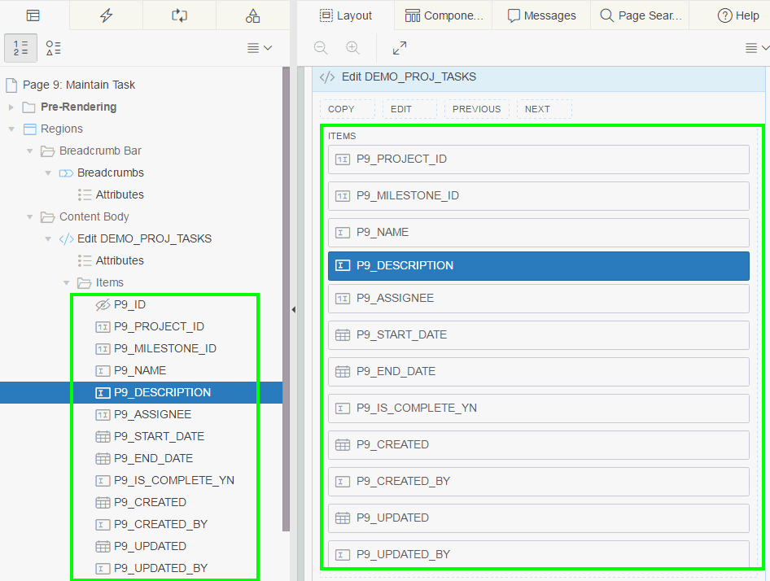

22.  Under Rendering, select the **P9\_PROJECT\_ID** item. In the Property Editor:

	-   Identification: Type - select **Select List**
	
	-   Label: Label - enter **Project**
	
	-   Appearance: Template - select **Required**
	
	-   Validation: Value Required - select **Yes**
	
	-   List of Values: Type - select **Shared Component**
	
	-   List of Values: List of Values - select **PROJECTS**
	
	-   List of Values: Display Extra Values - select **No**
	
	-   List of Values: Null Display Value - enter **– Select Project –**

23.  The Milestones item should be defined as a Cascading List of Values, whereby only the milestones for the currently selected Project item are displayed. In the Layout, under Content Body, click the **P9\_MILESTONE\_ID** item. In the Property Editor:

	-   Identification: Type - select **Select List**
	
	-   Label: Label - enter **Milestone**
	
	-   List of Values: Type - select **SQL Query**
	
	-   List of Values: SQL Query - cut and paste the following:

  
		      select name as display, id as return

		      from demo_proj_milestones

		      where project_id = :P9_PROECT_ID

		      order by 1
     

	-   List of Values: Display Extra Values - select **No**
	
	-   List of Values: Null Display Value - enter **- Select Milestone -**
	
	-   List of Values: Cascading LOV Parent Item(s) - select **P9\_PROJECT\_ID**

   **Note**: You cannot use the MILESTONES List of Values for this item, as this query needs to limit the milestone records returned to those for the selected project, using P9\_PROJECT\_ID.  
    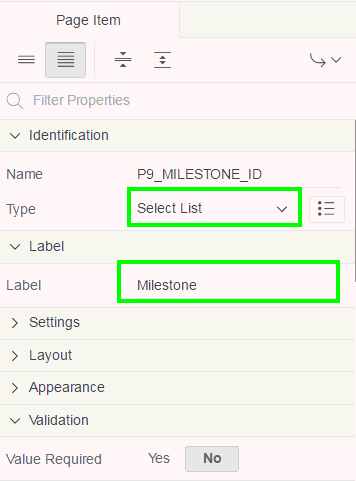 
    

24.  In the Rendering tree, click the **P9\_NAME** item. In the Property Editor:

	-   Label: Label - enter **Task**
	
	-   Appearance: Template - select **Required**
	
	-   Appearance: Width - enter **60**
	
	-   Validation: Value Required - select **Yes**

25.  In the Layout, click the **P9\_DESCRIPTION** item. In the Property Editor:

	-   Identification: Type - select **Textarea**
	
	-   Appearance: Width - enter **70**

26.  In the Grid Layout, under Content Body, click the **P9\_ASSIGNEE** item. In the Property Editor:

	-   Identification: Type - select **Select List**
	
	-   List of Values: Type - select **Shared Component**
	
	-   List of Values: List of Values - select **TEAM\_MEMBERS**
	
	-   List of Values: Display Extra Values - select **No**
	
	-   List of Values: Null Display Value - enter **- Select Assignee –**

27.  In the Rendering tree, click the **P9\_IS\_COMPLETE\_YN** item. In the Property Editor:

-   Identification: Type - select **Switch**

-   Label: Label - enter **Completed?**

    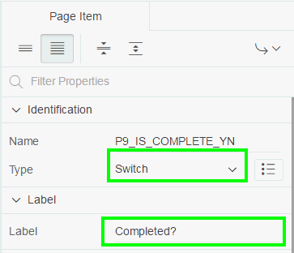

28.  Delete the four audit items from the Maintain Milestone page. In the Rendering tree, hold the Ctrl key and click these to select them all: **P9\_CREATED**, **P9\_CREATED\_BY**, **P9\_UPDATED**, and **P9\_UPDATED\_BY**.
    Then, right-click and select **Delete**.

29.  Click **Save**.

30.  Copy the Audit Details region from Page 3 to Page 9. In page designer, navigate to **Page 3**.

31.  In the Rendering tree, right-click the **Audit Details** sub region and select **Copy to other Page....**
    

32.  Enter **9** for To Page and select **Yes** for Copy Region Items. Click **Next**.

33.  Click **Copy**.

34.  In Page Designer, navigate back to **Page 9**.

35.  In the Rendering tree, select the **Audit Details** sub region.
    In the Property Editor, for Parent Region select **Edit DEMO\_PROJ\_TASKS**.
    Click **Save**.

36.  Given that the Maintain Task page is a normal page, rather than a modal page, you can simply click **Save and Run Page** to review the page.
    

37.  The Maintain Task displays the region title Edit DEMO\_TASKS and also has a border around the region. Click **Edit Page 9** in the Develop Toolbar, to return to Page Designer.

38.  In the Rendering tree, click the **Edit DEMO\_TASKS** region. In the Property Editor, click the Template Options button.
    

39. In the Template Options dialog, input the following:

	-   Header - select Hidden but accessible
	
	-   Style - select Remove UI Decoration

    Click **OK**.
    

40.  It would also be beneficial to include the Milestone Due Date on the page so it can be compared to the Task End Date. To facilitate this add a display only item and then populate the item based on the selected Milestone.
    In the Layout, click the bottom divider to display the Gallery. In the Gallery, click **Items** and locate **Display Only**.
    

41.  Click and hold **Display Only** and drag it to the left of the **P9\_MILESTONE\_ID** in the Layout.

   You will need to hover to the left of the existing item before the dark yellow box displays next to the existing item.
    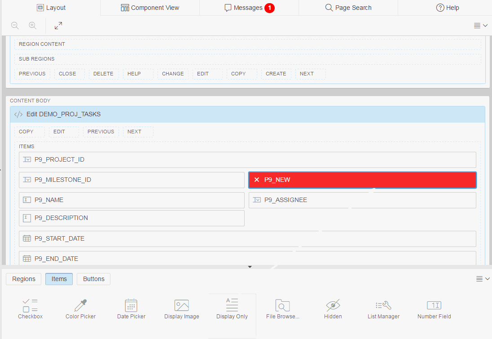

42.  Set the attributes for the new item. In the Property Editor:

	-   Identification: Name - enter **P9\_MILESTONE\_DUE\_DATE**
	
	-   Label: Label - enter **Due Date**
	
	-   Settings: Save Session State - select **No**
	
	-   Source: Type - select **Null**

   **Note**: This item is display only and is not based on a Database Column. As such it is very important to not save session state for this item and to set the source type appropriately. 
    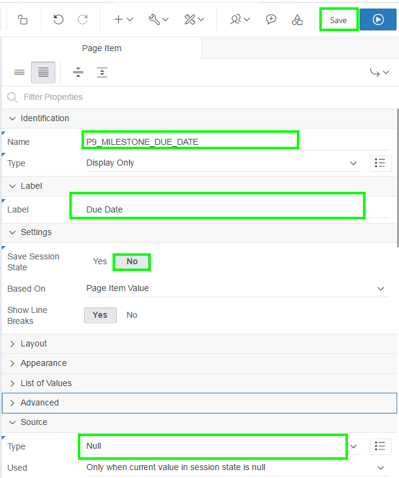

----------

