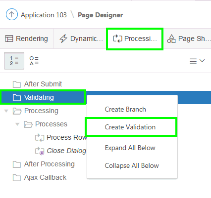
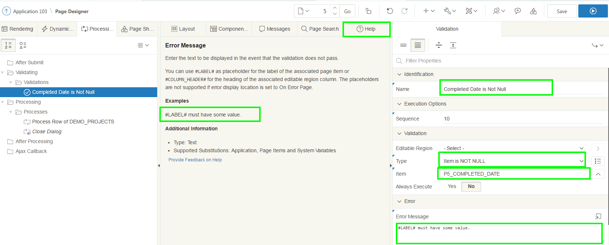
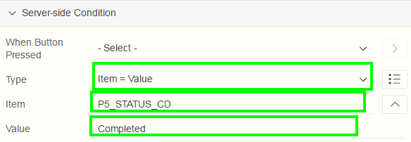
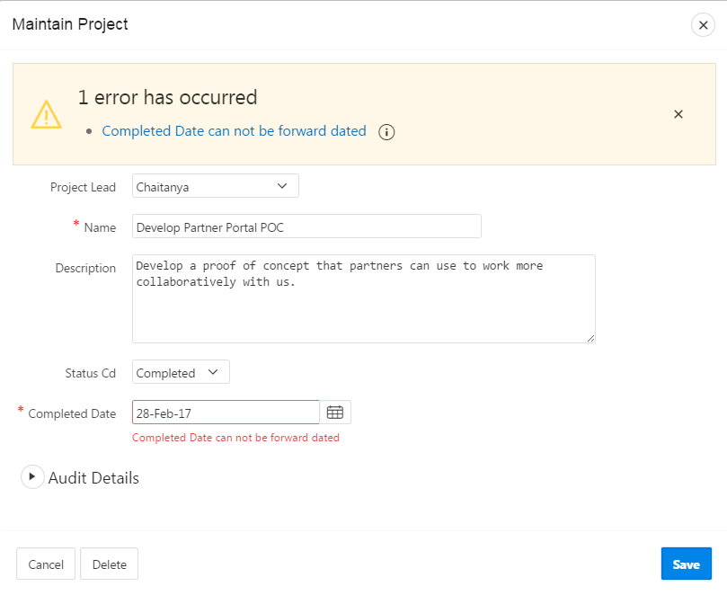
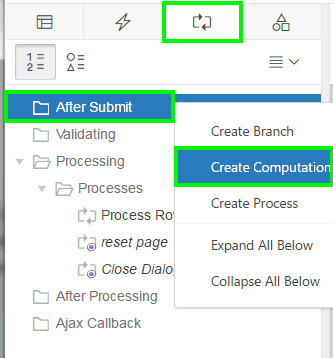
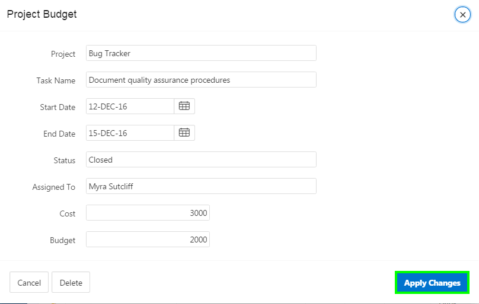
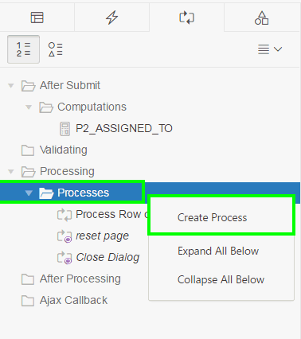
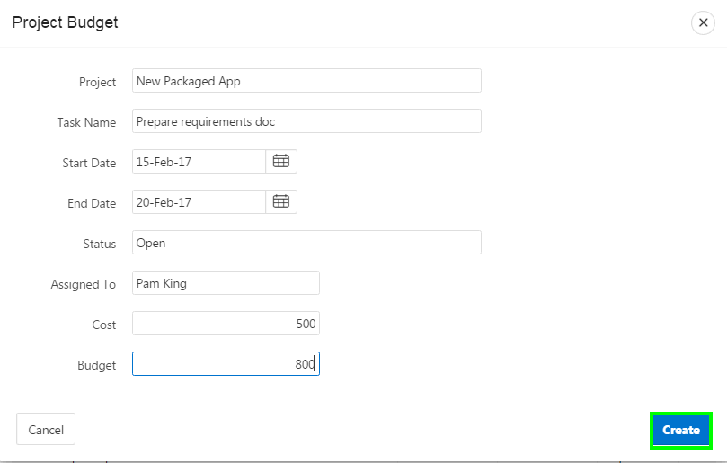
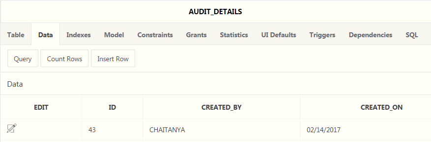
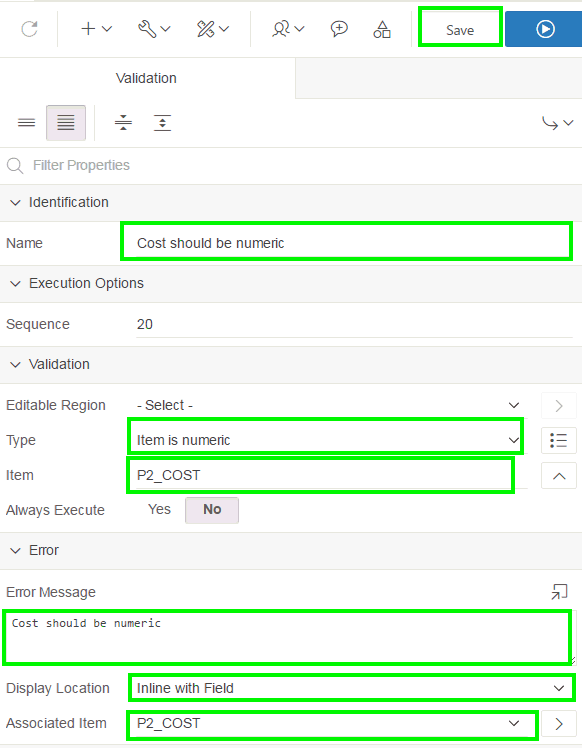

# Unit 10: Adding Computations, Processes, and Validations

This exercise includes four hands-on-labs.

HOL 10-1 uses the Demo Projects application.

HOL 10-2, HOL 10-3, and HOL 10-4 use the Budget App application.

**HOL 10-1 Implementing Validations on the Maintain Project Page**: In this lab, you create and use validations on the Maintain Project page.

**HOL 10-2 Creating and Using a Computation**: In this lab, you create a computation that changes the value of a field entered using the form to uppercase after the page is submitted

**HOL 10-3 Creating and Using a Process**: This lab covers creating an After Submit process on the Project Budget form page

**HOL 10-4 Creating and Using Validations**: In this hands-on lab, you create a not null validation and a validation to ensure that the item is numeric.

## HOL 10-1: Implementing Validations on the Maintain Project Page

In this lab, you add validations to the Maintain Projects page so that when a user changes the status to Completed, they add the Completed Date and that it is not forward-dated.

1.  Navigate to **App Builder** and run the **Demo Projects** application.
    In the navigation menu, click **Demo Projects** and then in the Interactive Grid, click a project name.
    In the Developer Toolbar, click **Edit Page 5**.

2.  In the page designer, click the **Processing** tab.
    Right-click **Validating** and select **Create Validation**. 
      
    In the central pane, click the **Help** tab.  

     **Note**: The help text displays the currently selected attribute in the Property Editor (right pane). For example, clicking on the Validation Type attribute label (not the select list) displays a list of all the available options, together with a description of when each option will pass (not display the error message) or fail (displays the error message).

3.  In the property editor:

	-   Identification: Name - enter **Completed Date is Not Null**
	
	-   Validation: Type - select **Item is NOT NULL**
	
	-   Validation: Item - select **P5\_COMPLETED\_DATE**
	
	-   Error: Error Message - select the Error Message attribute label (not the data entry area), at which point the Help pane will display the help text for Error Message. On the Help pane under Examples, copy and paste **\#LABEL\# must have some value.** into the Property Editor attribute
	
	-   Condition: Type - select **Item = Value**
	
	-   Condition: Item - select **P5\_STATUS\_CD**
	
	-   Condition: Value - enter **Completed**

     **Note**: This condition ensures that the validation only fires when the Status item is *Completed*.
       

    

     **Note**: The \#LABEL\# text within the Error Message will be substituted with the Label of the associated item. In this manner, if the item label is updated the error message will also reflect the updated value. This improves consistency and prevents messages having an out of date label reference.

4.  In the Processing pane, right-click **Validating** and select **Create Validation**.

5.  In the property editor:

	-   Identification: Name - enter **Completed Date is not Forward Dated**
	
	-   Validation: PL/SQL Expression - enter **:P5\_COMPLETED\_DATE &lt;= sysdate**
	
	-   Error: Error Message - enter **\#LABEL\# cannot be forward dated**
	
	-   Error: Associated Item - select **P5\_COMPLETED\_DATE**
	
	-   Condition: Type - select **Item is NOT NULL**
	
	-   Condition: Item - select **P5\_COMPLETED\_DATE**

      

      

6.  Now that you created the two validations, you want to verify if they work as expected. Navigate to the Demo Projects application runtime environment.
    In the navigation menu, click **Demo Projects**. Then, select a project name.

7.  Try out these functions to see how the page responds:

    -   Save a record with a Status of Completed and no Completion Date - An error message should be displayed.

    

    -   Save a record with a Completion Date in the future - An error message should be displayed.

    

## HOL 10-2: Creating and Using a Computation

In this lab, you create a computation that changes the Assigned To value entered using the form to uppercase after the page is submitted.

1.  Navigate to **App Builder** and run the **Budget App** application.

2.  In the navigation menu, click **PROJECT\_BUDGET**. This is the interactive report that has been created when you created the application using a spreadsheet in HOL 3-2.

3.  Create an After Submit PL/SQL Expression computation on the P2\_ASSIGNED\_TO item. The PL/SQL expression should be: **upper(:P2\_ASSIGNED\_TO)**. Test the page to see that the Assigned To is stored as uppercase.
   
    Perform the following steps:

	a)  In the PROJECT\_BUDGET interactive report, click the **Edit** icon (pencil) for any record.
	    Then, in the Developer Toolbar, click **Edit Page 2**.
	    
	
	b)  In the page designer, click **Page Processing**.
	    Right-click **After Submit** and select **Create Computation**.
	    
	   
	
	c)  In the property editor:
	
	 -   Identification &gt; Item Name: Select **P2\_ASSIGNED\_TO**
		
	 -   Execution Options &gt; Point: Select **After Submit**
		
	 -   Computation &gt; Type: Select **PL/SQL Expression**

	d)  Computation &gt; PL/SQL Expression: Enter **upper(:P2\_ASSIGNED\_TO)**
	    
	    Click **Save**.
	
	e)  This is a dialog page and so you cannot run this directly. You need to first run interactive report page.
	    Navigate to application runtime environment and click **PROJECT\_BUDGET** in the navigation menu and then click the edit icon for a record.
	    
	
	f)  Click **Apply Changes**. The data is submitted now.
	    
	
	g)  Navigate to application runtime environment and click **PROJECT\_BUDGET** in the navigation menu and then click the edit icon for the same record that you did in step e above. Notice that the value for Assigned To is stored in uppercase.
	    

## HOL 10-3: Creating and Using a Process

In this lab, you create a process to insert a record into a table called AUDIT\_DETAILS every time a project is added.

1.  You want to create an After Submit process on the Project Budget form page. Whenever a user adds a new project by using this form, the user details are stored in the AUDIT\_DETAILS table.
    
    Perform the following steps:

	a)  View **Page 2** in page designer
	
	b)  Click the Processing tab, and navigate to Processing &gt; Processes.
	    Select **Process Row of PROJECT\_BUDGET**.
	    In the property editor:
	
	-   Settings &gt; Return Key Into Item: Select **P2\_ID**
		
	-   Success Message &gt; Success Message: Enter **Project added successfully!**
	
	    Click **Save**.
	
	    

2.  Navigate to SQL Workshop and create the AUDIT\_DETAILS table.

	a)  Click **SQL Workshop** and select **SQL Commands**.
	    
	
	b)  Copy the following SQL and paste it in the SQL Commands area and click **Run**.
	
	  
	      CREATE table "AUDIT_DETAILS" (
	  
	     "ID" NUMBER,
	  
	     "CREATED_BY" VARCHAR2(60),
	  
	    "CREATED_ON" DATE,
	  
	    constraint "AUDIT_DETAILS_PK" primary key ("ID")
	  
	    )
	      
	
	   
	
	c)  The table is created. Now, navigate to the window or tab of the Budget App application runtime environment.
	    In the navigation menu, click **PROJECT\_BUDGET**.\
	    Click the Edit icon for a record and then in the Developer Toolbar, click **Edit Page 2**.

3.  Click the **Processing** tab.
    Navigate to Processing, right-click **Processes** and select **Create Process**.
    

4.  In the property editor:

	-   Identification &gt; Name: Enter **Audit Details**
	
	-   Identification &gt; Type: Select **PL/SQL Code**
	
	-   Source &gt; PL/SQL Code: Copy and paste the following code:

  
         `INSERT INTO audit_details VALUES(:P2_ID,:APP_USER, sysdate);`
     

	-   Execution Options &gt; Sequence: Enter **40**
	
	-   Execution Options &gt; Point: Select **Processing**
	
	-   Success Message &gt; Success Message: Enter **Success!**
	
	-   Error &gt; Error Message: Enter **Error!**
	
	-   Server-side Condition &gt; When Button Pressed: Select **CREATE**

    Click **Save**.  
    **Note**: The sequence of this process should be the one immediately after the Process Row of PROJECT\_BUDGET process.

      

    

5.  Now, you want to verify if the processes are working. In the page designer toolbar, click the Navigate to Previous Page arrow.
      
    Then, click **Save and Run Page**. 

6.  Click the **Create** button.
    

7.  In the Project Budget dialog, enter values for each of the fields and click **Create**.

	- Project: **New Packaged App**
	- Task Name: **Prepare requirements doc**
	- Start Date: **15-Feb-17**
	- End Date: **20-Feb-17**
	- Status: **Open**
	- Assigned To: **Pam King**
	- Cost: **500**
	- Budget: **800**

    

8.  The record is created now. In the Developer Toolbar, click **Home**.

9.  Click **SQL Workshop**. Then, click **Object Browser**.
    Under Tables, select **AUDIT\_DETAILS**.
    Click **Data**.
    Notice that the user details have been added to the table.
    

##HOL 10-4: Creating and Using Validations

In this lab, you create two validations on the Project Budget form page. The first validation you create ensures that the project field is not null. The second one ensures that the value entered for cost is only numeric.

1.  Navigate to the window or tab of the Budget App application runtime environment.
    In the navigation menu, click **PROJECT\_BUDGET**.
    Click the Edit icon for a record and then in the Developer Toolbar, click **Edit Page 2**.

2.  You want to create two validations. The first validation is to ensure that the Project field is not null.
    In the page designer, click the **Processing** tab.
    Right-click **Validating** and select **Create Validation**.  
    

3.  In the property editor:

	-   Identification &gt; Name: Enter **Project is not null**
	
	-   Validation &gt; Type: Select **Item is NOT NULL**
	
	-   Validation &gt; Item: Select **P2\_PROJECT**
	
	-   Error &gt; Error Message: Enter **Project is not null!**
	
	-   Error &gt; Display Location: Select **Inline in Notification**

    

4.  You need to create another validation to ensure that the value entered for Cost should be only numeric.
    Under Processing, right-click **Validating** and select **Create Validation**.

5.  In the property editor:

	-   Identification &gt; Name: Enter **Cost should be numeric**
	
	-   Validation &gt; Type: Select **Item is numeric**
	
	-   Validation &gt; Item: Select **P2\_COST**
	
	-   Error &gt; Error Message: Enter **Cost should be numeric**
	
	-   Error &gt; Display Location: Select **Inline with Field**
	
	-   Error &gt; Associated Item: Select **P2\_COST**

    Click **Save**.

    

6.  Now, you can test to verify if the validations work. Navigate to the application run time environment.
    In the navigation menu, click **PROJECT\_BUDGET**.
    Then, click **Create**.

7.  In the Project Budget dialog, enter the following and then click the **Create** button.

	-   Task Name: **Prepare requirements doc**
	
	-   Start Date: **14-Feb-17**
	
	-   End Date: **22-Feb-17**
	
	-   Status: **Open**
	
	-   Assigned To: **Pam King**
	
	-   Cost: **abcd12**
	
	-   Budget: **3000**
    
    

    Notice that the errors are displayed.
    Click **Cancel**.

----------

