# Unit 11: Implementing Navigation in your Application

In this hands-on lab, you implement navigation in the Demo Projects application.

Breadcrumbs are very common within Web applications to allow users to easily traverse from the current page to a parent page. Use of the Back button is discouraged within Web applications, as this operation may display old ("stale") information to the user. This hands-on lab covers updating the breadcrumb entries for the following pages:

 -   Demo Proj Team Members
	
 -   Demo Projects
	
 -   Demo Proj Milestones
	
 -   Demo Proj Tasks

The Navigation Menu is defined as a list within Shared Components. In this hands-on lab, you update the Navigation Menu entries, and include icons for each entry.

In this hands-on lab, you update breadcrumb entries for the pages in the Demo Projects application. You also update the Navigation Menu entries and add icons for each entry.

1.  Navigate to **App Builder** and run the **Demo Projects** application.
    In the navigation menu, click **Demo Proj Team Members**.
    In the Developer Toolbar, click **Edit Page 2**.

2.  Update the page properties from Demo Proj Team Members to Team Members.
    In the Property Editor:

	-   Identification: Name - enter **Team Members**
	
	-   Identification: Title - enter **Team Members**

    Click **Save**.  
    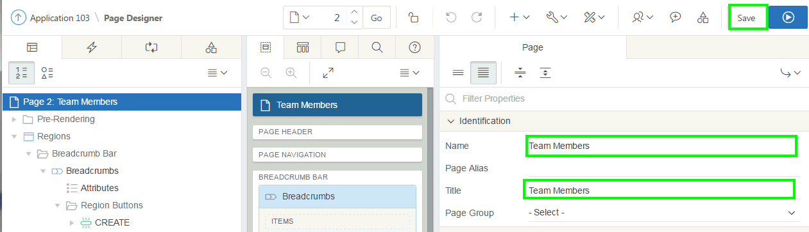

3.  Update the breadcrumb entry for the page.

	a)  In the Rendering tree, click the **Shared Components** tab.
	
	b)  Expand the Breadcrumbs node and click the **Breadcrumb** entry.
	
	c)  In the Property Editor, click the **Edit Component** button.
	    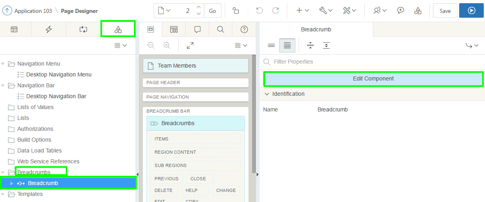

4.  Click the **Demo Proj Team Members** breadcrumb entry.

5.  For Short Name, enter **Team Members**, and click **Apply Changes**.
    

6.  To return to page designer, on the toolbar, click **Edit Page 2**.
    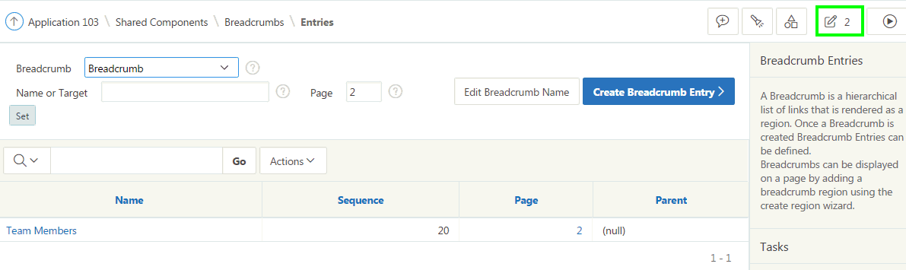

7.  The navigation menu is still displayed as Demo Proj Team Members. Update the Navigation Menu entries, and include icons for each entry.
    In the page designer, click **Shared Components** icon in the toolbar (not the page shared components).
    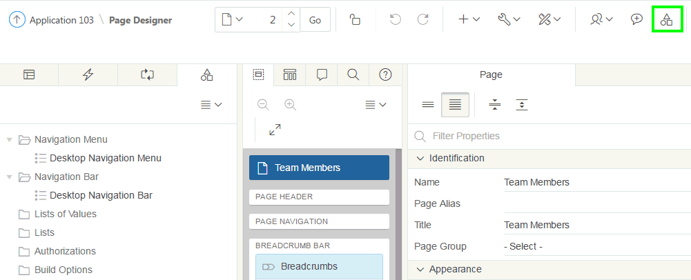

8.  Under Shared Components, locate Navigation and click **Lists**.  
    

9.  In the Lists report, click **Desktop Navigation Menu**.
    

10.  In the List Details report, click **Home**.
    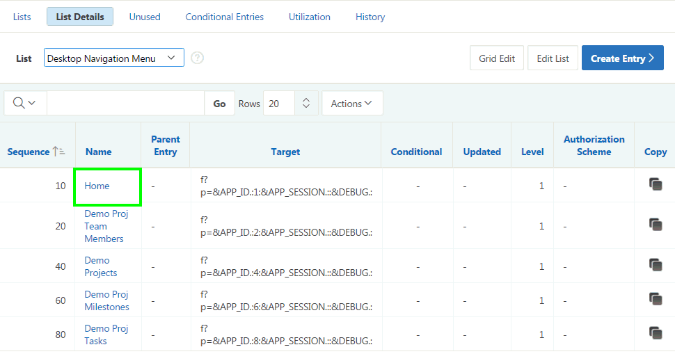

11.  In the Home list entry, locate the **Image/Class** item. Click the up arrow, at the end of the field ( **\^** ), to display a list of images.
    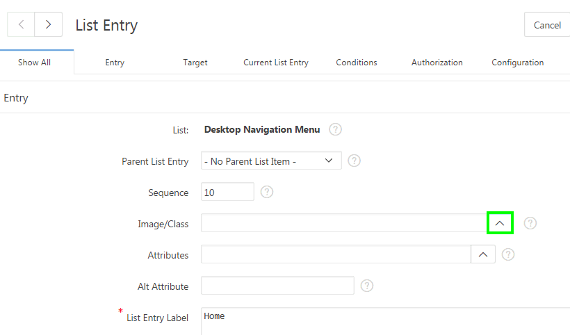

12.  Review the library of images, provided by Font Awesome (fa). These images can be utilized throughout the application to improve aesthetics, and provide a visual indicator, rather than just text.
    Locate and select **fa-home**.
    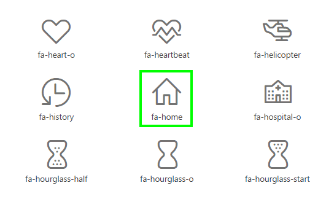

13. Click the **Next** button ( **&gt;** ), adjacent to the page title, to navigate to the next entry.
    **Note**: As you navigate from one record to another, any changes to the previous record are automatically saved.
    

14. On the Demo Proj Team Members list entry, for Image/Class enter fa-users, and for List Entry Label enter **Team Members**.
    Click the **Next** button ( **&gt;** ).
    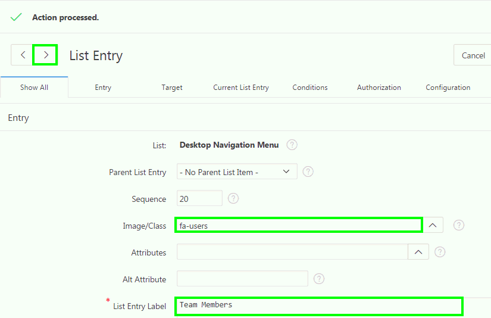

15. On the Demo Projects list entry, for Image/Class enter **fa-folder**, and for List Entry Label enter **Projects**.
    Click the **Next** button (**&gt;**).
    **Note**: You can simply type in the image name, such as **fa-folder**, directly into the Image/Classs field, rather than bringing up the library of images.

16. On the Demo Proj Milestones list entry, for Image/Class enter **fa-flag**, and for List Entry Label enter **Milestones**.
    Click the **Next** button ( **&gt;** ).

17. On the Demo Proj Tasks list entry, for Image/Class enter **fa-check-square-o**, and for List Entry Label enter **Tasks**.
    Click the **Next** button ( **&gt;** ).
    Click **Apply Changes**.
    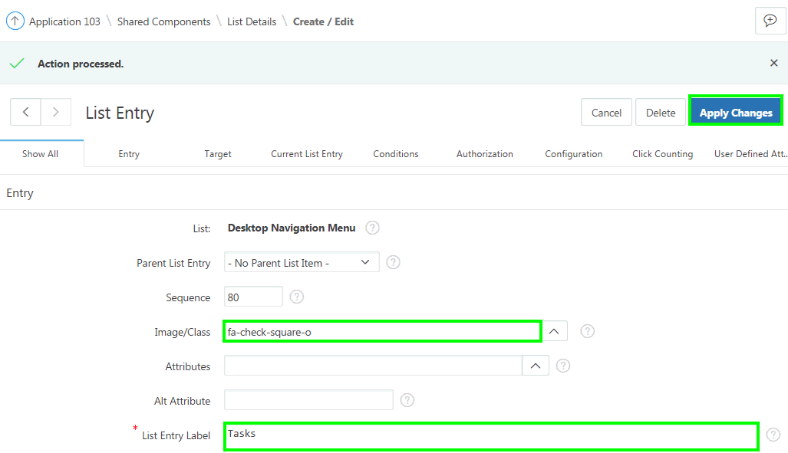

18. Click **Run** on the toolbar to see the updated navigation menu.
    

19. You still see the Interactive Grid region title. You want to update the region template. In the Developer Toolbar, click **Edit Page 2**.
    

20. Under Rendering &gt; Regions, select **Demo Proj Team Members**.
    In the property editor, locate Appearance. For Template, select **Interactive Report**.
    Click **Save**. Then, click **Save and Run Page**.
    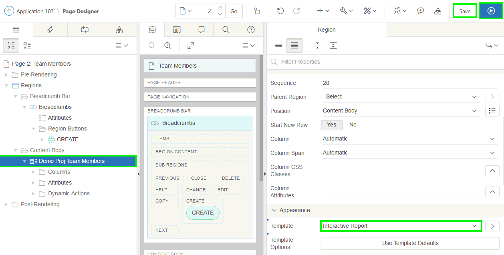

21. The Team Members page looks like: 
    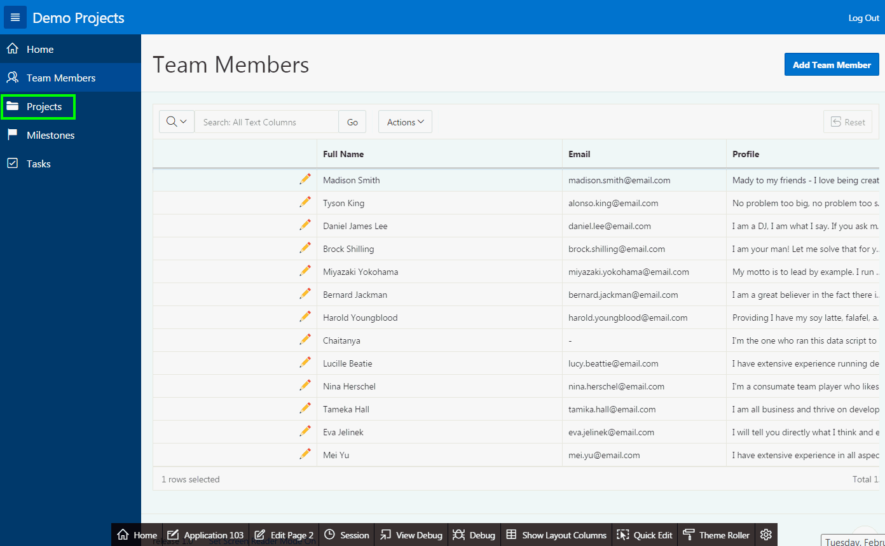
    Now, update the page properties and the breadcrumb entry for the Demo Projects page. In the navigation menu, click **Projects**.
    In the Developer Toolbar, click **Edit Page 4**.

22. In the Property Editor:

	-   Identification: Name - enter **Projects**
	
	-   Identification: Title - enter **Projects**

    Click **Save**.
    

23.  Update the breadcrumb entry for the page.

   a)  In the Rendering tree, click the **Shared Components** tab.
	
   b)  Expand the Breadcrumbs node and click the **Breadcrumb** entry.
	
   c)  In the Property Editor, click the **Edit Component** button.
      

24.  Click the **Demo Projects** breadcrumb entry.

25.  For Short Name, enter **Projects**, and click **Apply Changes**.
     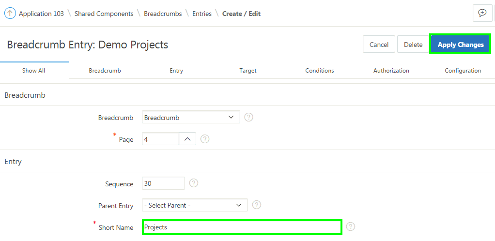

26.  To return to page designer, on the toolbar, click **Edit Page 4**.
     

27.  Under Rendering &gt; Regions, select **Demo Projects**.
    In the property editor, locate Appearance. For Template, select **Interactive Report**.
    Click **Save**. Then, click **Save and Run Page**.
    

28.  Now, update the page properties and the breadcrumb entry for the Demo Proj Milestones page. In the navigation menu, click **Milestones**.
    In the Developer Toolbar, click **Edit Page 6**.
    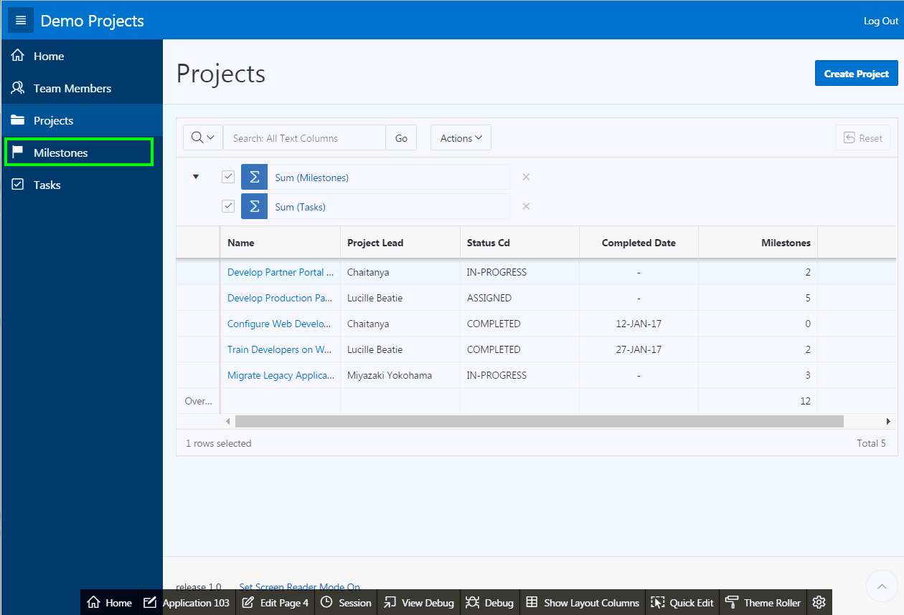

29.  In the Property Editor:

   -   Identification: Name - enter **Milestones**
	
   -   Identification: Title - enter **Milestones**  
    Click **Save**.
    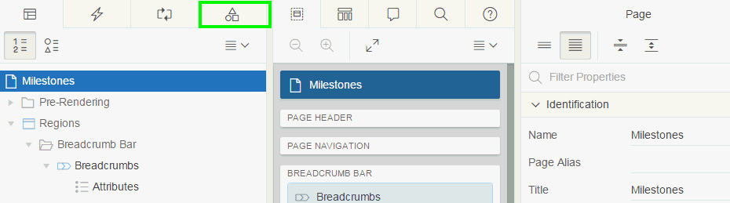

30.  Update the breadcrumb entry for the page.

   a)  In the Rendering tree, click the **Shared Components** tab.
	
   b)  Expand the Breadcrumbs node and click the **Breadcrumb** entry.
	
   c)  In the Property Editor, click the **Edit Component** button.

31.  Click the **Demo Proj Milestones** breadcrumb entry.

32.  For Short Name, enter **Milestones**, and click **Apply Changes**.
    

33.  To return to page designer, on the toolbar, click **Edit Page 6**.

34.  Under Rendering &gt; Regions, select **Demo Proj Milestones**.
    In the property editor, locate Appearance. For Template, select **Interactive Report**.
    Click **Save**. Then, click **Save and Run Page**.

35.  The Milestones page now looks like:
    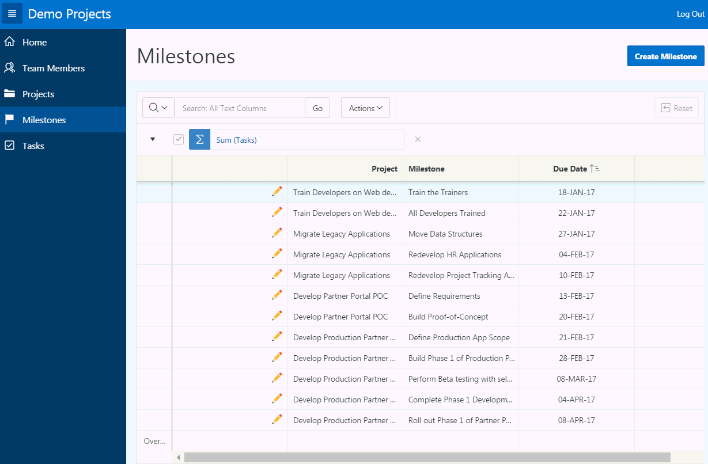

36.  Now, update the page properties and the breadcrumb entry for the Demo Proj Tasks page. In the navigation menu, click **Tasks**.
    In the Developer Toolbar, click **Edit Page 8**.

37.  In the Property Editor:

   -   Identification: Name - enter **Tasks**
	
   -   Identification: Title - enter **Tasks**  
    Click **Save**.

38.  Update the breadcrumb entry for the page.

   a)  In the Rendering tree, click the **Shared Components** tab.
	
   b)  Expand the Breadcrumbs node and click the **Breadcrumb** entry.
	
   c)  In the Property Editor, click the **Edit Component** button.

39.  Click the **Demo Proj Tasks** breadcrumb entry.

40.  For Short Name, enter **Tasks**, and click **Apply Changes**.

41.  To return to page designer, on the toolbar, click **Edit Page 8**.

42.  Under Rendering &gt; Regions, select **Demo Proj Tasks**.
    In the property editor, locate Appearance. For Template, select **Interactive Report**.
    Click **Save**. Then, click **Save and Run Page**.

43.  The Tasks page now looks like:
    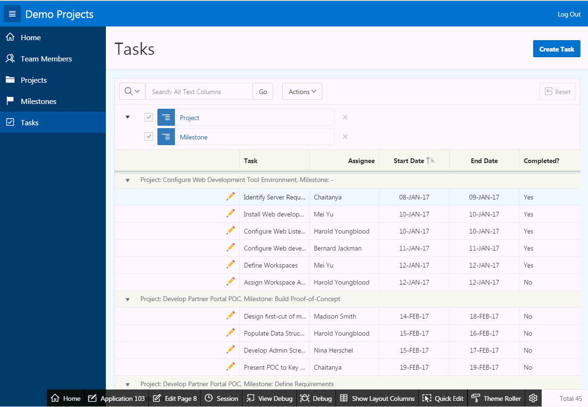

----------

