# Unit 13: Implementing Security in your Application

Application security is very important in the majority of applications, except for "Public" applications. You must ensure users enter valid credentials, generally username and password (Authentication), and that once logged in that each user has appropriate rights within the application (Authorization).

This exercise includes three hands-on-labs.

HOL 13-1 uses the Demo Projects application.

HOL 13-2 and 13-3 use the Budget App application.

**HOL 13-1 Creating and Using an Authorization Scheme**: In this lab, you create an authorization scheme to ensure only people entered as Team Members can log into the Demo Projects application. You create a user and verify if the user can access the application.

**HOL 13-2 Creating and Using an Authentication Scheme**: In this hands-on lab, you create an Open Door Credentials authentication scheme and make it current. You test the authentication scheme and then switch back to the default Application Express Authentication scheme.

**HOL 13-3 Controlling User Access by Using the Access Control Administration**: In this hands-on lab you create three different users as Administrator, Developer and End User. You create an Access Control Administration page, set the application mode to restrict access and add these users to the Access Control list. Finally, you apply the authorization scheme to pages and verify if users are allowed or denied access.

## HOL 13-1: Creating and Using an Authorization Scheme

In this hands-on lab, you create an authorization scheme to ensure only people entered as Team Members can log into the Demo Projects application. You apply the authorization scheme to the application properties.

1.  Navigate to **App Builder** and run the **Demo Projects** application.
    In the Developer Toolbar, click Application &lt;*n*&gt;.

2.  In the application home page, click **Shared Components**.
    Under Shared Components &gt; Security, click **Authorization Schemes**.  
    

3.  Click **Create**.
    

4.  For Create Authorization Scheme, select **From Scratch and c**lick **Next**.
    

5.  For Details, input the following:

	-   Name - enter **Team Members**
	
	-   Schema Type - select **Exists SQL Query**
	
	-   SQL Query - copy and paste the following:
	
	  
		      select 1
	    	  
	    	  from demo_proj_team_members
	    	  
	    	  where upper(username) = upper(:APP_USER)
	  
	
	-   Identify error message displayed when scheme violated - enter **You must be a team member to use this application**.

    Click **Create Authorization Scheme**.

     **Note**: **:APP\_USER** is a built-in application item that returns the username of the currently logged in user.

    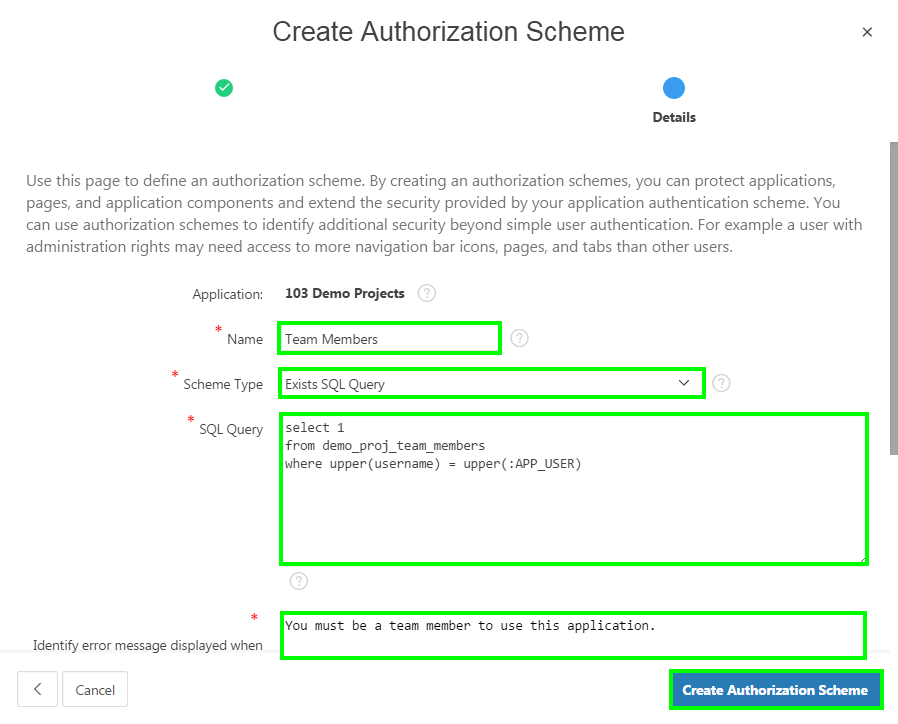

6.  The Team Members authorization scheme is created now.
    Rather than applying the authorization scheme to every page, apply the scheme to the application properties.

    Click the **Shared Components** breadcrumb entry.

    Alternatively, on the toolbar, click the Shared Components button, which is located in the top-right and contains a triangle, circle, and square in its icon.
    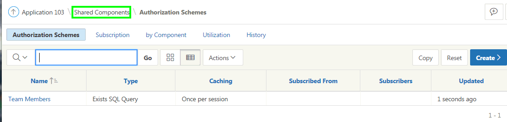

7.  Under Security, click **Security Attributes**.
    
    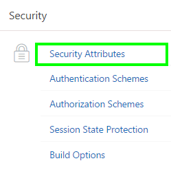

8.  Click the **Authorization** tab.
    For Authorization Scheme, select **Team Members** from the list.
    Click **Apply Changes**.
    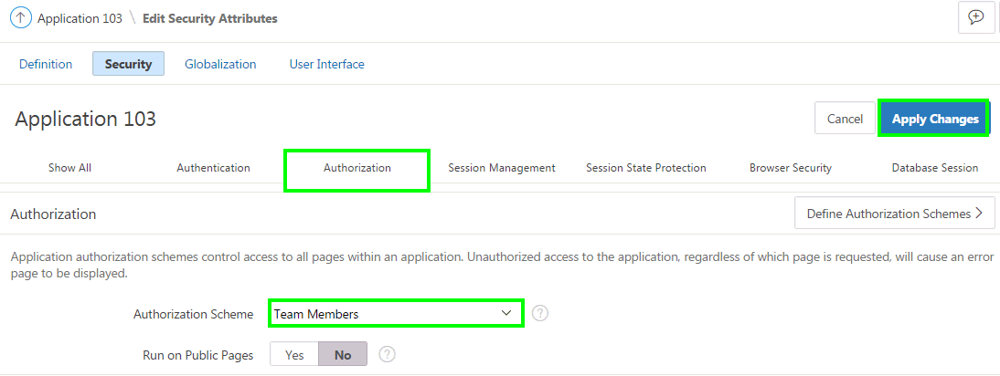

9.  In order to test the authorization scheme it is necessary to create a new user account.

    In the Application Express toolbar, click **Administration**, identified by a user icon with a spanner, then select **Manage Users and Groups**.

    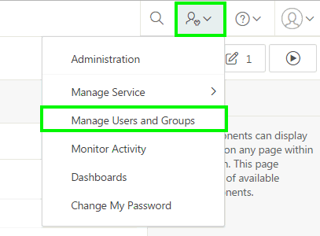

10.  Click **Create User**.

   To create a user, input the following:

   -   Username - enter unauthorized
	
   -   Email Address - enter unauthorized@email.com
	
   -   Password - enter unauthorized
	
   -   Confirm Password - enter unauthorized
	
   -   Require Change of Password on First Use - No

   Click **Create User**.
   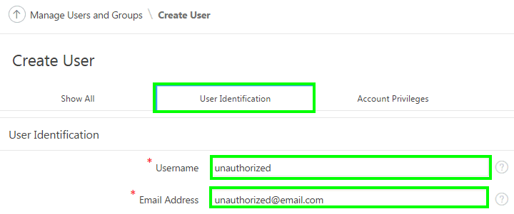
   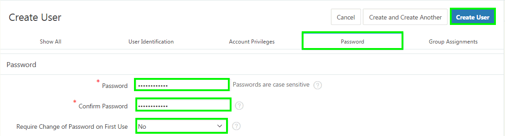

11.  Navigate to the runtime environment (tab or window). Click **Logout** in the navigation bar (top left).

12.  On the Log In page, for Username enter **unauthorized**, and for Password enter **unauthorized**.
    Click **Log In**.  
    

13.  Verify the access denied message is displayed.  
    Click **OK**.  
    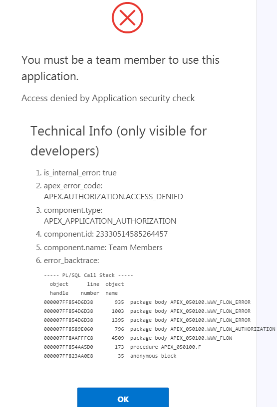

14.  On the Log In page, enter your username and password credentials that you use to log into the App Builder.  

     Click **Log In**.

## HOL 13-2: Creating and Using an Authentication Scheme

In this hands-on lab, you create an authentication scheme named Open Door Credentials in the Budget App application. Upon creation, this scheme becomes Current Scheme by default. You test this scheme by logging in to the application. Finally, you switch back to Application Express Authentication scheme.

1.  In the App Builder, click **Budget App** application.

2.  Navigate to **Shared Components**.
    Under Security, click **Authentication Schemes**.  
    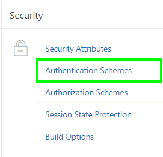

3.  You want to create an authentication scheme. Click **Create**.
    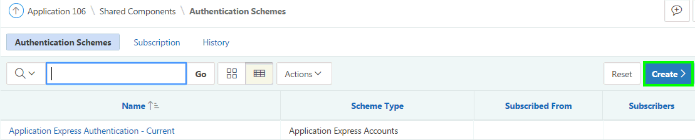

4.  For Create Scheme, select **Based on a pre-configured scheme from the gallery**, and click **Next**.
    
    

5.  For Name, enter **Open Door Credentials**.
    For Scheme Type, select **Open Door Credentials** from the list.
    Click **Create Authentication Scheme**.
    

6.  In the toolbar, click the **Run Page** icon.
    If you are already logged in, then click Logout to perform the next step.

7.  Enter your Username and click **Login**.
    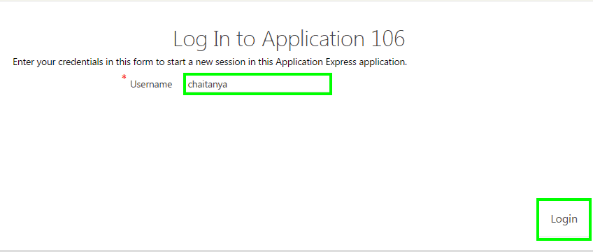

8.  The Home page is displayed.
    In the Developer Toolbar, click Application&lt;*n*&gt;.
    
    Your application might display the Vita (Copy) Theme Style. Click the **Customize** link at the bottom of the page, select **Vita** for Theme Style and click **Apply Changes**.

9.  You want to switch back to the Application Express Authentication scheme.
    In the application home page, click **Shared Components**.  
    

10. Under Security, click **Authentication Schemes**.  
    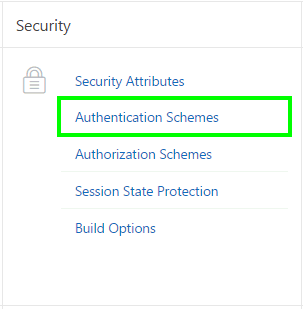

11. Click **Application Express Authentication** in the report.
    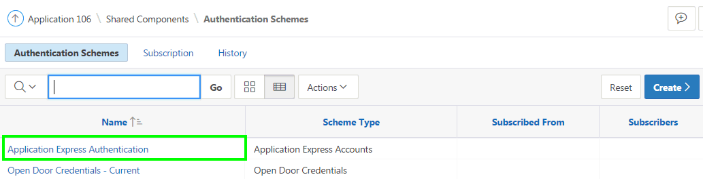

12. Click **Make Current Scheme**.
    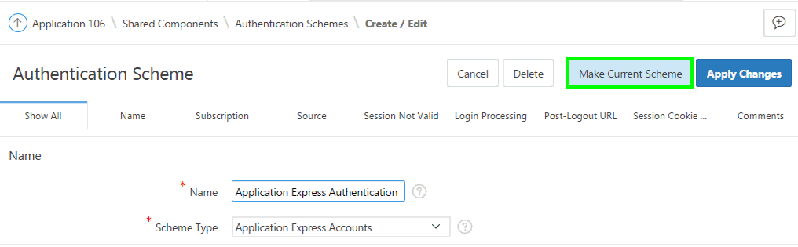

13. The Application Express Authentication scheme is now activated as current authentication scheme.
    

14. In the toolbar, click the **Run Page** icon. Then, click **Logout**.

15. Notice that the authentication scheme has changed. Enter your username and password and click **Log In**.

## HOL 13-3: Controlling User Access by Using the Access Control Administration

In this hands-on lab, you first create an access control page and set the application mode to restrict access. Then, you create the access control list and assign the Budget App application components to an authorization scheme.

1.  If you are in the application runtime environment, switch to the window or tab for App Builder environment.

2.  In the Application Express toolbar, click **Administration** and select **Manage Users and Groups**.
    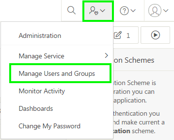

3.  Create the following users to add to the Access Control List.

	-   apex\_admin: Workspace Administrator
	
	-   apex\_dev: Developer
	
	-   apex\_user: End User

    Click **Create User**.

4.  Enter the following information and click **Create and Create Another**.

	-   Username: **apex\_admin**
	
	-   Email Address: **apex.admin@oracle.com**
	
	-   Select **Yes** for User is a workspace administrator
	
	-   Password: **apexadmin**
	
	-   Confirm Password: **apexadmin**
	
	-   Select **No** for Require Change of Password on First Use.
	    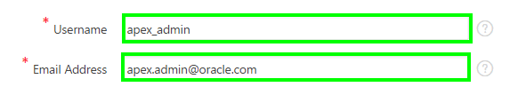  
	    
	    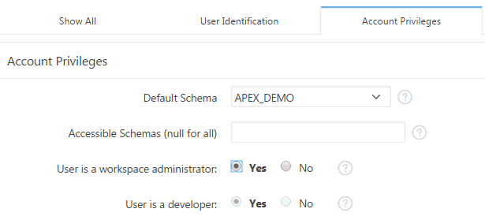

     

5.  Enter the following information and click **Create and Create Another**.

	-   Username: **apex\_dev**
	
	-   Email Address: **apex.dev@oracle.com**
	
	-   Select **No** for User is a workspace administrator
	
	-   Select **Yes** for User is a developer
	
	-   Password: **apexdev**
	
	-   Confirm Password: **apexdev**
	
	-   Select **No** for Require Change of Password on First Use.

6.  Enter the following information and click **Create User**.

	-   Username: **apex\_user**
	
	-   Email Address: **apex.user@oracle.com**
	
	-   Select **No** for User is a workspace administrator
	
	-   Select **No** for User is a developer
	
	-   Password: **apexuser**
	
	-   Confirm Password: **apexuser**
	
	-   Select **No** for Require Change of Password on First Use.

7.  You see users in the list now. Click **App Builder**.
    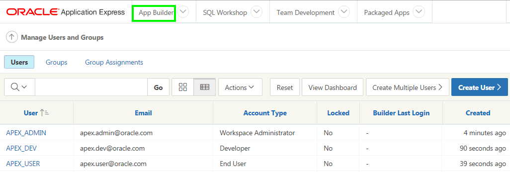

8.  In the report, click the **Budget App** application.
    

9.  In the application home page, click **Create Page**.
    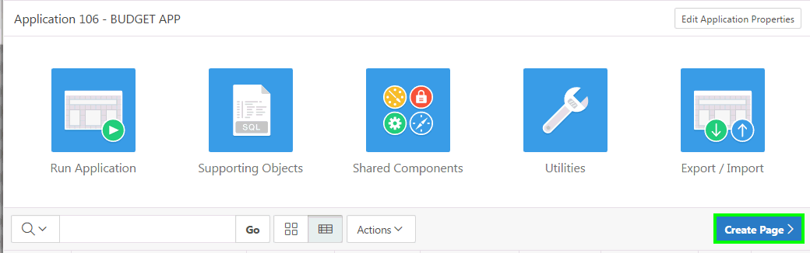

10.  Select **Access Control** for Page Type, and click **Next**.
    

11.  Click **Next**.
    

12.  Select **Create a new navigation menu entry**.
    Enter **Access Control** for New Navigation Menu Entry and click **Next**.
    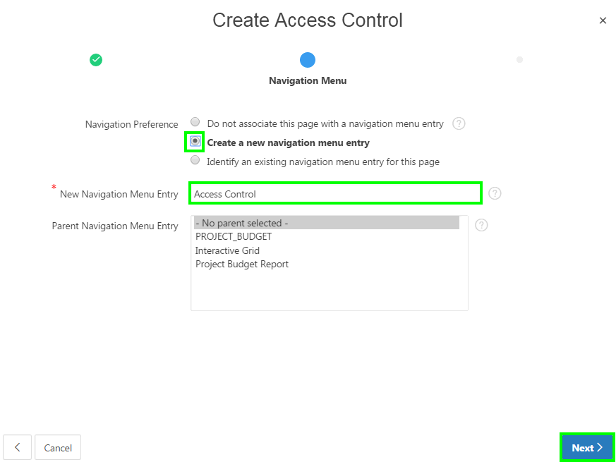

13.  On the Confirmation page, click **Create**.
    

14.  In the Page Designer, click **Save and Run Page**.

15.  The Access Control page is displayed. Now, you set the application mode.
    For Application Mode, select the **Restricted access. Only users defined in the access control list are allowed.** radio button.
    Then, click **Set Application Mode**.
    

16. Now, add users to the access control list. You add the three users you created in a previous step and also your workspace administrator username.

	-   apex\_admin is the administrator and so can modify anything including the user privileges
	
	-   apex\_dev is the developer and is allowed to edit application data. However, this user cannot change the application administration settings
	
	-   apex\_user is the end user and can only view the application but cannot make any changes to the data
	
	-   &lt;your username&gt; is the administrator.

    Click **Add User**.
    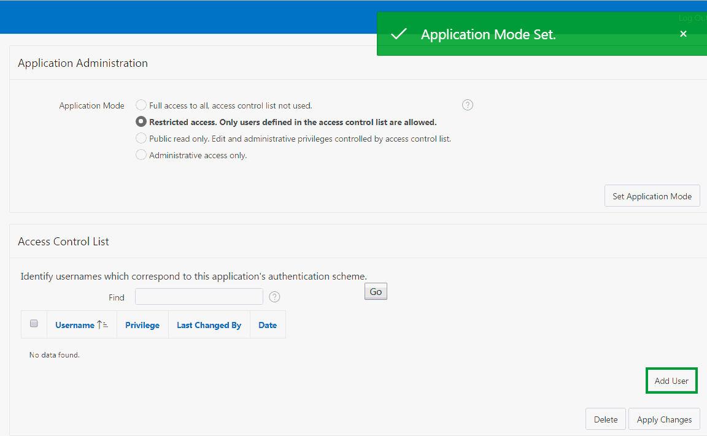

17.  Enter **apex\_admin** for Username, select **Administrator** for Privilege and click **Add User**.

18.  Enter **apex\_dev** for Username, select **Edit** for Privilege and click **Add User**.

19.  Enter **apex\_user** for Username, select **View** for Privilege and click **Add User**.

20.  Enter &lt;*your username*&gt; for Username, select **Administrator** for Privilege and click **Apply Changes**.
    

21.  Now, you are ready to define and apply the authorization schemes to each application component.

	-   Users with the Administrator privilege can make any changes, including administering the Budget App application
	
	-   Users with the Edit privilege can modify the data in the report but cannot make changes to the application mode and the access control list.
	
	-   Users with the View privilege can review the interactive report, but cannot modify the data.

   In the application runtime environment, click **Project\_Budget** in the navigation menu.
   In the Developer Toolbar, click **Edit Page 1**.

22.  Under Rendering, expand Regions. Under the Project Budget region, select **Attributes**.
    In the property editor, locate Authorization Scheme and select **access control-edit** from the list.
    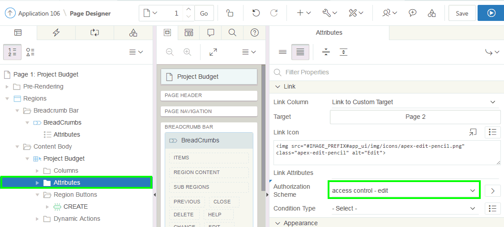

23.  You want the Create Button to appear only if the user has either the Edit or Administrator privilege. Under Rendering, locate Region Buttons and select **CREATE**.
    In the property editor, navigate to Security and select **access control-edit** for Authorization Scheme.
    Click **Save**.
    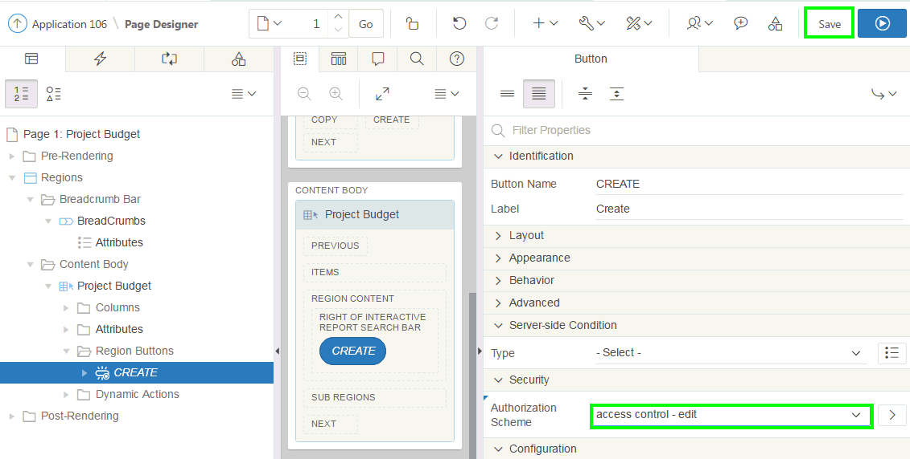

24.  You also want to protect against direct access to the Project Budget form dialog page. Though you restrict end users from editing the interactive report on the Home page, they can still access the Project Budget form page by entering the correct URL in the browser. To avoid this, you must restrict the Form page access to only users with the Edit and Administrator privilege.
   
   In the page designer, click **Navigate to Next Page** arrow in the toolbar.
   You are now viewing the Project Budget form page in page designer.

25.  Under Rendering, select **Page 2: Project Budget**.
    Under Rendering, navigate to **Security** and select **access control-edit** for Authorization Scheme.
    Click **Save**.
    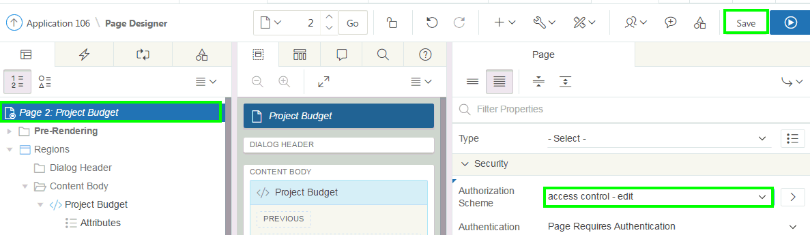

26.  Users with the Administrator privilege can only make changes to the access control list. Therefore, you must set the authorization scheme for the Access Control Administration page accordingly.
    
   In the page designer, enter the Access Control Administration page number in the Page Finder and click **Go**.
   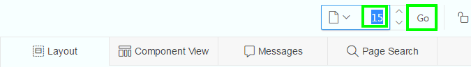

27.  Under Rendering, select Page&lt;*n*&gt;: Access Control Administration Page.
    In the property editor, navigate to Security and select **access control-administrator** for Authorization Scheme.
    Click **Save**.
    

28.  In the page designer, enter **1** in the Page Finder and click **Go**.
    

29.  In the page designer, click **Save and Run Page**.
    If you are logged in, click **Logout** before performing the next step.

30.  Enter **apex\_dev** for Username and **apexdev** for Password and click **Log In**.
    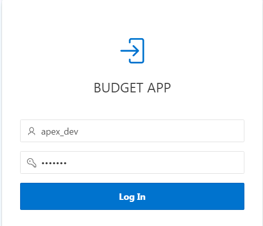

31. Notice that apex\_dev can edit the interactive report, and also create a new project.
    In the navigation menu, click **Access Control**.
    
    

32. Notice that you receive an error as you need the Administrator privilege to use the Access Control Administration page.
    Click **OK**.
    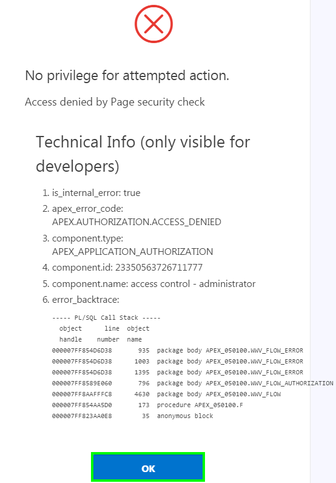

33. Click **Logout**.
    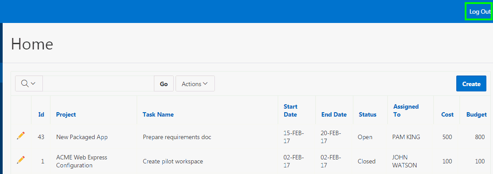

34. Now log in by entering **apex\_user** for Username and **apexuser** for password.

35. Notice that you cannot edit the interactive report and also cannot create a new project now.
    

36. Now, in your browser, change the page number in the URL to try to access the Project Budget form page. The Project Budget form is Page 2.
    For example, if your URL is http://<hostname>:8080/apex/f?p=106:1, then change it to http://<hostname>:8080/apex/f?p=106:2  
    Press the **&lt;Enter&gt;** key.

37. Notice that you receive an error as the form page can be accessed only if you have either the Edit or the Administrator privilege.  
    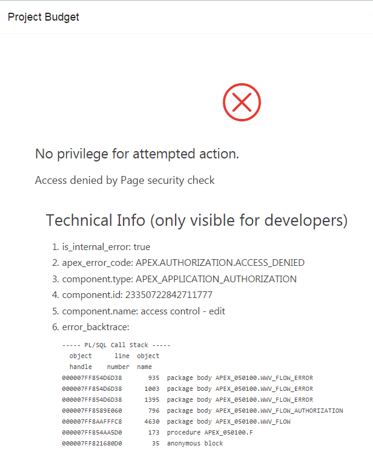  
    Click **OK**.  
    Then, click **Logout**.  

38. Now log in by entering **apex\_admin** for Username and **apexadmin** for password.

39. Notice that you can now edit the interactive report, and also create a project. In the navigation menu, click **Access Control**.
    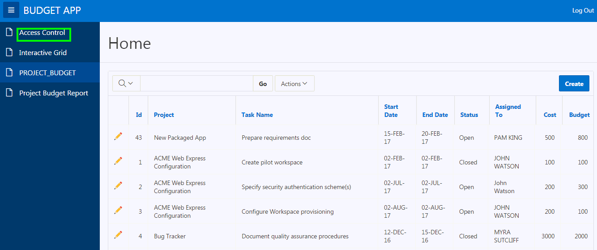

40. As you have the Administrator privilege, you can access the Access Control Administration page.
    In the Developer Toolbar, click Application&lt;*n*&gt;.
    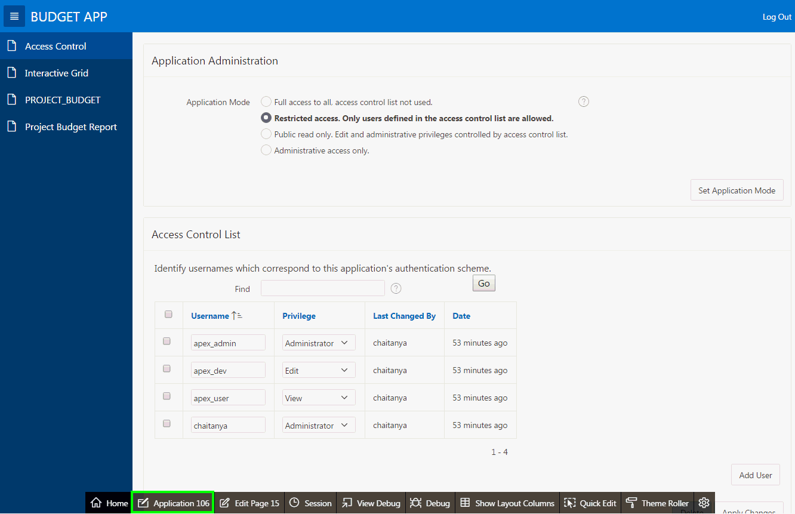

----------

