# Unit 14: Adding Additional Pages to your Application

This exercise includes five hands-on-labs and uses the Demo Projects application.

**HOL 14-1 Creating and Customizing a Calendar**: In this lab, you add a Calendar in the Demo Projects application. Later, you edit the calendar attributes and enable the drag and drop functionality.

**HOL 14-2 Adding the Project Tasks Chart:** In this hands-on lab, you first create a blank page named Reports. You select Reports as the Parent Navigation Menu Entry when you create all the three charts and the Project Tree page in this application. This lab covers creating the Project Tasks chart to review the completed and incomplete tasks.

**HOL 14-3 Adding the Project Milestones Chart**: In this lab, you create the Project Milestones chart to depict past milestones and future milestones. You create a copy of the Project Tasks chart and then edit the chart attributes including the source query.

**HOL 14-4 Adding the Project Leads Chart**: In this hands-on lab you create the Project Leads chart to depict the completed and incomplete tasks for each of the team members.

**HOL 14-5 Adding the Project Tree**: In this hands-on lab you create a blank page and then create a Tree region. This lab also covers updating the Demo Projects application navigation menu. To perform the steps in this lab, you need the Project\_Tree.sql file which is included in the apex-course-labs.zip.

The instructions in this exercise use the following page numbers:

 -   Page 16: Reports
		
 -   Page 18: Project Tree
		
 -   Page 19: Tasks Review
		
 -   Page 20: Milestones Review
		
 -   Page 21: Team Members Review

## HOL 14-1: Creating and Customizing a Calendar

In this hands-on lab, you create an authorization scheme to ensure only people entered as Team Members can log into the Demo Projects application. You apply the authorization scheme to the application properties.

1.  Navigate to **App Builder** and in the report, click **Demo Projects** application.

2.  In the application home page, click **Create Page**.

3.  Select **Calendar** page type and click **Next**.
    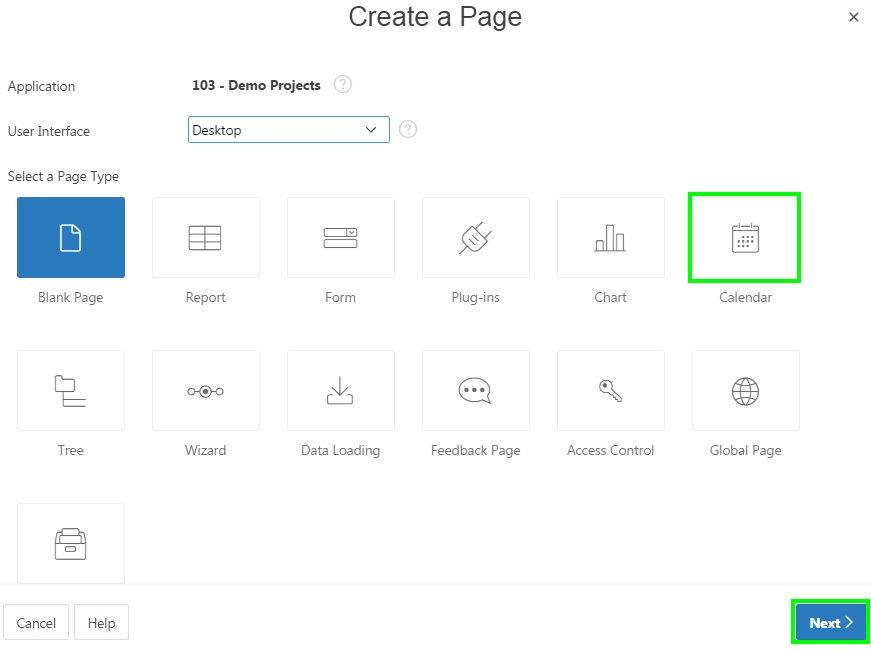

4.  Enter **Calendar** for Page Name, select **Breadcrumb** for Breadcrumb, and click **Next**.
    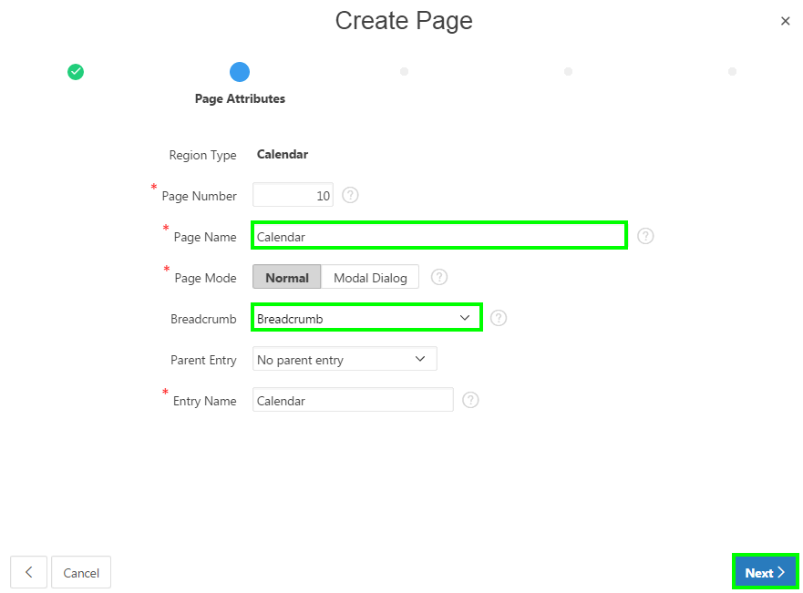

5.  For Navigation Preference, select the **Create a new navigation menu entry** radio button.
    Click **Next**.
    
    

6.  Select **Table** for Source, **DEMO\_PROJ\_TASKS** for Table/View Name.
    Click Next.
    

7.  Select **NAME** for Display Column, and **END\_DATE** for End Date Column.
    Click **Create**.
    

8.  Click **Save and Run Page**.
    
    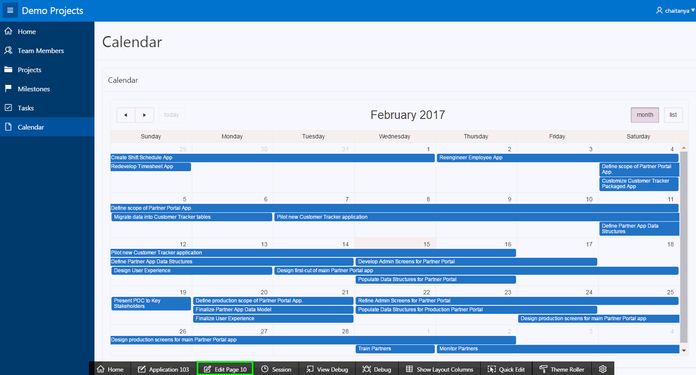
    In the Developer Toolbar, click **Edit Page 10**.

9.  The Calendar page displays the region title Calendar, and also has a border around the region.
    In the Rendering tree, locate the Calendar region. Click **Calendar**.

    In the Property Editor, click the **Template Options** button.
    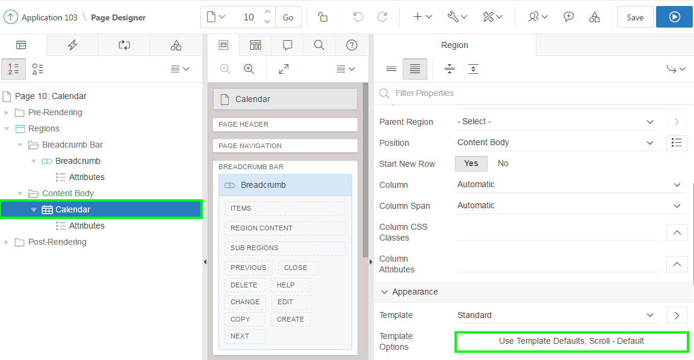

10.  In the Template Options dialog, input the following:

	-   Header - select **Hidden but accessible**
	
	-   Style - select **Remove UI Decoration**

   Click **OK**.  
   

11.  Click **Save and Run Page**.
    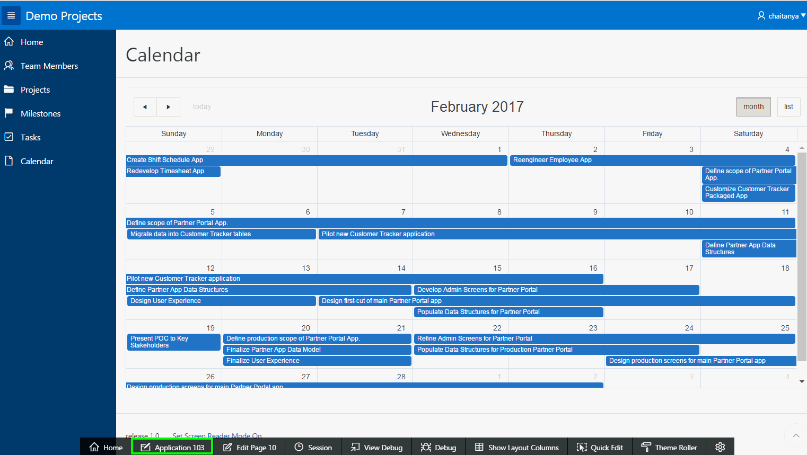
    In the Developer Toolbar, click **Application&lt;*n*&gt;**.

12.  You want to update the navigation menu. In the application home page, click **Shared Components**.

13.  Under Navigation, click **Lists**.

14.  Under Lists, click **Desktop Navigation Menu**.  
    

15.  Under List Details, click **Calendar**.
    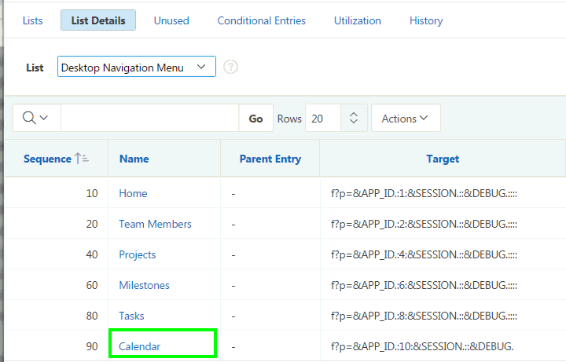

16.  On the Calendar list entry, for Image/Class enter **fa-calendar**.
    Click **Apply Changes**.
    

17.  In the Application Express toolbar, click **Run Page 10**.  
    

18.  In the navigation menu, notice the new icon. In the Developer Toolbar, click **Edit Page 10**.
    

19.  You need to add the Create and View / Edit links. In the Rendering tree, locate the Calendar region.
    Click **Attributes** under the Calendar region.

   In the Property Editor, locate Create Link and click **No Link Defined**.
   

20.  In the Link Builder – Create Link dialog, select **9** for Page, and enter **9** for Clear Cache.
    Click **OK**.
    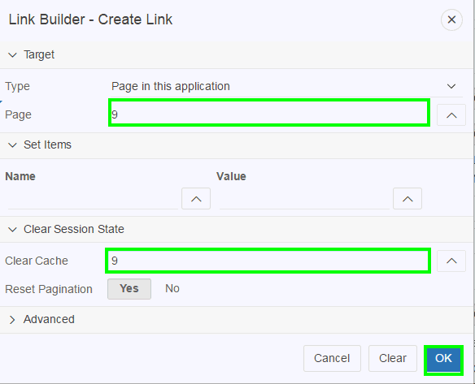

21.  In the Property Editor, locate View/Edit Link and click **No Link Defined**.
    

22.  In the Link Builder – View / Edit Link dialog, input the following:

	-   Page - select **9** **- Maintain Task**
	
	-   Name - select **P9\_ID**
	
	-   Value - select **ID** or enter **&ID.**
	
	-   Clear Cache - enter **9**

   Click **OK**.

   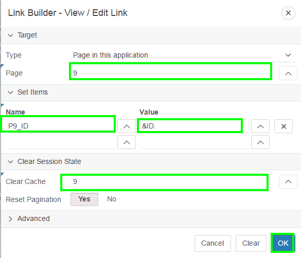

23.  You can enable calendar drag and drop by using the component attribute Drag and Drop. Your SQL query must select a primary key column and you must have set the Primary Key Column calendar attribute. Then enter the PL/SQL code to update the event row in the database in the Drag and Drop PL/SQL Code attribute. That PL/SQL code typically performs a SQL update on the database table - the bind variables :APEX$PK_VALUE., :APEX$NEW\_START\_DATE and :APEX$NEW\_END\_DATE contain the dragged events primary key value as well as the new start and new end timestamp.

	-   In the property editor, navigate to Primary Key Column, and select **ROWID**.
	
	-   Select **Yes** for Enable Drag and Drop.
	
	-   For Drag and Drop PL/SQL Code, copy and paste the following code:
	
	  
		      begin
		      
		      update DEMO_PROJ_TASKS
		      
		      set start_date = to_date(:APEX$NEW_START_DATE, 'YYYYMMDDHH24MISS'),
		      
		      end_date = to_date(:APEX$NEW_END_DATE, 'YYYYMMDDHH24MISS')
		      
		      where ROWID = :APEX$PK_VALUE;
		      
		      end;
  

   Then, click **Save**.

   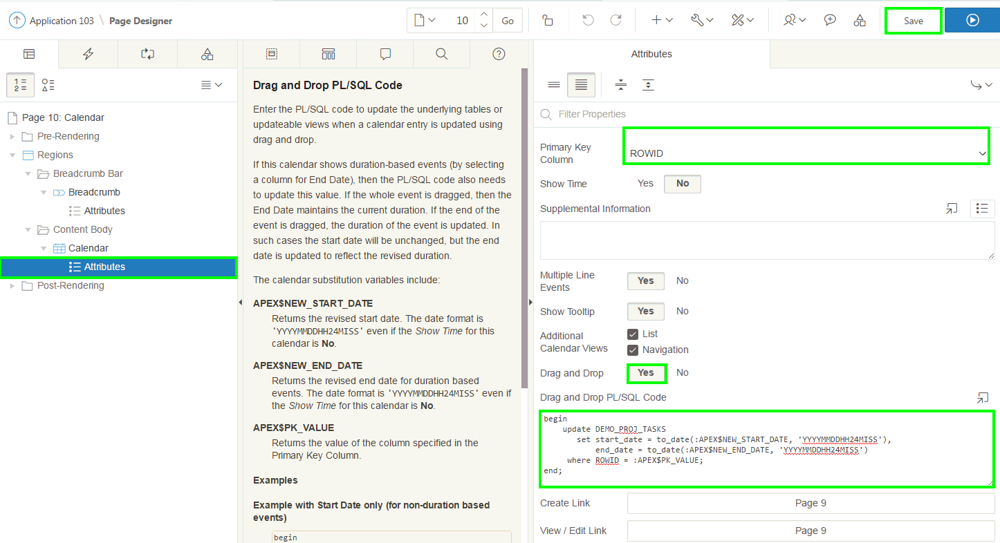

24.  Click **Save and Run Page**.
    

25.  In the Developer Toolbar, click **Application&lt;***n***&gt;**.

## HOL 14-2: Adding the Project Tasks Chart

In this hands-on lab, first you create a blank page named Reports. You select Reports as the Parent Navigation Menu Entry for all of the three charts and the Tree page you create in the Demo Projects application.

1.  First, create a blank page in the Demo Projects application. In the application home page, click **Create Page**.

2.  Select **Blank Page** and click **Next**.

3.  Enter **Reports** for Name, select **Breadcrumb** for Breadcrumb, and click **Next**.

    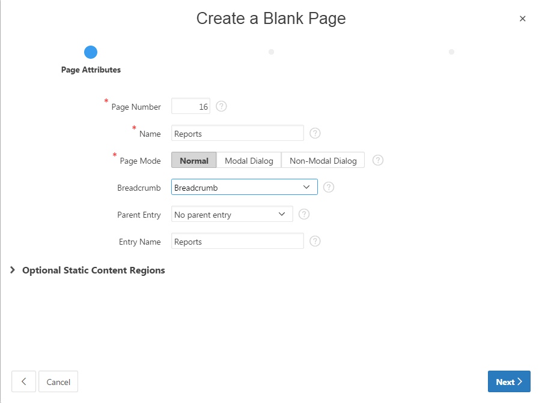

4.  Select **Create a new navigation menu entry** for Navigation Preference.
    Click **Next**.
    

5.  On the confirmation page, click **Finish**.

6.  In the page designer toolbar, click **Shared Components**. (not Page Shared Components).  
    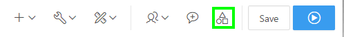

7.  Under Navigation, select **Lists**.  
    

8.  Under Lists, select **Desktop Navigation Menu**.  
    

9.  Under List Details, select **Reports**.
    
    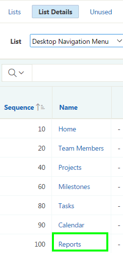

10.  For Image/Class, enter **fa-bar-chart**.
    Click **Apply Changes**.
    

11.  In the Application Express toolbar, click **Run Page 16**.  
     

12.  Notice the icon for Reports in the navigation menu.
    Now you add charts to the Demo Projects application.
    In the Developer Toolbar, click Application&lt;*n*&gt;.
    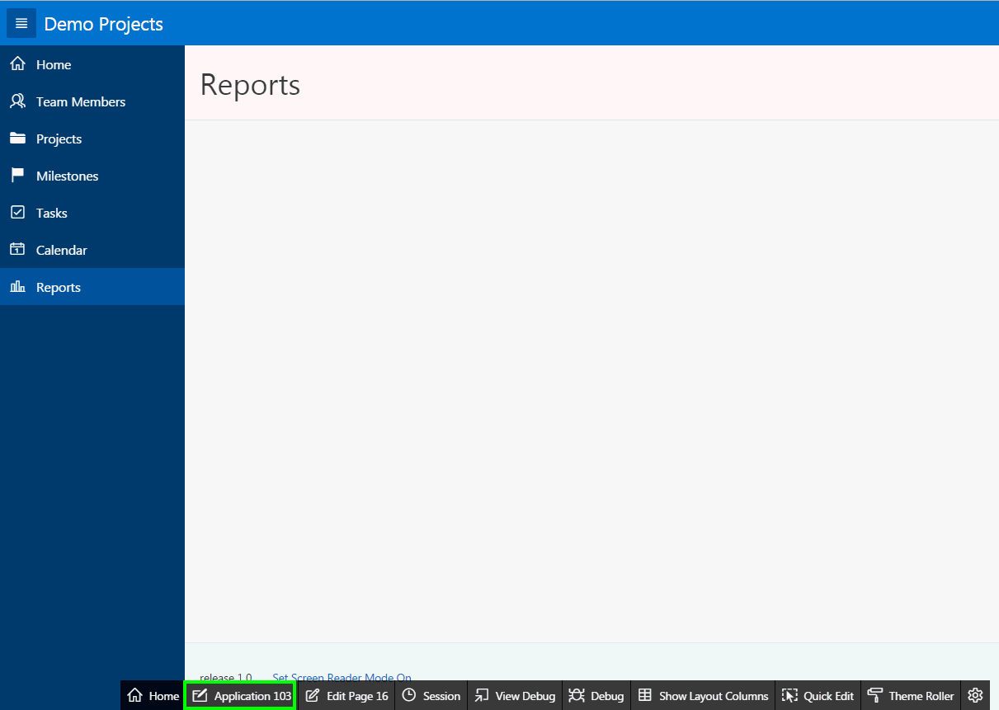

13. In the application home page, click **Create Page**.
    

14. Select **Bar** for Chart Type and click **Next**.
    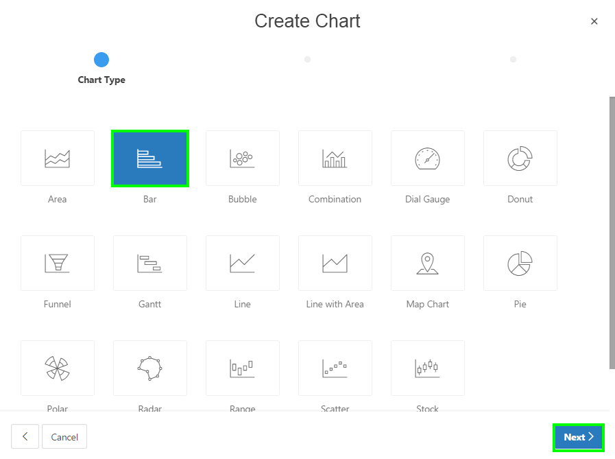

15. Enter **Tasks Review** for Page Name.
    Select **Breadcrumb** for Breadcrumb and **Reports (Page 16)** for Parent Entry and click **Next**.
    

16. Select **Create a new navigation menu entry** for Navigation Preference.
    Select **Reports** for Parent Navigation Menu Entry and click **Next**.
    

17. For Source Type, select **SQL Query**.
    Copy and paste the following code in to **SQL Query**:

  
	      select p.id
	      
	      , p.name as label
	      
	      , (select count('x') from demo_proj_tasks t
	      
	      where p.id = t.project_id
	      
	      and nvl(t.is_complete_yn,'N') = 'Y'
	      
	      ) value
	      
	      , 'Completed Tasks' series
	      
	      , p.created
	      
	      from demo_projects p
	      
	      UNION ALL
	      
	      select p.id
	      
	      , p.name as label
	      
	      , (select count('x') from demo_proj_tasks t
	      
	      where p.id = t.project_id
	      
	      and nvl(t.is_complete_yn,'N') = 'N'
	      
	      ) value
	      
	      , 'Incompleted Tasks' series
	      
	      , p.created
	      
	      from demo_projects p
	      
	      order by 5
	  

    Then, click **Next**.

    

18.  For Column Mapping, select the following:

	-   Orientation: Horizontal
	
	-   Label Column: LABEL
	
	-   Value Column: VALUE

   Click **Create**.
   

19.  In the page designer, rename the chart region title as **Project Tasks**.
    

20.  Under Rendering, expand Regions &gt; Project Tasks and select **Attributes**.
    In the property editor, under Appearance, select **Yes** for Stack.
    Under Layout, enter **500** for Maximum Width.
    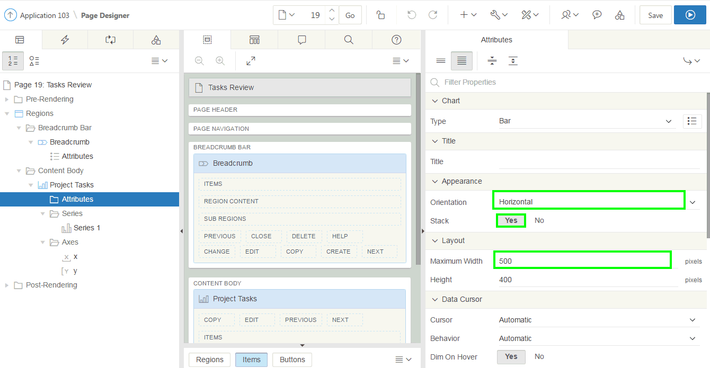

21.  Under Rendering, expand Regions &gt; Project Tasks &gt; Series and select **Series 1**.
    In the property editor, navigate to Column Mapping and select **SERIES** for Series Name.
    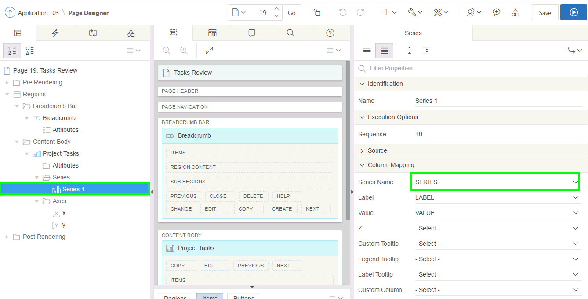

22.  Under Rendering, expand Regions &gt; Project Tasks &gt; Axes and select **x**.
    In the property editor, enter **Project** for Title.
    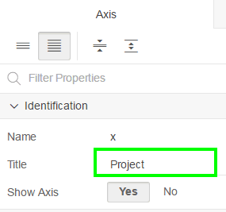

23.  Under Rendering, expand Regions &gt; Project Tasks &gt; Axes and select **y**.  
    In the property editor, enter **Tasks** for Title. 
    Click **Save**. Then, click **Save and Run Page**. 
    

24.  The chart is displayed.
    In the Developer Toolbar, click **Edit Page 19**.
    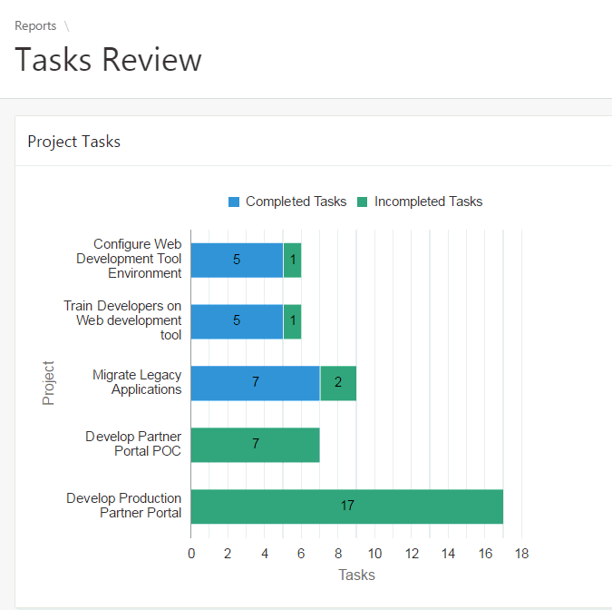

## HOL 14-3: Adding the Project Milestones Chart

In this hands-on lab, you create a bar chart to show the past and future milestones .

1.  View Page 19: Tasks Review in page designer. In the page designer, on the toolbar, click the **Create** (+) icon and select **Page as Copy**. 
    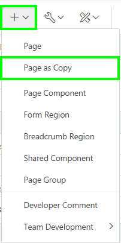

2.  For Create a page as a copy of, select **Page in this application** and click **Next**.
    

3.  For New Page Number, enter **20** and for New Page Name, enter **Milestones Review**.
    Select **Breadcrumb** for Breadcrumb and **Reports (Page 16)** for Parent Entry.
    Click **Next**.
    

4.  For Navigation Preference, select **Create a new navigation menu entry**.
    Select **Reports** for Parent Navigation Menu Entry.
    Click **Next**.
    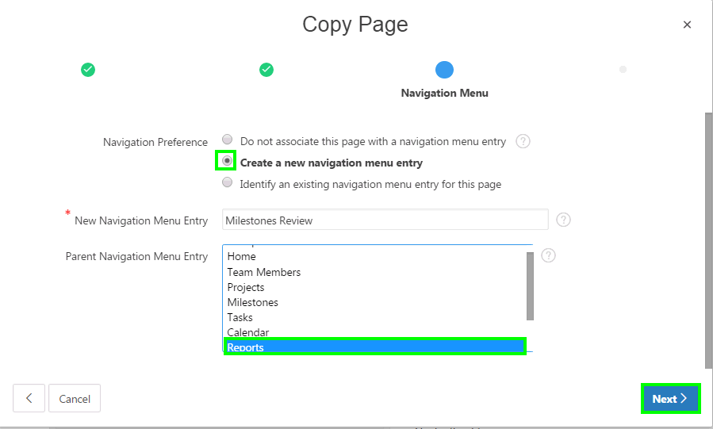

5.  For region New Value, enter **Project Milestones**.
    Click **Copy**.
    

6.  The page along with the chart region is copied. Now, you need to modify the region source query and chart attributes.
    Under Rendering, expand Regions &gt; Project Milestones and select **Attributes**.
    In the property editor, for Appearance &gt; Orientation, select **Vertical**.
    Under Layout, remove the value for **Maximum Width**.
    

7.  Under Rendering, expand Regions &gt; Project Milestones &gt; Series and select **Series 1**.
    In the property editor, for Source &gt; SQL Query, copy and paste the following SQL:

 
	      select p.id
	      
	      , p.name as label
	      
	      , (select count('x') from demo_proj_milestones m
	      
	      where p.id = m.project_id
	      
	      and m.due_date &lt; sysdate
	      
	      ) value
	      
	      , 'Past Milestones' series
	      
	      , p.created
	      
	      from demo_projects p
	      
	      UNION ALL
	      
	      select p.id
	      
	      , p.name as label
	      
	      , (select count('x') from demo_proj_milestones m
	      
	      where p.id = m.project_id
	      
	      and m.due_date &gt;= sysdate
	      
	      ) value
	      
	      , 'Future Milestones' series
	      
	      , p.created
	      
	      from demo_projects p
	      
	      order by 5
	     

    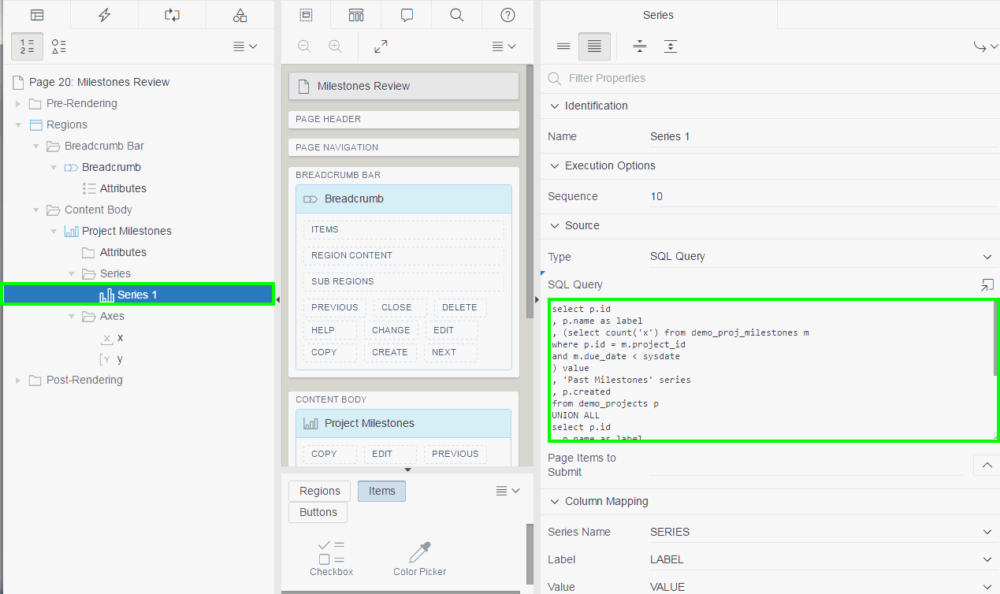

8.  Under Rendering, expand Regions &gt; Project Milestones &gt; Axes and select **y**.
    In the property editor, for Value &gt; Format Scaling, select **Automatic** and delete the value for Step.
    Click Save. Then, click **Save** and **Run Page**.
    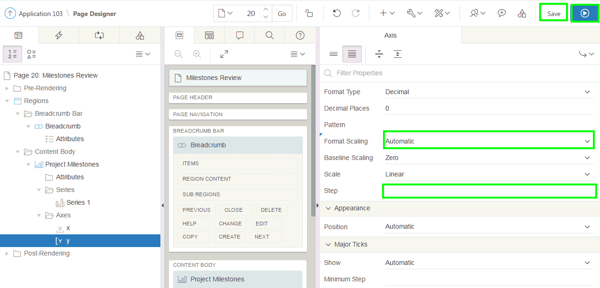

9.  The chart is displayed.
    In the Developer Toolbar, click **Edit Page 20**.
    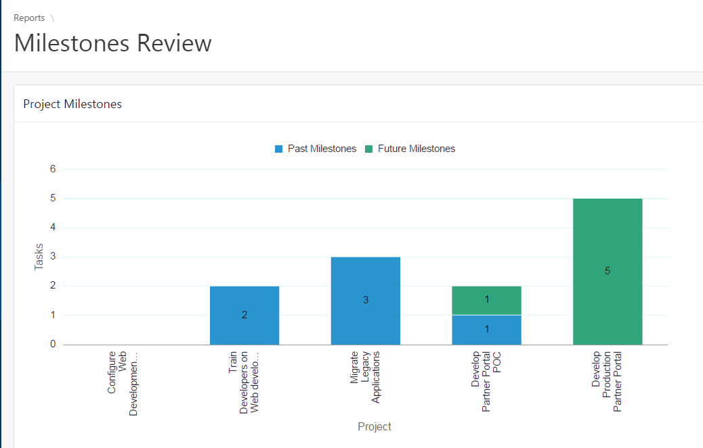

## HOL 14-4: Adding the Project Leads Chart

In this hands-on lab, you create a bar chart to review the completed and incomplete tasks of team members.

1.  View Page 20: Milestones Review in page designer. In the page designer, on the toolbar, click the **Create** (+) icon and select **Page as Copy**.  
    

2.  For Create a page as a copy of, select **Page in this application** and click **Next**.
    

3.  For New Page Number, enter **21** and for New Page Name, enter **Team Members Review**.
    Select **Breadcrumb** for Breadcrumb and **Reports (Page 16)** for Parent Entry.
    Click **Next**.
    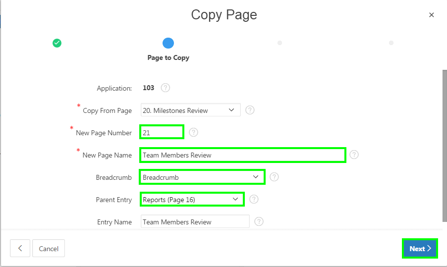

4.  For Navigation Preference, select **Create a new navigation menu entry**.
    Select **Reports** for Parent Navigation Menu Entry.
    Click **Next**.
    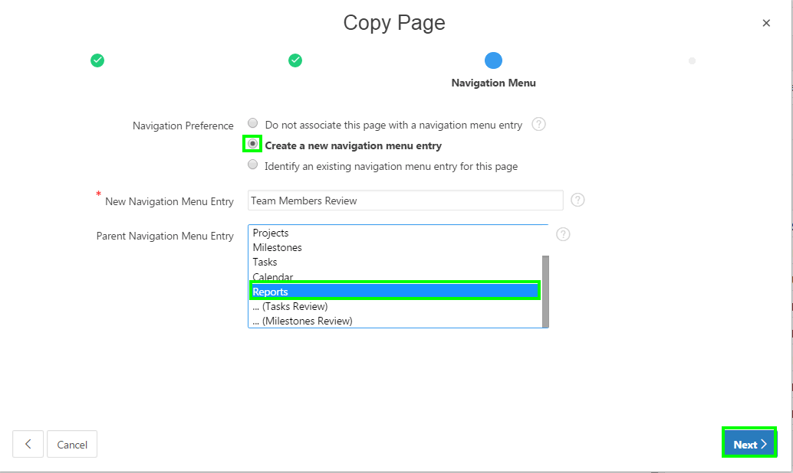

5.  For region New Value, enter **Project Leads**.
    Click **Copy**.
    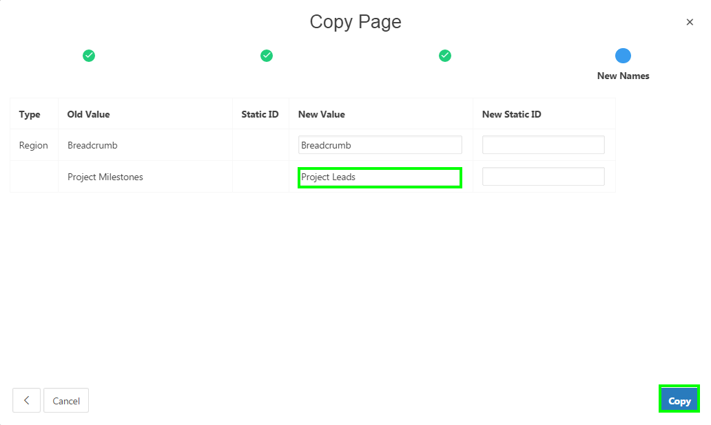

6.  The page along with the chart region is copied. Now, you need to modify the region source query and chart attributes.
    Under Rendering, expand Regions &gt; Project Leads &gt; Series and select **Series 1**.
    In the property editor, for Source &gt; SQL Query, copy and paste the following SQL:

  
	      select p.id
	      
	      , (select nvl(tm.full_name, tm.username)
	      
	      from demo_proj_team_members tm
	      
	      where tm.id = p.project_lead
	      
	      )
	      
	      || ‘ [‘|| p.name ||’]’ as label
	      
	      , (select count(‘x’) from demo_proj_tasks t
	      
	      where p.id = t.project_id
	      
	      and nvl(t.is_complete_yn,’N’) = ‘Y’
	      
	      ) value
	      
	      , ‘Completed Tasks’ series
	      
	      , p.created
	      
	      from demo_projects p
	      
	      UNION ALL
	      
	      select p.id
	      
	      , (select nvl(tm.full_name, tm.username)
	      
	      from demo_proj_team_members tm
	      
	      where tm.id = p.project_lead
	      
	      )
	      
	      || ‘ [‘|| p.name ||’]’ as label
	      
	      , (select count(‘x’) from demo_proj_tasks t
	      
	      where p.id = t.project_id
	      
	      and nvl(t.is_complete_yn,’N’) = ‘N’
	      
	      ) value
	      
	      , ‘Incompleted Tasks’ series
	      
	      , p.created
	      
	      from demo_projects p
	      
	      order by 5
	  

    

7.  Under Rendering, expand Regions &gt; Project Leads &gt; Axes and select **x**.
    In the property editor, for Identification, delete the Title.
    

8.  Under Rendering, expand Regions &gt; Project Milestones &gt; Axes and select **y**.  
    In the property editor, for Identification, verify if the title is **Tasks**. 
    Click Save. Then, click **Save** and **Run Page**. 
    

9.  The chart is displayed.
    In the Developer Toolbar, click Application&lt;*n*&gt;.
    

## HOL 14-5: Adding the Project Tree

In this hands-on lab, you create the Project Tree and then update the application navigation menu. You create a blank page and then add the Tree region.

1.  First, create a blank page in the Demo Projects application. In the application home page, click **Create Page**.

2.  Select **Blank Page** and click **Next**.

3.  Enter **18** for Page Number.
    Select **Breadcrumb** for Breadcrumb and **Reports (Page 16)** for Parent Entry.
    Click **Next**.
   
    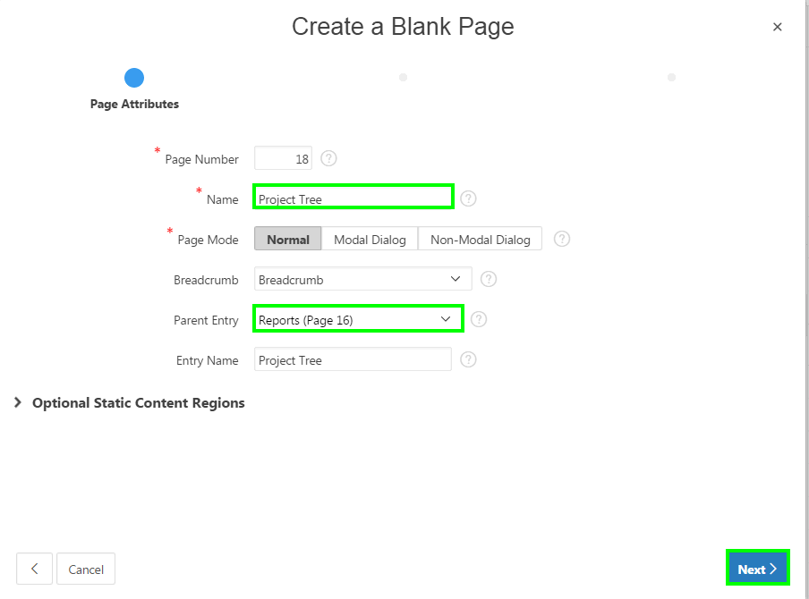

4.  For Navigation Preference, select **Create a new navigation menu entry**.
    Select **Reports** for Parent Navigation Menu Entry and click **Next**.
    

5.  On the Confirm page, click **Finish**.
    
    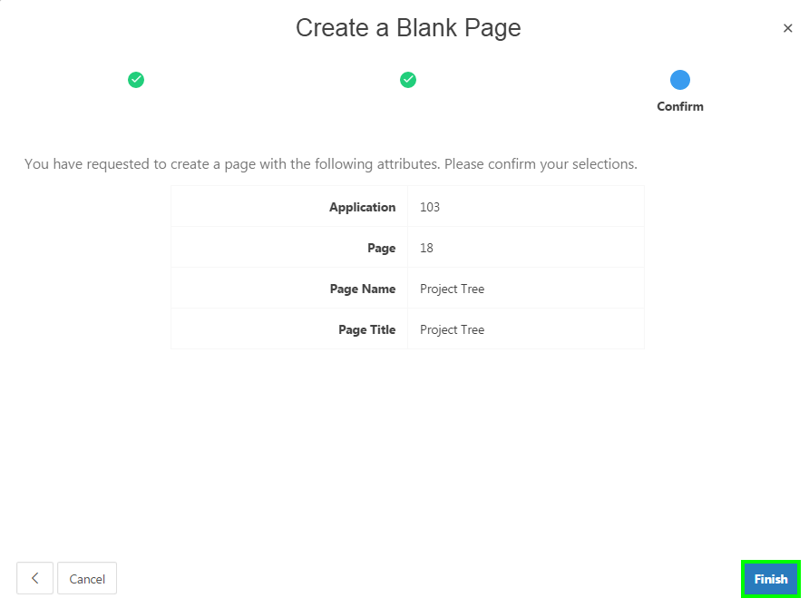

6.  Now you create a Tree region.
    In the page designer, under Rendering, right-click **Regions** and select **Create Region**.
    
    

7.  In the property editor, for Identification &gt; Title, enter **Project Tree**.
    For Identification &gt; Type, select **Tree**.
    The apex-course-labs.zip file includes Project\_Tree.sql file. On your local folder, navigate to the location where you unzipped the zip file and open **Project\_Tree.sql**.
    Copy the SQL code from this file and then paste it in to **Source &gt; SQL Query** in the page designer.
    
    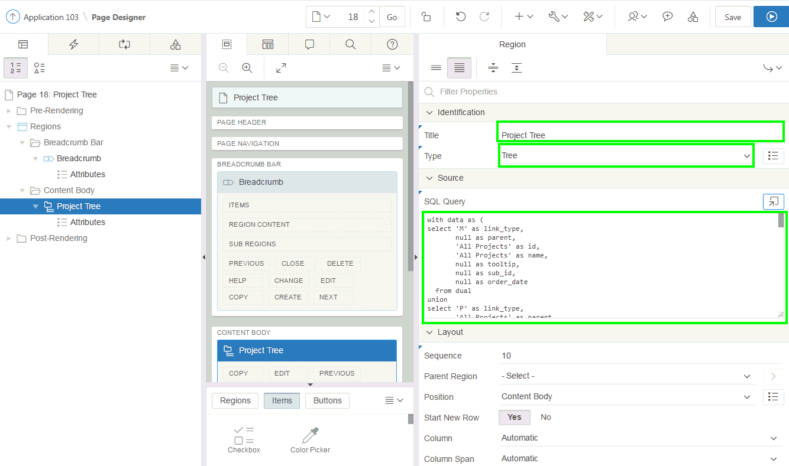

8.  In the page designer, navigate to Appearance and then click the **Template Options** button.
    

9.  In the Template Options dialog:

	-   General: Select the **Remove Body Padding** check box.
	
	-   Header: Select **Hidden but accessible**
	
	-   Style: Select Remove UI Decoration

    Click **OK**.  
    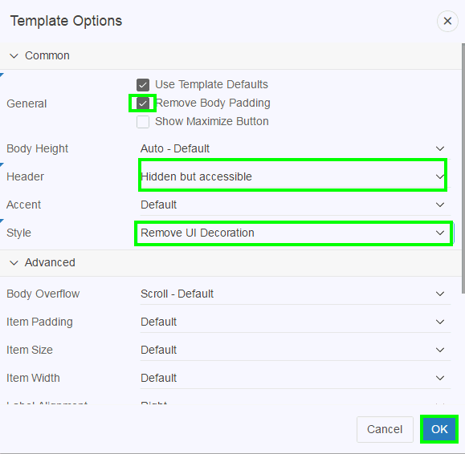

10.  In the property editor, navigate to Settings and for Tooltip, select **Database Column**.
    Click **Save**. Then, click **Save and Run Page**.  
    

11.  The project tree is displayed.
    

12.  In the Demo Projects application navigation menu, entries under the Reports parent entry should look like:
    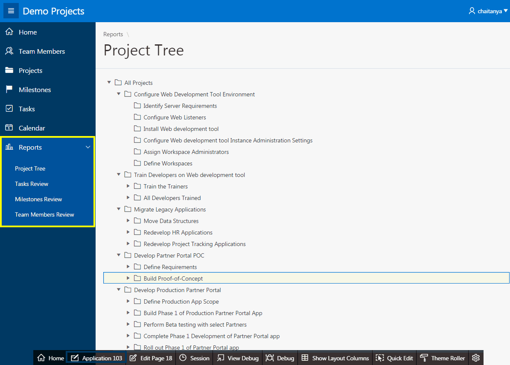
    To achieve this, you edit the Desktop Navigation Menu.
    In the Developer Toolbar, click Application&lt;*n*&gt;.

13.  In the application home page, click **Shared Components**.  
    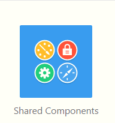

14.  Under Navigation, click **Lists**.  
    

15.  Under Lists, select **Desktop Navigation Menu**.  
    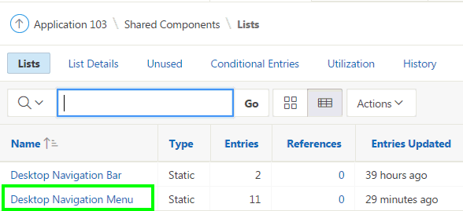

16.  You want to adjust the sequence of the list entries. Click **Grid Edit**.  
    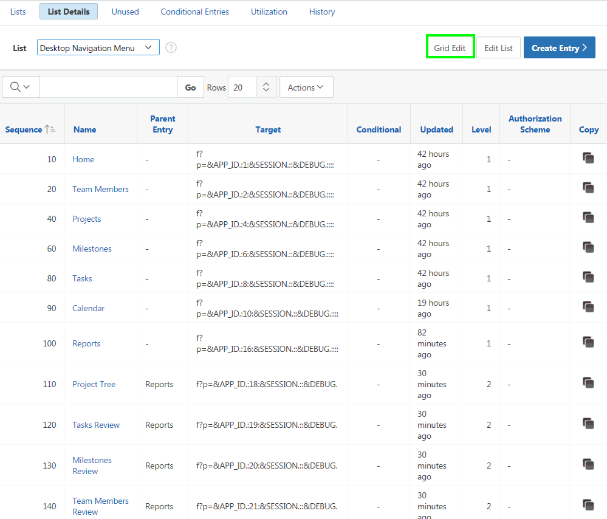

17.  You see an editable interactive grid.

     For Project Tree row, click the Sequence column field and enter value as **110**. Similarly, for Tasks Review, Milestones Review, and Team Members Review, enter the sequence values as **120**, **130**, and **140**.
     Click the **Save** button.
    Then, in the Application Express toolbar, click **Run Page 18**.
    

18.  The updated navigation menu is displayed.
    In the Developer Toolbar, click Application&lt;*n*&gt;.
    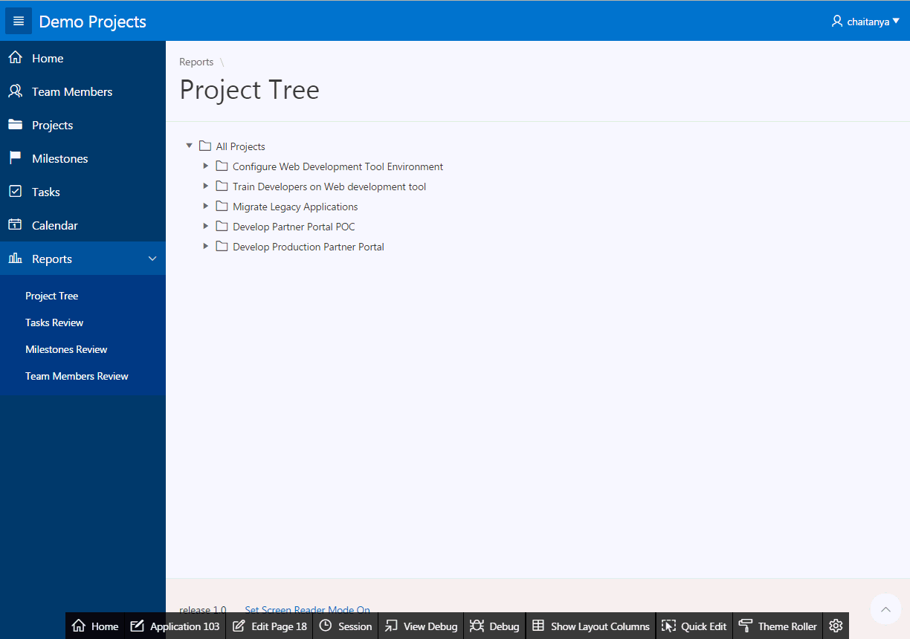

----------

