# Unit 15: Creating and Using Dynamic Actions and Plug-ins

This exercise includes five hands-on-labs and uses the Demo Projects application.

**HOL 15-1 Creating and Using a Dynamic Action on the Maintain Project Page**: In this lab, you add a dynamic action on the Maintain Project page to show or hide the Completed Date based on the value of Status.

**HOL 15-2 Creating and Using a Dynamic Action on the Maintain Task Page:** In this lab, you add a dynamic action on the Maintain Task page to populate the Due Date whenever the Milestone is changed.

**HOL 15-3 Creating and Using Dynamic Actions on the Project Tree Page**: This lab covers creating two buttons that you use to expand and contract the project tree nodes. You create a dynamic action on each of these buttons. Then, for each of the button, you set the action as defined by the dynamic action.

**HOL 15-4 Creating and Using a Plug-in**: In this hands-on lab you create a copy of the Badge List Plug-in from the Sample Charts packaged app. Then, on the application home page, you create a badge list region. On this region, you display three different badges: Open Projects, Upcoming Milestones, and Open Tasks.

**HOL 15-5 Updating the Home Page**: In this hands-on lab you create a dashboard by adding new components to the Home page of the application. You replace the Project Tasks chart with the Recent Projects classic report region. Then, you adjust the Recent Projects and My Outstanding Tasks regions so that they are placed horizontally next to each other. Finally, you modify the Summary region (Badge) attributes to enable the colorful display of the badges.

## HOL 15-1: Creating and Using a Dynamic Action on the Maintain Project Page

On the Maintain Project page, the Completed Date field is displayed irrespective of the value of Status. In this lab, you add a dynamic action on the page to show or hide the Completed Date based on the value of Status.

1.  In the Demo Projects application home page, click **Shared Components**.

2.  You want to create a dynamic LOV for Status. Under Other Component, click **List of Values**.

3.  Click **Create**.
    Accept the default for Source and click **Next**.

4.  For Name, enter **STATUS**, select **Dynamic** for Type and click **Next**.

5.  For Query, copy and paste the following SQL:

  
	      select description d, cd r
	      
	      from demo_proj_status
	      
	      order by display_order
  

6.  Click **Create List of Values**.

7.  In the Application Express toolbar, click **Run Page 1**.

    In the Demo Projects application runtime environment, click **Projects** in the navigation menu.
    Then, in the interactive grid, select a project name with status as IN-PROGRESS or ASSIGNED.

    In the dialog page, for Status Cd, select each of the values Assigned, Completed, and In-Progress. Notice that the Completed Date field is displayed irrespective of the status.

    You want to create a dynamic action that will allow the display of the Completed Date field only if the status is *Completed*.

    In the Developer toolbar, click **Edit Page 5**.
    

8.  In the page designer, expand Regions &gt; Edit Demo\_Projects &gt; Items.
    Right-click the **P5\_STATUS\_CD** item and select **Create Dynamic Action**.
    

9.  In the property editor:

	-   Identification &gt; Name: Enter **Show Completed Date**
	
	-   Client-side Condition &gt; Type: Select **Item = Value**
	
	-   Client-side Condition &gt; Item: Select **P5\_STATUS\_CD**
	
	-   Client-side Condition &gt; Value: Enter **COMPLETED**

     **Note**: The capitalization and spelling of the value must match the data entry value exactly in order for the dynamic action to fire.  
    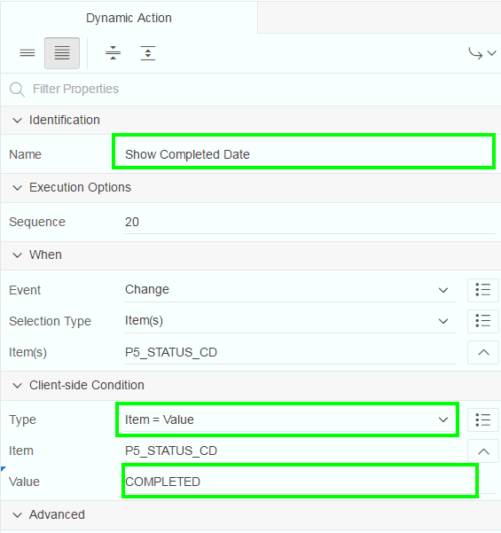

10.  In the Rendering tree, under the Show Completed Date dynamic action, expand the **True** node and select **Show**.
    In the Property Editor, for Item(s) select **P5\_COMPLETED\_DATE**.
    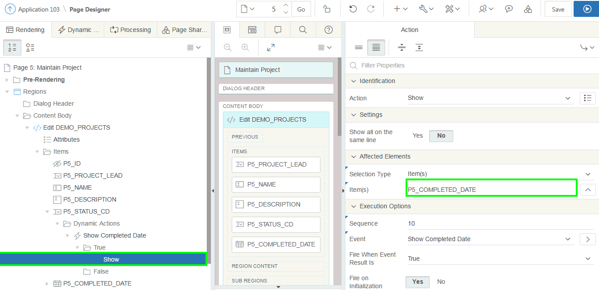

11.  Right-click **Show** and select **Create Opposite Action**.
    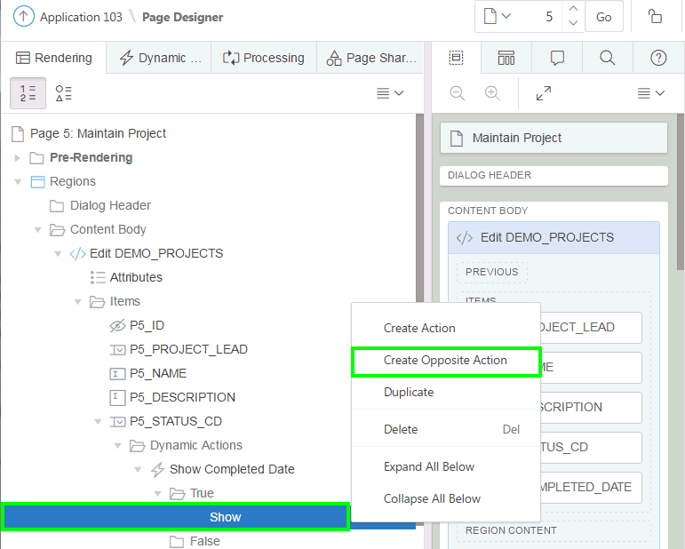

12.  Notice that the opposite action is created now. The Completed Date field will be hidden if the Status includes a value other than COMPLETED.
    Click **Save**.
    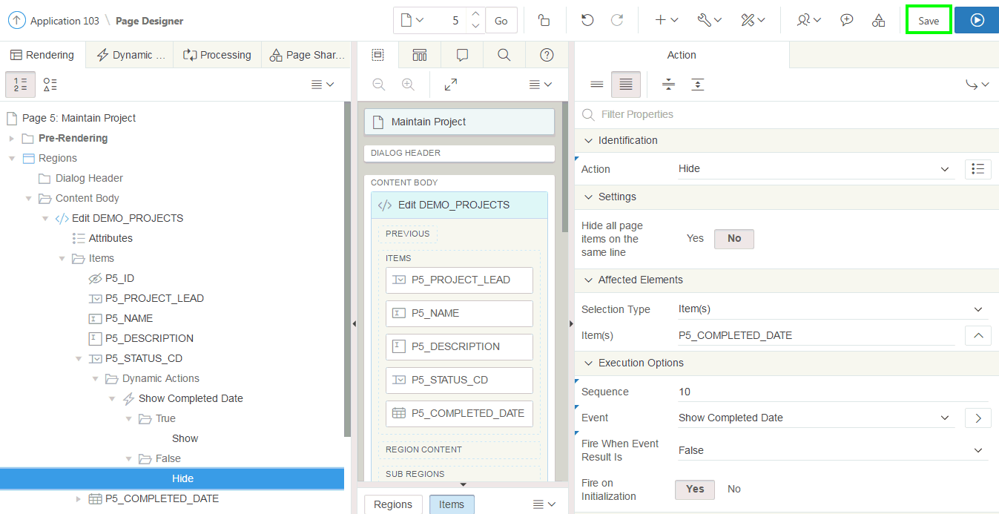

13.  Now, you can verify to see if the dynamic action works as expected.
    Navigate to the Demo Projects application runtime environment. If the Maintain Project dialog is open, click **Cancel**.
    In the navigation menu, click **Projects** and then in the report, click any project name with the Status as COMPLETED.
    Notice that the Completed Date field is displayed.    
    

14.  In the Maintain Project dialog, for Status Cd, select either Assigned or In-Progress.
    Notice that this time, the Completed Date field is hidden.
    Click the **Cancel** button.    
    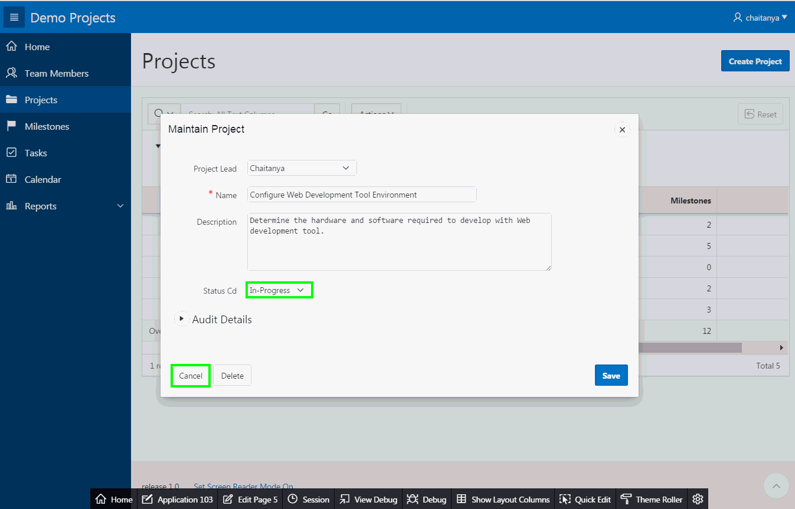

## HOL 15-2: Creating and Using a Dynamic Action on the Maintain Task Page

In this hands-on lab, first, you rename the breadcrumb entry for Page 9 as Maintain Task. Then, you add a dynamic action on this page to populate the Due Date whenever the Milestone is changed.

1.  In the Demo Projects application runtime environment, click Tasks in the navigation menu.
    In the interactive grid, click the Edit icon for a task name.
    Notice that the breadcrumb entry still shows Demo Proj Tasks.
    In the Developer Toolbar, click **Edit Page 9**.

2.  In the page designer, click **Page Shared Components**.
    Expand Breadcrumbs and select **Breadcrumb**.
    In the property editor, click **Edit Component**.
    

3.  Click **Demo Proj Tasks**.
    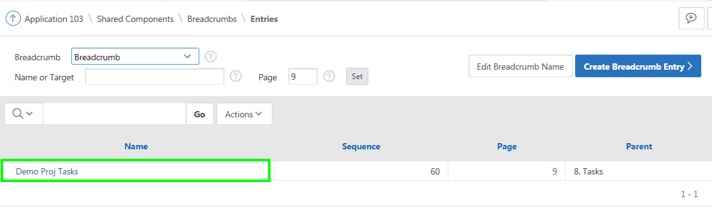

4.  Under Entry, for Short Name, enter **Maintain Task**.
    Click **Apply Changes**.
    

5.  In the Application Express toolbar, click **Edit Page 9**.
    On this page, you want to populate the Due Date whenever the Milestone is changed. In order to achieve this you will use a Dynamic Action with an action of Set Value, which can execute an AJAX call to retrieve data from the database.

6.  Under Rendering &gt; Regions &gt; Edit Demo\_Proj\_Tasks, expand items.
    Right-click **P9\_MILESTONE\_ID** and select **Create Dynamic Action**.  
    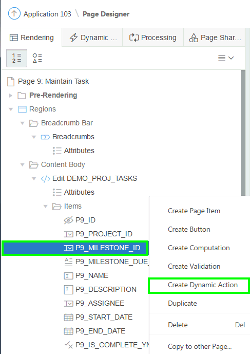

7.  For the new Dynamic Action, in the Property Editor, for Name enter **Get Due Date**.
    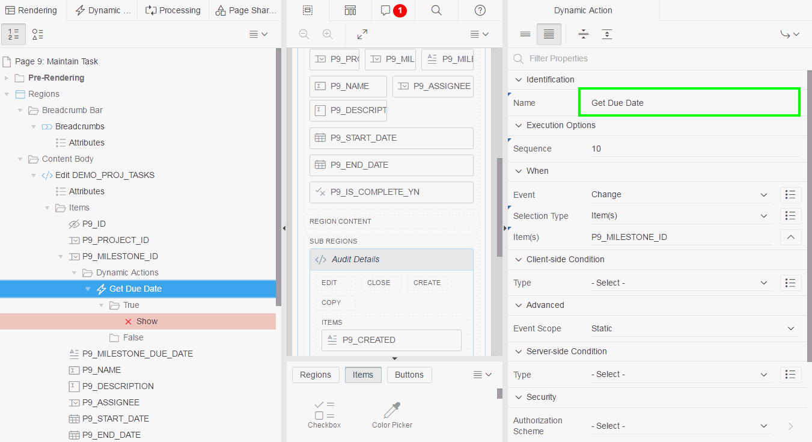

8.  In the Rendering tree, under the P9\_MILESTONE\_ID item, select the **Action** under the True node (currenly labeled X Show).

    In the Property Editor:

	-   Identification: Action - select **Set Value**
	
	-   Settings: Set Type - select **SQL Statement**
	
	-   Settings: SQL Statement - copy and paste the following code:

  
		       select due_date
		      
		       from demo_milestones
		      
		       where id = :P9_MILESTONE_ID
  

	-   Settings: Page Items to Submit - select **P9\_MILESTONE\_ID**
	
	-   Affected Elements: Item(s) - select **P9\_MILESTONE\_DUE\_DATE**

    Click **Save**.

    

9.  Navigate to Demo Projects application runtime environment.
    In the navigation menu, click Tasks.

    In the interactive grid, click the Edit icon for a task with milestones.  
    

10.  Try selecting different values for **Milestone** to see how the Due Date is updated based on the selection.
    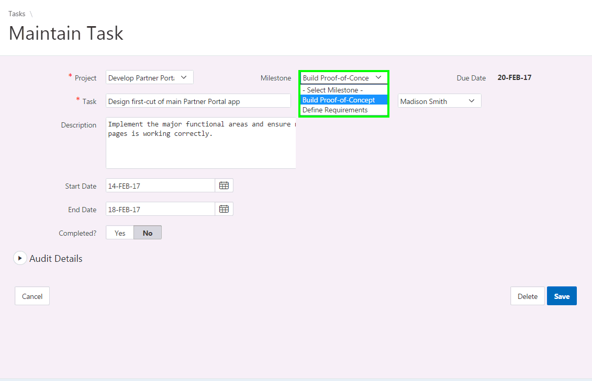

## HOL 15-3: Creating and Using Dynamic Actions on the Project Tree Page

In this lab, you update the Project Tree page that you created in HOL 14-5. You add two buttons: Collapse All and Expand All. You use them to expand and contract the project tree nodes. You create a dynamic action on each of these buttons. Then, for each of the button, you set the action as defined by the dynamic action.

1.  Navigate to Demo Projects application runtime environment. In the navigation menu, under Reports, click **Project Tree**.
    In the Developer Toolbar, click **Edit Page 18**.

2.  Now, to expand and collapse the project tree nodes, you want to create Expand All and Collapse All buttons on the Project Tree button. These buttons’ actions are defined by dynamic actions.
    Under Rendering, expand Regions &gt; Breadcrumb.
    Right-click **Breadcrumb** and select **Create Button**. 
    

3.  In the Property Editor:

	-   Identification &gt; Button Name: Enter **CONTRACT\_ALL**
	
	-   Identification &gt; Label: Enter **Collapse All**
	
	-   Layout &gt; Button Position: Select **Edit**
	
	-   Behavior &gt; Action: Select **Defined by Dynamic Action**

    Under Appearance, click **Template Options** button. Deselect the **Use Template Defaults** check box and click **OK**.

    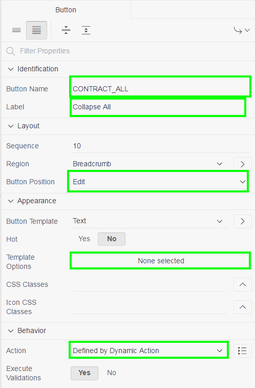

4.  Now, right-click the **CONTRACT\_ALL** button and select **Duplicate**.

5.  In the Property Editor:

	-   Identification &gt; Button Name: Enter **EXPAND\_ALL**
	
	-   Identification &gt; Label: Enter **Expand All**
	
	-   Layout &gt; Button Position: Select **Edit**
	
	-   Behavior &gt; Action: Select **Defined by Dynamic Action**

    Under Appearance, click **Template Options** button. Deselect the **Use Template Defaults** check box and click **OK**.

    

6.  Now you want to create a dynamic action for each of these two buttons.
    Under Rendering, expand Regions &gt; Breadcrumb &gt; Region Buttons.
    Right-click the **CONTRACT\_ALL** button and select **Create Dynamic Action**.

7.  In the property editor, for Identification &gt; Name, enter **CONTRACT\_ALL**.
    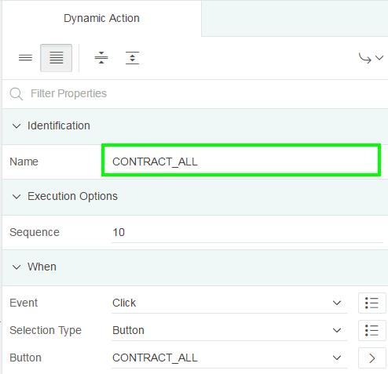

8.  Under Rendering, navigate to the CONTRACT\_ALL region button and expand Dynamic Actions. Select **Show**.
    In the property editor, for Identification &gt; Action, select **Collapse Tree**.
    For Affected Elements &gt; Selection Type, select **Region**.
    For Affected Elements &gt; Region, select **Project Tree**.
    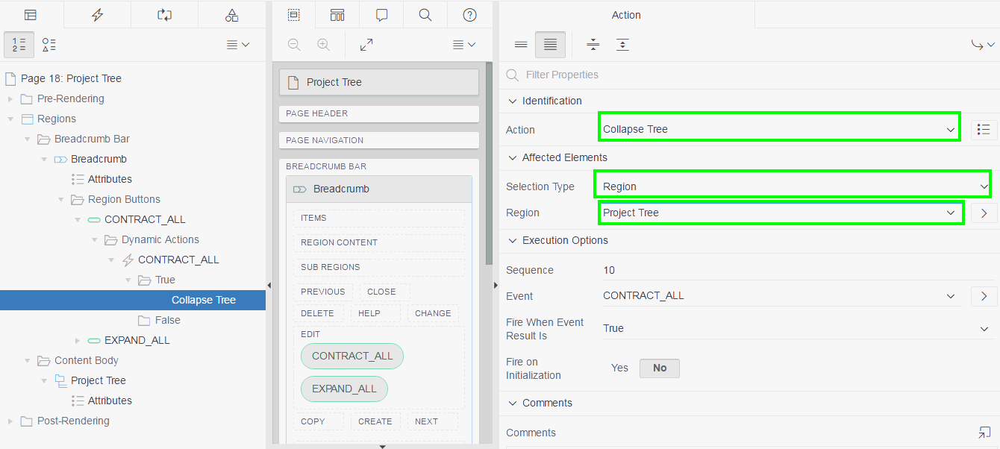

9.  Under Rendering, expand Regions &gt; Breadcrumb &gt; Region Buttons.
    Right-click the **EXPAND\_ALL** button and select **Create Dynamic Action**.

10.  In the property editor, for Identification &gt; Name, enter **EXPAND\_ALL**.
    

11.  Under Rendering, navigate to the EXPAND\_ALL region button and expand Dynamic Actions. Select **Show**.
    In the property editor, for Identification &gt; Action, select **Expand Tree**.
    For Affected Elements &gt; Selection Type, select **Region**.
    For Affected Elements &gt; Region, select **Project Tree**.
    Click **Save and Run Page**.
    

12.  The project tree is now displayed in collapsed mode. Click the **Expand All** button.
    

13.  The project tree is expanded now.
    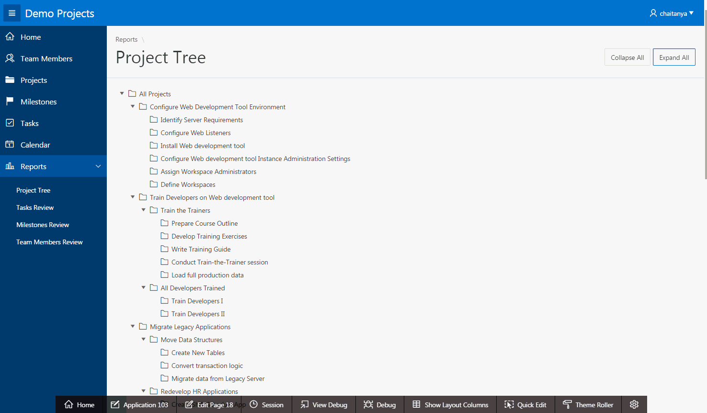

14.  In the Developer Toolbar, click Application&lt;*n*&gt;.

## HOL 15-4: Creating and Using a Plug-in

In this hands-on lab, you create the Badge List Plug-in as a copy of the plug-in from the Sample Charts application. On the application home page, you create a badge list region. On this region, you display three different badges: Open Projects, Upcoming Milestones, and Open Tasks.

1.  Install the Sample Charts application so that you can subscribe to the badge list plug-in.
    In the main toolbar, click **Packaged Apps** and select **Sample Apps**.
    

2.  Click **Sample Charts**.  
    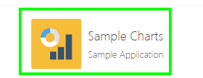

3.  Click **Install Packaged App**.
    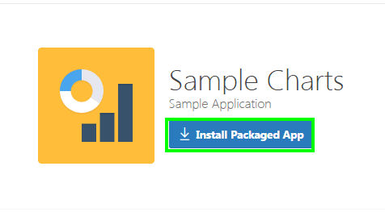

4.  Accept the default authentication and click **Next**.
    

5.  Click **Install Packaged App**.
    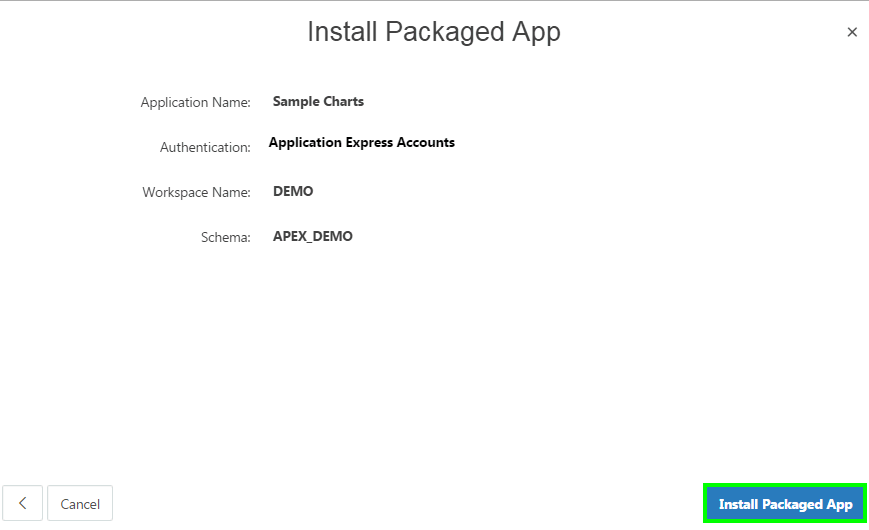

6.  The Sample Charts application is application.
    Click **App Builder**.
    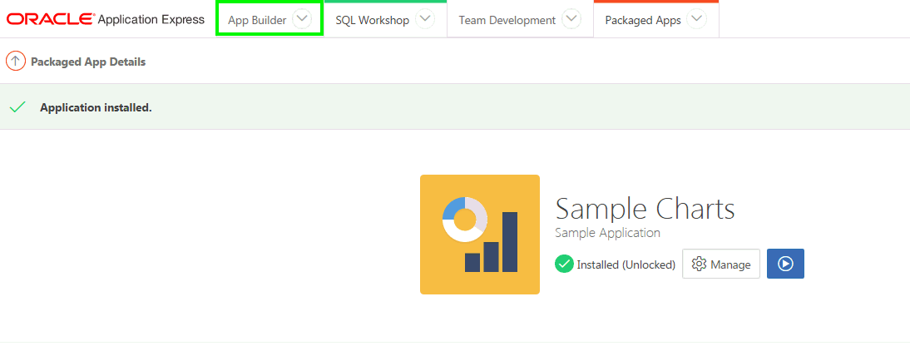

7.  In the report, select Demo Projects application.
    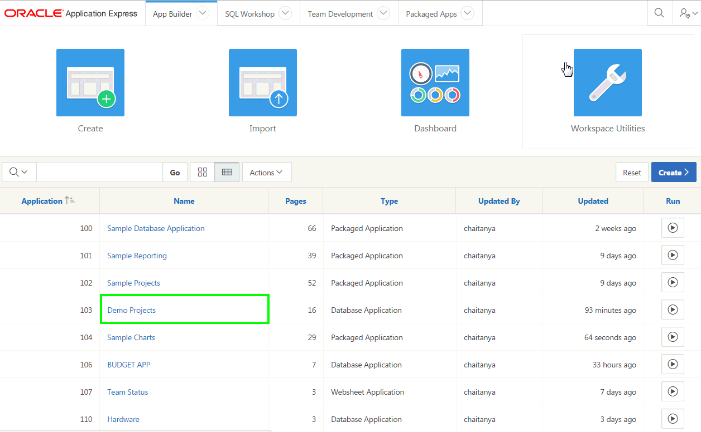

8.  In the application home page, click **Shared Components**.

9.  Under Other Components, click **Plug-ins**.  
    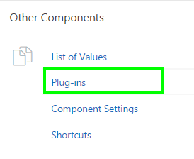

10. In the Plug-ins page, click **Create**.
    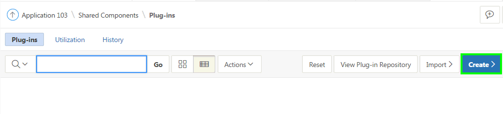

11. For Create Plug-in, select **As a Copy of an Existing Plug-in** and click **Next**.
    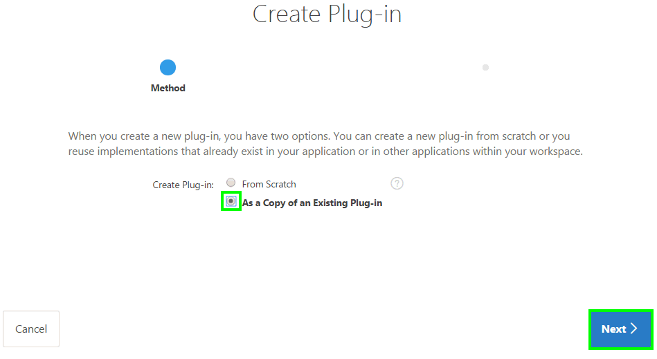

12. For Copy From Application, select &lt;xxx&gt;**Sample Charts** and click **Next**.
    

13. At the bottom of the page, click the **Deselect All** button.
    

14. Now, for Badge List, select **Copy and Subscribe**.
    Then, click **Copy Plug-ins**.
    

15. In the Application Express toolbar, click **Edit Page 1**.
    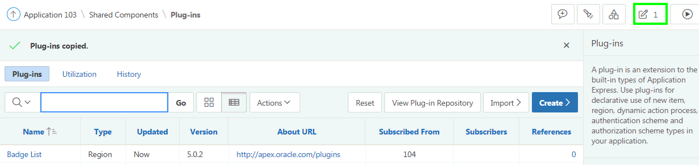

16. Use Page Designer's drag-and-drop functionality to quickly add a Badge List from the Gallery to the Layout.
    In Page Designer, within the Gallery (directly below the Layout), click **Regions**, and locate **Badge List**.

    Click and hold **Badge List \[Plug-In\]** and drag it into **Content Body**, to a position directly above the Project Tasks region. It should appear as a darkened tile before you drop it into place.

     **Note**: When you drag the region up, and hover over the small yellow section, below Content Body, the yellow section will expand. A darker yellow section, with a black box around it, will indicate where the region will be placed.
    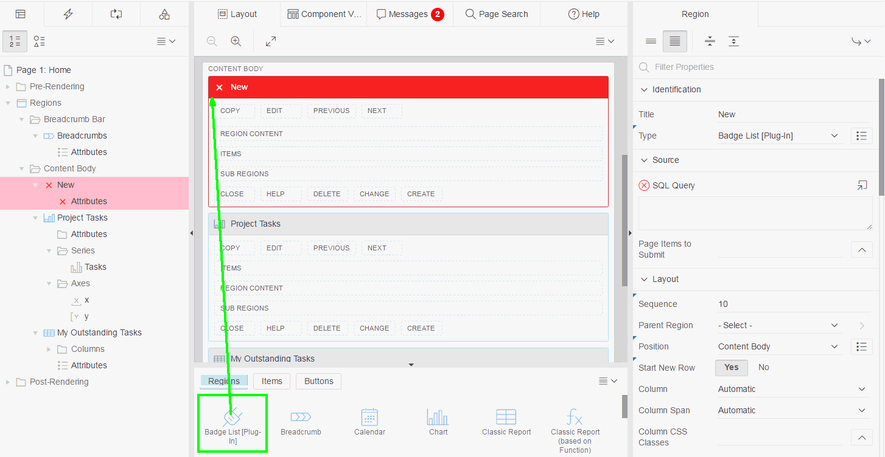

17.  In the Property Editor:

	-   Identification: Title - enter **Summary**
	
	-   Source: SQL Query - copy and paste the following:
	
	  
		      select 'Open Projects' label
		      
		      , count(*) value
		      
		      , 'f?p='||:APP_ID||':4:'||:APP_SESSION||':::::' link
		      
		      from demo_projects
		      
		      where status_cd != 'Completed'
		      
		      UNION ALL
		      
		      select 'Upcoming Milestones' label
		      
		      , count(*) value
		      
		      , 'f?p='||:APP_ID||':4:'||:APP_SESSION||':::::' link
		      
		      from demo_proj_milestones
		      
		      where due_date > sysdate
		      
		      UNION ALL
		      
		      select 'Open Tasks' label
		      
		      , count(*) value
		      
		      , 'f?p='||:APP_ID||':4:'||:APP_SESSION||':::::' link
		      
		      from demo_proj_tasks
		      
		      where is_complete_yn = 'N'
	 

     **Note**: This query has three sub-queries, separated by UNION ALL that will be displayed as three separate badges within the region.

  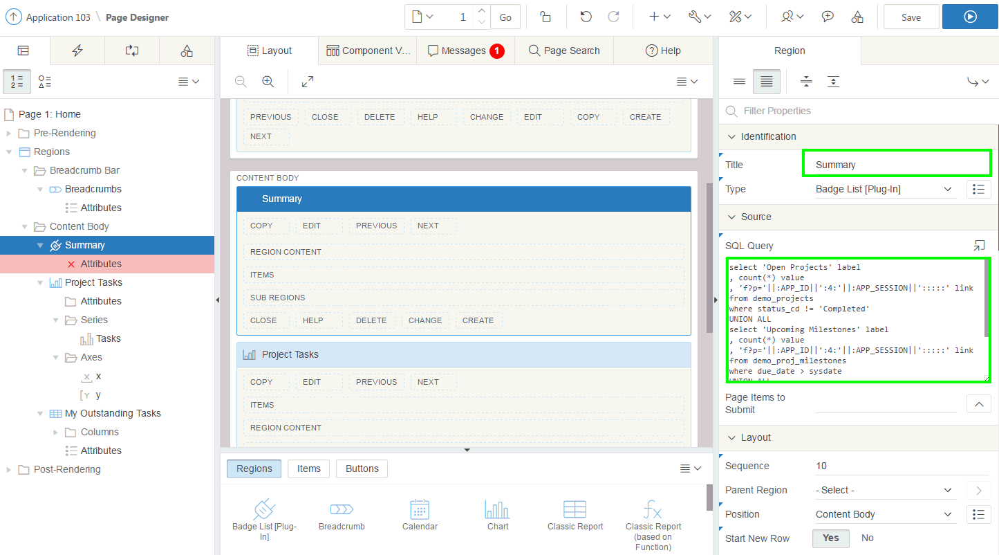

18.  In the property editor, navigate to Appearance and click **Template Options**.     
    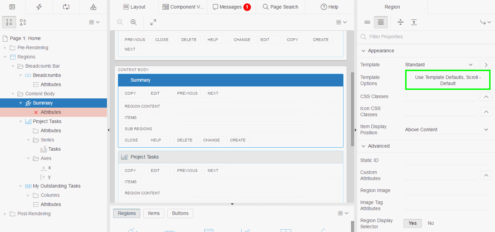

19.  In the Template Options dialog, select the **Remove Body Padding** check box.
    For Header, select **Hidden but accessible**.
    Click **OK**.
    

20.  In the Rendering tree, under the Summary region, click Attributes.

     In the Property Editor:

	-   Settings: Top Label - select **LABEL**
	
	-   Settings: Value - select **VALUE**  
    For Link Target, click **No Link Defined**.  
    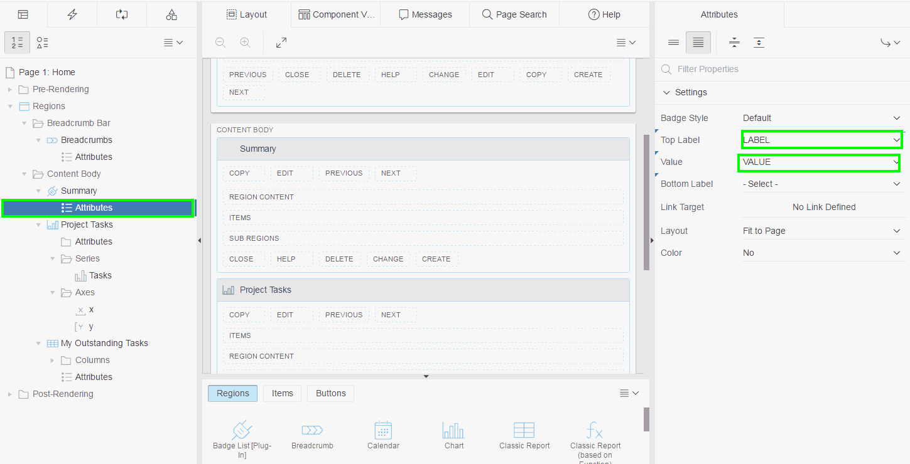

21.  In the Link Builder – Link Target dialog, select URL for Type. For URL, enter **&LINK.**.
    Click **OK**.
    Note: When you enter **&LINK.** ensure you include the period.  
    

22.  Click **Save and Run Page**.

## HOL 15-5: Updating the Home Page

In this lab, you create a dashboard by adding new components to the Home page of the Demo Projects application. You already created a badge list region in HOL 15-4. This lab covers adding the Recent Projects classic report region and modifying the Summary region attributes.

1.  You already have the Project Tasks chart added as a page under Reports. Therefore, you do not need the same chart on the Home page anymore. Instead, you add a new classic report region here.
    View Page 1 in page designer.
    Under Rendering, navigate to Regions. Right-click **Project Tasks** region and select **Delete**.  
    

2.  Now, in the Layout, navigate to Gallery and click **Regions**.
    Click and hold **Classic Report** and drag it into **Content Body**, to a position directly between the Summary and the My Outstanding Tasks regions.
    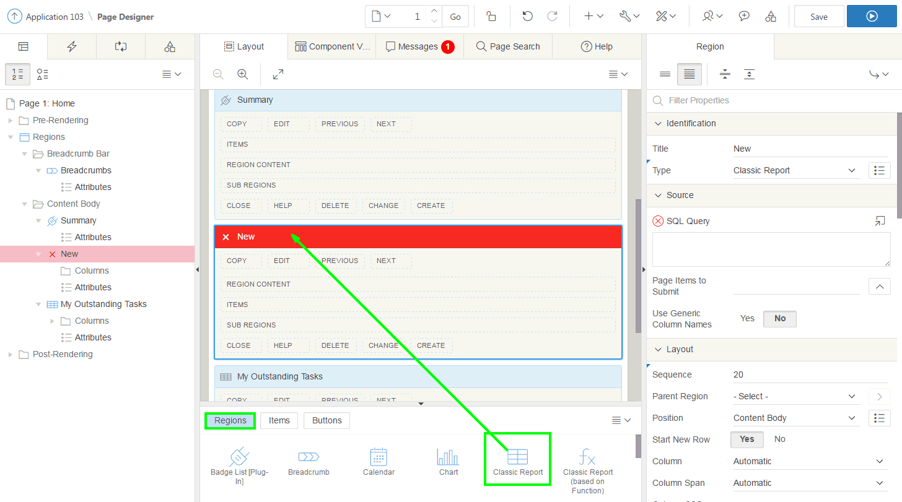

3.  In the property editor:

	-   Identification &gt; Title: Enter **Recent Projects**
	
	-   Identification &gt; Source &gt; SQL Query: Copy and paste the following code:
	
	  
		      select p.id project_id
		      
		      , t.id
		      
		      , null event_modifiers
		      
		      , null event_attributes
		      
		      , null user_color
		      
		      , dbms_lob.getlength('PHOTO_BLOB') user_avatar
		      
		      , t.full_name user_name
		      
		      , nvl(p.completed_date, p.updated) event_date
		      
		      , (case p.status_cd
		      
		      when 'ASSIGNED' then 'is-removed'
		      
		      when 'IN-PROGRESS' then 'is-updated'
		      
		      when 'COMPLETED' then 'is-new'
		      
		      end) event_status
		      
		      , (select s.description
		      
		      from demo_proj_status s
		      
		      where s.cd = p.status_cd
		      
		      ) event_type
		      
		      , (case p.status_cd
		      
		      when 'ASSIGNED' then 'fa fa-clock-o'
		      
		      when 'IN-PROGRESS' then 'fa fa-refresh'
		      
		      when 'COMPLETED' then 'fa fa-check'
		      
		      end) event_icon
		      
		      , p.name event_title
		      
		      , p.description event_desc
		      
		      from demo_projects p
		      
		      , demo_proj_team_members t
		      
		      where p.project_lead = t.id
		      
		      order by p.updated desc
  

     

4.  In the property editor, locate Appearance and click **Template Options**.  
    

5.  In the Template Options dialog:

	-   For General, select the Remove Body Padding check box.
	
	-   For Body Height, select **480px**.

    Click **OK**.  
    

6.  In the property editor, under Advanced, select **No** for Region Display Selector.  
    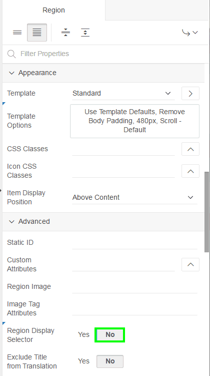

7.  Under Rendering, expand Regions &gt; Recent Projects and select **Attributes**.
    In the property editor:

	-   Layout &gt; Number of Rows: Enter **5**
	
	-   Appearance &gt; Template: Select **Timeline**
	
	-   Pagination &gt; Type: Select **No Pagination (Show All Rows)**

    Under Appearance, click **Template Options**.
    

8.  In the Template Options dialog, select **Compact** for Style.
    Click **OK**.
    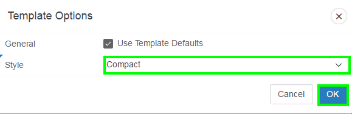

9.  In the Layout, click and hold the **My Outstanding Tasks** region and drag it into the position next to the Recent Projects region. Both the Recent Projects and My Outstanding Tasks regions should now appear on the same line horizontally.
    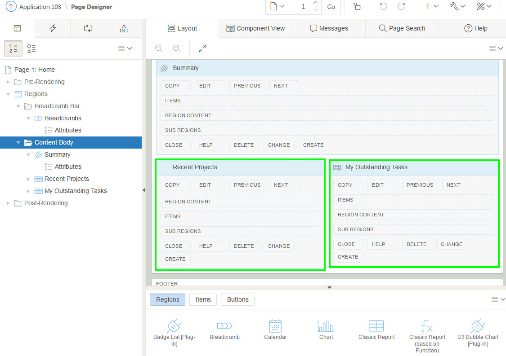

10.  Under Rendering, expand **Regions &gt; Recent Projects &gt; Columns**.
    Click **USER\_AVATAR**.
    In the property editor:

	-   Identification &gt; Type: Select **Display Image**
	
	-   BLOB Attributes &gt; Table Name: Select **DEMO\_PROJ\_TEAM\_MEMBERS**
	
	-   BLOB Attributes &gt; BLOB Column: Select **PHOTO\_BLOB**
	
	-   Primary Key Column 1: Select **ID**
	
	-   BLOB Attributes &gt; Mime Type Column: Select **PHOTO\_MIMETYPE**
	
	-   BLOB Attributes &gt; Filename Column: Select **PHOTO\_FILENAME**
	
	-   BLOB Attributes &gt; LAST\_UPDATED Column: Select **PHOTO\_LAST\_UPDATED**

   Click **Save and Run Page**.
   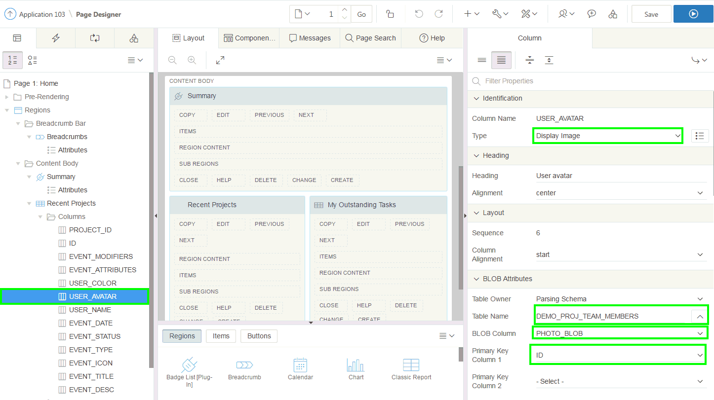
   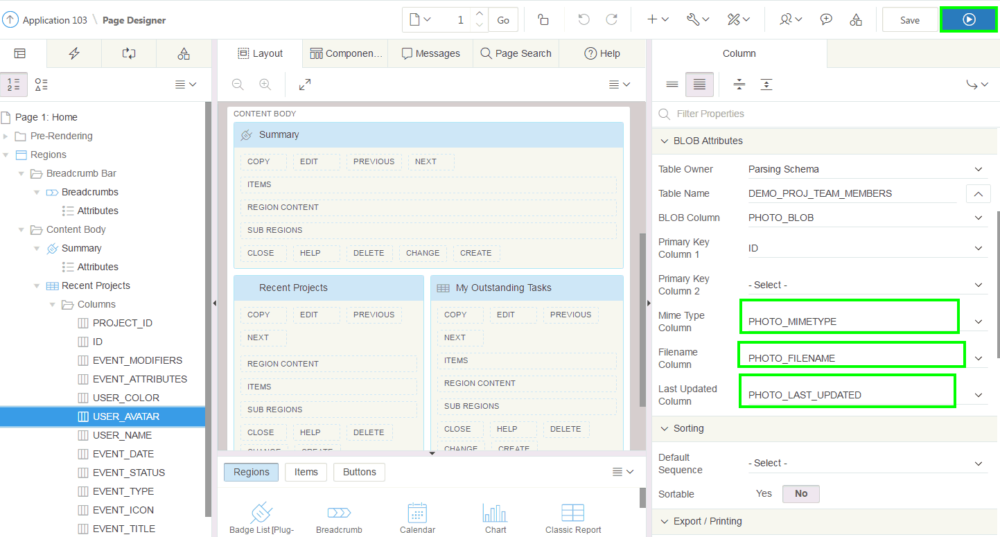
   The Home page is displayed now.
   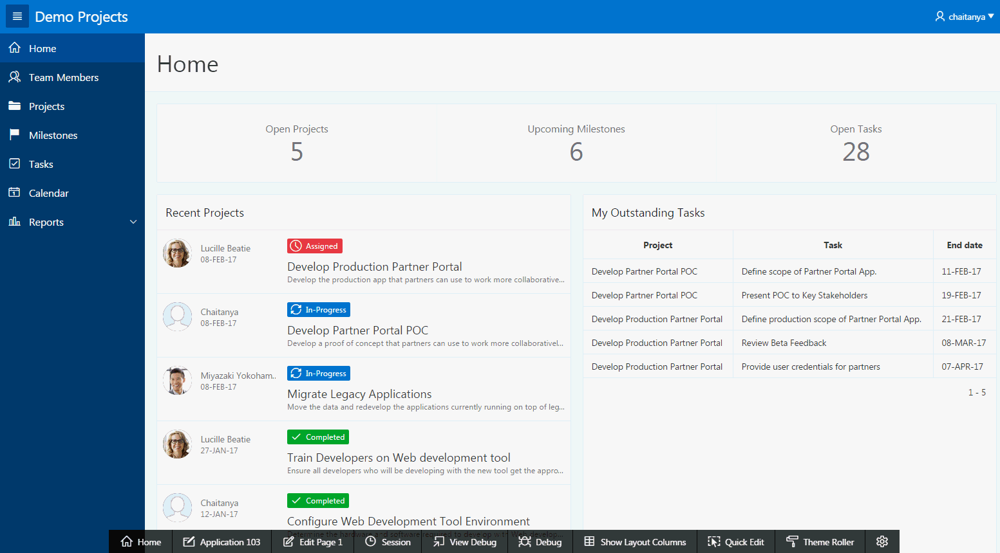

11.  You can set color for the badges.
    Navigate to page designer and under Rendering, expand Regions &gt; Summary. Then, select **Attributes**.
    In the property editor, under Settings, for Color, select **Yes**.
    Click **Save and Run Page**.
    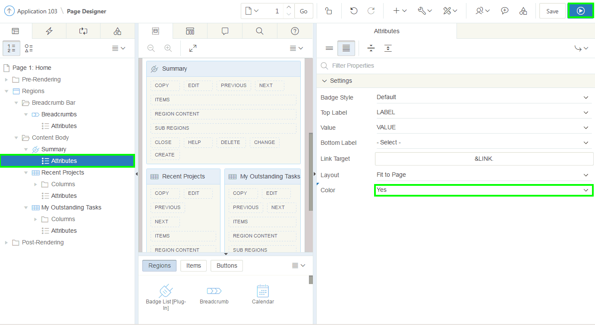

12.  The Home page now is displayed with the colored badges.
     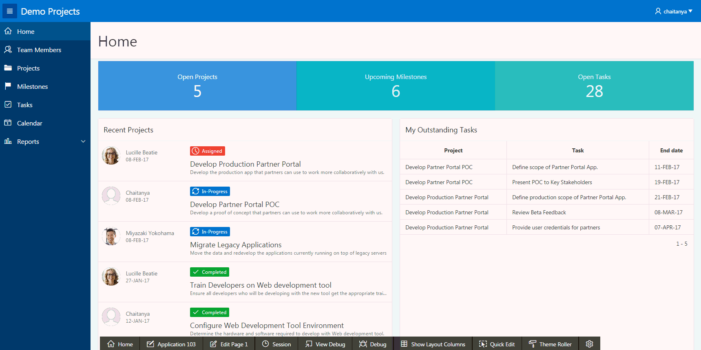

----------

